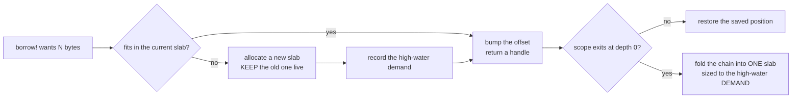
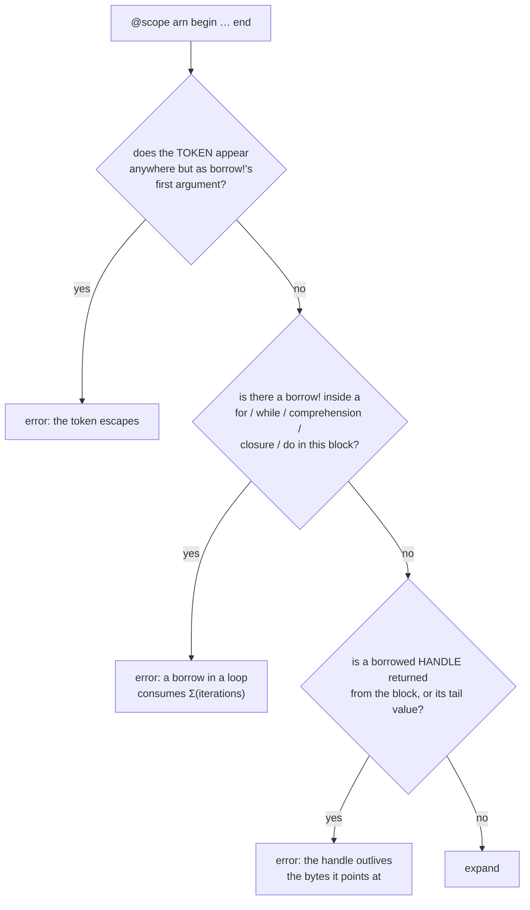
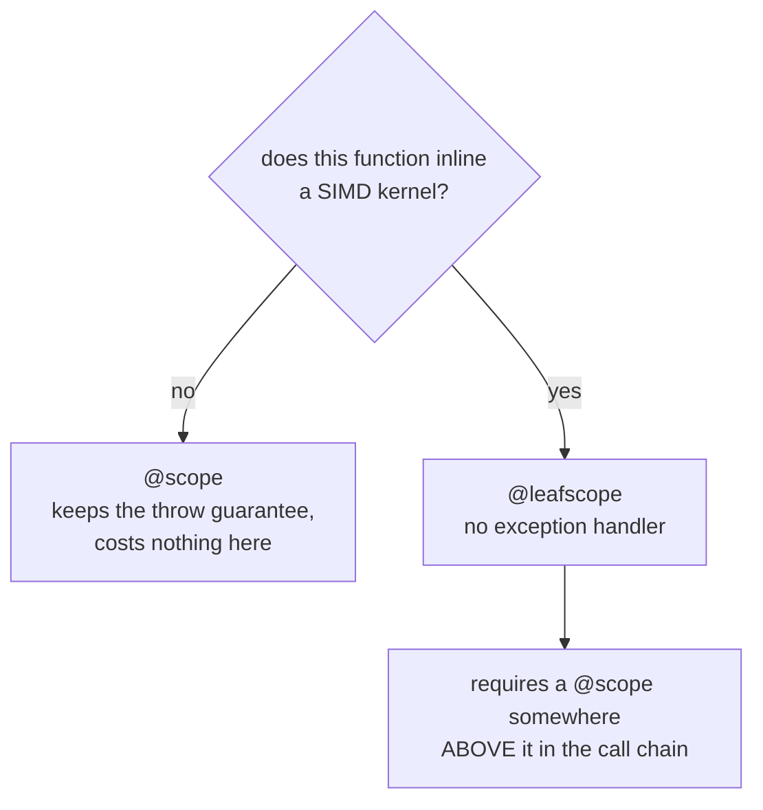

# The scratch arena

Every LAPACK routine needs scratch. PureBLAS used to give each one a named field on a struct:
`L3Workspace` reached **180 fields**, most of them dedicated to a single routine — `trsen11`, `qp3wrow`,
`ggs_rqtau`, `stnseed`. That shape has three costs beyond the ugliness. Every call site drags in scratch
for routines it can never reach. The peak footprint is the sum of each role's maximum rather than the
maximum of what is concurrently live. And it forces one sharing policy on every role, which is the wrong
shape for the multithreading milestone.

The arena replaces it. A role does not own storage; it **borrows** a shape and stride for the duration of
a lexical scope, and the bump pointer rewinds when the scope exits.

```julia
@scope arn begin
    W = borrow!(arn, T, n, nb)          # n×nb, leading dimension n
    v = borrow!(arn, Int, n)            # a vector
    _panel!(A, W, v)                    # handles pass DOWN freely
end                                     # rewound here; W and v are dead
```

`L3Workspace` is now **7 fields** — the GEMM and syr2k packing buffers, which are genuinely shared
allocator state rather than per-routine scratch.

## How it works

The arena is a byte-addressed bump allocator over one slab. Entering a scope records the current
position; leaving restores it. Nothing is freed individually and nothing is reference-counted.

```mermaid
sequenceDiagram
    participant C as caller
    participant S as "@scope"
    participant A as Arena
    C->>S: enter
    S->>A: record (slab, offset, depth)
    C->>A: borrow!(T, m, n)
    A-->>C: PtrMatrix at offset, offset += ld·n·sizeof(T)
    C->>A: borrow!(T, k)
    A-->>C: PtrVector, offset advances again
    Note over C: kernels run; handles pass into callees
    C->>S: exit
    S->>A: restore (slab, offset, depth) — both handles now dangle
```

Because a scope restores an absolute position rather than undoing individual borrows, an *enclosing*
scope's exit repairs anything an inner one failed to release. That property is what makes the
handler-free variant below safe.

### Growth

If a borrow does not fit, the arena takes a **new slab and keeps the old one live**, so growth never
invalidates a handle already handed out. At depth zero the chain folds back into a single slab sized to
the high-water demand.



Folding to the *demand* rather than to the sum of slab capacities matters: summing capacities compounds
the growth doubling into the permanent size, so a slab of `S` overflowed by one byte becomes `2S`, folds
to `3S`, and the next one-byte overflow gives `9S`, without bound.

### Handles

`borrow!` returns `PtrMatrix{T}` or `PtrVector{T}` (`src/ptrmat.jl`) — isbits structs holding a pointer, a
shape and a leading dimension. They index, `view`, and pass into kernels like an `Array`, and being isbits
they cross a non-inlined call boundary without a heap box. A non-isbits element type such as `BigFloat`
falls back to a heap `Matrix`, which is correct but not allocation-free; no gated path uses one.

**Slicing keeps the type.** `view(A, rows, cols)` on a `PtrMatrix` is another `PtrMatrix`; a column view is
a `PtrVector`. That is load-bearing — see *the closed-union trap* below.

## What the macro enforces, and when

Three rules are checked when `@scope` **expands**, so a violation is a compile error rather than a lint
finding or a debugging session.



The third rule is deliberately narrow: it rejects a handle in *value position* only. `return sum(A)` is
normal and stays legal, and so does passing a handle down into a callee — handles are meant to travel,
they are only forbidden from outliving.

### What the checks do not catch

They are lexical checks on the unexpanded body, not a proof. Three holes, all measured:

| hole | why it cannot be closed lexically |
|---|---|
| a handle **stored** into a field or global, or captured by a closure that outlives the block | the handle is an ordinary local; only the token is tracked |
| a loop emitted by **another macro** | the body is walked unexpanded, where `@turbo`/`@nloops` is a `macrocall` node, not a `for` |
| **recursion** | not lexical, so no macro can see it — a self-recursive routine holding a scope per level holds every level's borrows at once |

For the first, `@fenced_scope` is the runtime answer: every borrow becomes its own `mmap` behind a
`PROT_NONE` guard page, so *using* a released handle faults at the offending line instead of silently
reading whatever the next borrow wrote. It is roughly a thousand times the cost of a bump, so it is
opt-in per scope — written into the source of the routine being debugged, never a global mode.

## `@scope` or `@leafscope`

`@scope` wraps its body in `try`/`finally` so the arena is released on all three exit paths: falling off
the end, an early `return`, and a throw. That handler is free in a dispatch-level routine and **ruinous in
one that inlines a register-hungry kernel**, because it lowers to `jl_enter_handler` plus a
`returns_twice` setjmp, and LLVM must then be conservative about registers for the whole function.

Measured on Zen 3, where the SIMD leaf holds 18 live vectors against a 16-register file:

| | vector spills in `_trsm_rl_fused_drv!` | `trsmR@100` | `trsmR@128` |
|---|---|---|---|
| before the arena | 113 | 1.037 | 0.978 |
| with `@scope` (handler) | **172** | 0.746 | 0.708 |
| with `@leafscope` | **113** | 1.035 | 0.973 |

The AVX-512 machines have fourteen spare vector registers and were unaffected — which is why the whole
effect was invisible on the machine the conversion was written on.



`@leafscope` reproduces the first two exit paths itself — it rewrites every `return` in the block to
release first, skipping any `return` belonging to a nested closure or `do` block. It gives up only the
throw path, and that is bounded rather than ignored: releasing restores the arena's position *absolutely*
from the record made on entry, so the first enclosing scope that does run its exit repairs everything at
once. Hence the rule in the diagram.

## The closed-union trap

`StridedMatrix` and `StridedVector` are **closed** unions — `Array`, `SubArray`, `ReshapedArray`,
`ReinterpretArray` and combinations. `PtrMatrix` and `PtrVector` are not in them and never can be. So a
fast-path gate written inline as

```julia
x isa StridedVector && stride(x, 1) == 1        # WRONG for a borrow
```

sends every borrowed operand to the generic scalar path: right answer, no test failure, no gate cell
moves. Use **`_strided1(A)`** and **`_dense1(x)`** (`src/ptrmat.jl`), which const-fold to the identical
check for a Strided argument and carry explicit methods for the pointer types. `test/fastpath_lint.jl`
fails the suite on a new bare `isa`.

This class had fired five times before the lint existed — twice through the C-ABI shims, twice through
the conversion, and once in a way that sent **every** drop-in `getrf` down a scalar panel.

## Costs, stated plainly

- A converted routine is **not** allocation-free on its very first call at a new arena high-water; it is
  allocation-free from the second. The struct paid that cost at module load instead.
- Two borrows in one scope are two disjoint ranges, so the self-aliasing bug class the old fields kept
  producing — a role re-claimed from inside a live claim of itself, right on the first call and wrong on
  the second — cannot be written any more.
- A borrow is **exact**. A grown field handed back whatever leading dimension an earlier call had asked
  for, which is a measured 1.16 → 0.57 hazard: an ascending benchmark sweep hides it, and a caller going
  large-then-small gets a different library.

## Threading

The arena is a process-global bump allocator, exactly as the struct it replaces was a process-global
object. That is not a regression in kind, but it is one in degree: interleave two tasks and the failure is
arbitrary cross-role aliasing, where the struct's was bounded to one role.

A per-task owner is therefore a **precondition** of enabling threads, not an optimisation to weigh against
its cost. It is also why the conversion was worth doing before that milestone: going per-task costs the
arena one line, where per-task ownership of a 180-field struct means duplicating 180 grown buffers per
task.
