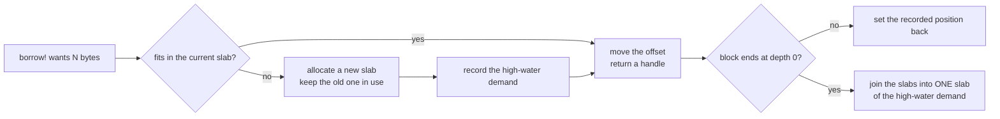
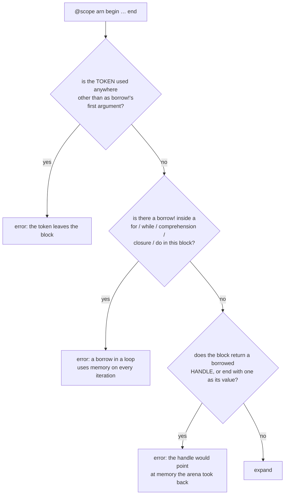
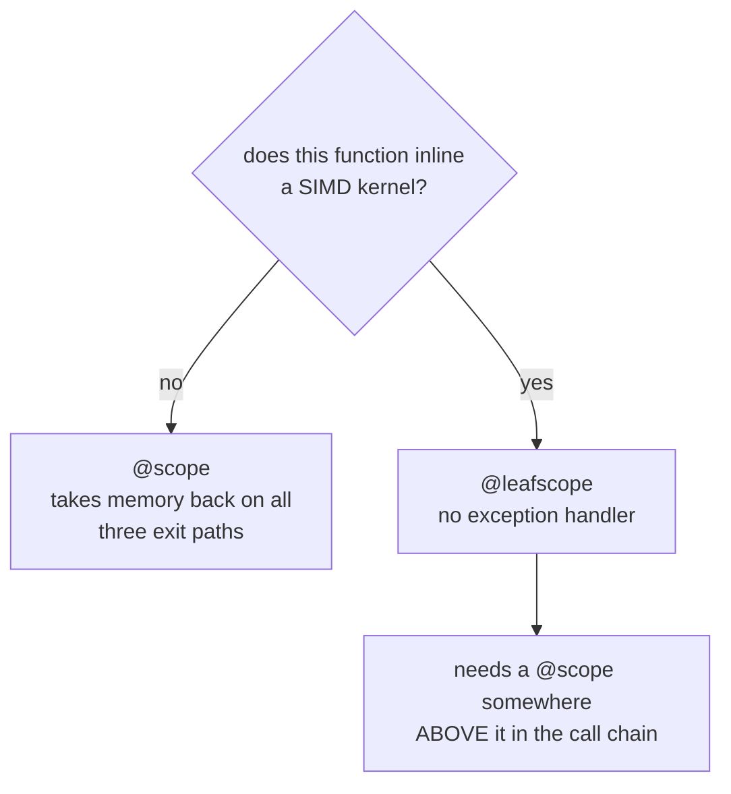

# The scratch arena

**The scratch arena is one growing block of memory. A routine borrows temporary matrices and vectors from it, and the arena takes them back automatically when the routine's code block ends.**

Think of a notepad with a bookmark:

1. When a routine starts a block, it puts a bookmark at the next free page.
2. Each borrow uses the next free pages.
3. When the block ends, the notepad goes back to the bookmark. The pages stay in the notepad for the next routine.

```julia
@scope arn begin
    W = borrow!(arn, T, n, nb)          # an n×nb matrix, leading dimension n
    v = borrow!(arn, Int, n)            # a vector of length n
    _panel!(A, W, v)                    # pass the handles down to other functions
end                                     # the arena takes W and v back here
```

## How it works

The arena keeps one position: which slab, which offset in that slab, and how deep the blocks are.

1. At the start of a block, `@scope` records that position.
2. Each `borrow!` gives a handle at the current offset, then moves the offset forward by the size of the borrow.
3. At the end of the block, `@scope` sets the position back to the recorded value.

```mermaid
sequenceDiagram
    participant C as caller
    participant S as "@scope"
    participant A as Arena
    C->>S: enter
    S->>A: record (slab, offset, depth)
    C->>A: borrow!(T, m, n)
    A-->>C: PtrMatrix at offset, offset += ld·n·sizeof(T)
    C->>A: borrow!(T, k)
    A-->>C: PtrVector, offset moves forward again
    Note over C: kernels run; handles pass into callees
    C->>S: exit
    S->>A: set (slab, offset, depth) back — both handles are now invalid
```

The position is set back to an exact recorded value. So when an outer block ends, it also takes back everything that an inner block did not.

### Growth

1. If a borrow fits in the current slab, the arena moves the offset and gives the handle.
2. If a borrow does not fit, the arena allocates a new slab. The old slab stays in use, so every handle already given out stays valid.
3. The arena records the largest total size that was requested (the high-water demand).
4. When the outermost block ends (depth 0), the arena joins its slabs into one slab of the high-water demand.



The joined slab has the size of the **demand**. This keeps the arena at the largest size that routines asked for.

### Handles

`borrow!` gives a `PtrMatrix{T}` or a `PtrVector{T}` (`src/ptrmat.jl`).

- Each handle is a small fixed-size value: a pointer, a shape and a leading dimension.
- You can index it, take a `view` of it, and pass it to a kernel, as you do with an `Array`.
- It passes into a function that is not inlined with no heap allocation.
- A `view` of a `PtrMatrix` is a `PtrMatrix`. A column view is a `PtrVector`.
- For an element type that is not a fixed-size value, such as `BigFloat`, `borrow!` gives a heap `Matrix`. That result is correct, but it allocates. No gated path uses such a type.

## The rules `@scope` checks

`@scope` checks three rules when it expands. If code breaks a rule, the error comes at compile time.



The third rule applies to the handle itself as a value. You can return a value computed from a handle, for example `return sum(A)`. You can pass a handle down to other functions.

### The rules you must keep yourself

The checks read the source of the block. Keep these three rules yourself:

| rule | why the macro cannot see it |
|---|---|
| Keep each handle in its block. Do not store it in a field or a global, and do not capture it in a closure that lives longer than the block. | The macro tracks the token. A handle is an ordinary local variable. |
| Do not borrow in a loop that another macro makes (for example `@turbo` or `@nloops`). | The macro reads the body before other macros expand. There, such a loop is a macro call, not a `for`. |
| In a recursive routine, remember that each level holds its own borrows at the same time. | Recursion is not visible in the source of one block. |

To test the first rule, use `@fenced_scope`:

- Each borrow gets its own memory pages from `mmap`, with a `PROT_NONE` guard page after them.
- A use of a handle after its block ends stops the program at that line.
- It costs about one thousand times as much as a normal borrow. Add it to the source of the routine that you are testing, one block at a time.

## `@scope` or `@leafscope`

**Use `@leafscope` in a function that inlines a SIMD kernel. Use `@scope` everywhere else.**

`@scope` puts its body in `try`/`finally`. So the arena takes the memory back on all three exit paths:

1. The block runs to its end.
2. The block returns early.
3. The block throws an error.

The `try`/`finally` handler costs nothing in a routine that only dispatches. In a function that inlines a SIMD kernel with many live vectors, the handler makes LLVM keep fewer values in registers for the whole function.

Measured on Zen 3, where the SIMD leaf holds 18 live vectors and the CPU has 16 vector registers:

| | vector spills in `_trsm_rl_fused_drv!` | `trsmR@100` | `trsmR@128` |
|---|---|---|---|
| `@scope` (with handler) | **172** | 0.746 | 0.708 |
| `@leafscope` | **113** | 1.035 | 0.973 |

The AVX-512 machines have fourteen spare vector registers, so the handler did not change their results.



`@leafscope` covers the first two exit paths itself. It changes each `return` in the block so that the return first gives the memory back. It skips a `return` that belongs to a closure or a `do` block inside it.

For a thrown error, the `@scope` above it gives the memory back. That works because each block sets the position back to an exact recorded value. This is why a `@leafscope` needs a `@scope` above it.

**Since threading, a missing `@scope` above a `@leafscope` costs more than leaked bytes.** A thrown error leaves `depth` above zero, and a threaded `gemm!` refuses to run while `depth` is above zero (see [Threads](#Threads) below). So that thread would stop threading for the rest of the program. `_trmm_small!` was the one leaf whose only scope was its own; it now uses `@scope`, which it can afford because every one of its five callers reaches it only at `k <= _TRMM_BASE`.

## Fast-path checks on borrowed operands

**To check whether an operand can take a fast path, use `_strided1(A)` for a matrix and `_dense1(x)` for a vector** (`src/ptrmat.jl`).

- For an `Array` or a `SubArray`, these give the same answer as `isa StridedMatrix` / `isa StridedVector`, and they fold to the same constant check.
- They also accept `PtrMatrix` and `PtrVector`, which are outside Julia's closed `StridedMatrix` and `StridedVector` unions.
- `test/fastpath_lint.jl` fails the test suite on a new bare `isa StridedVector && stride(x, 1) == 1` gate.

## Costs and properties

- **First call at a new largest size:** the routine allocates, because the arena grows. From the second call it allocates 0 bytes. Measured: 1456 bytes on the first `trexc!` call at n=16, then 0.
- **Two borrows in one block never overlap.** Each borrow is its own range, so a routine cannot write over its own scratch.
- **Each borrow has an exact shape.** Its leading dimension is the value that the call asks for, on every call, whatever earlier calls asked for.

## Threads

There is one arena per THREAD (`_ARENA` is a `Base.OncePerThread`), and that is safe only because of
the rule in the next paragraph.

**A threaded `gemm!` refuses to run while any scope is live.** `gemm!` and `_symm!` thread only when
`iszero(_arena().depth)`. The reason is task migration: the threaded driver yields in its join, and a
yielded task usually resumes on a DIFFERENT thread — measured on Zen 4, 7491 of 9600 yields moved. A
routine that entered holding thread `t1`'s borrow therefore finishes on `t3` while `t1`'s arena is free
for any other task to claim the same bytes. The guard asks the arena directly instead of auditing the
23 internal call sites one at a time, it cannot be forgotten by a future caller, and it costs one field
load — paid only by calls already large enough to have considered threading.

The consequence to know about: a routine that wraps its body in `@scope` gets no threading inside it.
`trsm!` is the case in point.

### Workspaces that are NOT the arena

The pools that are not scopes — `_LU_PAD`, `_QR_WS`, the SVD / eigen / tridiagonal pools, the symm
materialize twin — are keyed on the TASK (`Base.OncePerTask`), not the thread, for the same migration
reason. Before that change, concurrent callers measured `getrf!` 20 of 96 results wrong (some `NaN`),
`geqrf!` 17 of 96 and `symm!` 5 of 96, against 0 of 96 serial.

**The cost is a one-off per task, not a tax per call.** A brand-new task touches those pools cold and
allocates its own copies; under thread ownership it inherited whatever its thread already held. The
second call in the same task allocates nothing. Same shape as the arena's own growth note above, and
measured the same way — see `bench/probes/m4_trsm_and_task_cost.jl`. So a program that spawns many
short-lived tasks each doing one large factorization pays this repeatedly; one that reuses a task pool
pays it once per worker.

Lookup cost is ~14.7 ns per task-keyed fetch against ~1.51 ns per thread-keyed one. That is why the
hot small-op owners (`_TRMM_BPF`, the trsv reciprocal caches, the serial `_SYMM_SCR`) stayed
thread-keyed: they are provably never live across a threaded call, and `test/perthread_lint.jl` holds
each of those claims in a reviewed baseline.
