# Performance

The gate: **≥ 1.0× OpenBLAS, per machine, single-threaded** (0.96× is the older floor and is
still drawn on the plots). All plots show the PureBLAS/OpenBLAS speed ratio — higher is better,
1.0 is parity.

The dev fleet is three machines, gated independently (tuning for one µarch does not transfer):

- **Zen4** (`wintermute`) — double-pumped AVX-512; the primary tuning target.
- **Zen3** (`galen`) — AVX2 (16 ymm registers); the hardest target and current campaign focus.
- **Zen5** (`neuromancer`) — native 512-bit AVX-512; clears the AVX2 pain points but has its own
  disjoint residuals.

**How the plots read:** one panel per op, the three µarchs overlaid as ratio-vs-size curves.
The grey line is 1.0 parity (the gate), the dashed line the 0.96 floor; the band on each curve
is the q10–q90 spread of the pooled per-round ratios.

**Methodology** (`bench/plots.jl`): single-thread (`BLAS.set_num_threads(1)`), native PureBLAS
API vs `LinearAlgebra.BLAS`, Float64 plus the full ComplexF64 surface. Each (op, size) is
measured over repeated rounds of ABBA-alternated windows; per-round ratios are pooled and the
median is the reported number. Runs are only valid at locked frequency — a floating boost clock
drifts between the two windows and fabricates ratios. Reproduce:

```
sudo bench/fleet_freqlock.sh lock       # passive governor, boost off, pin to base clock
taskset -c N julia --project=bench bench/plots.jl bench
```

## Real: BLAS-1 / BLAS-2 / BLAS-3 / LAPACK

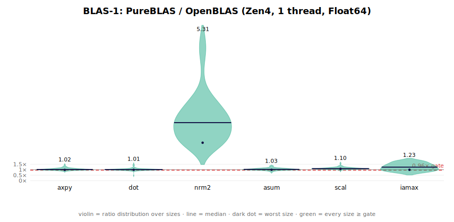

Bandwidth-bound; at parity fleet-wide (worst sizes ≥ 0.98, except `iamax` on AVX2 at 0.95).
`nrm2` runs 7–10× because OpenBLAS uses the always-scaled LAPACK algorithm; PureBLAS scales
only on overflow/underflow.

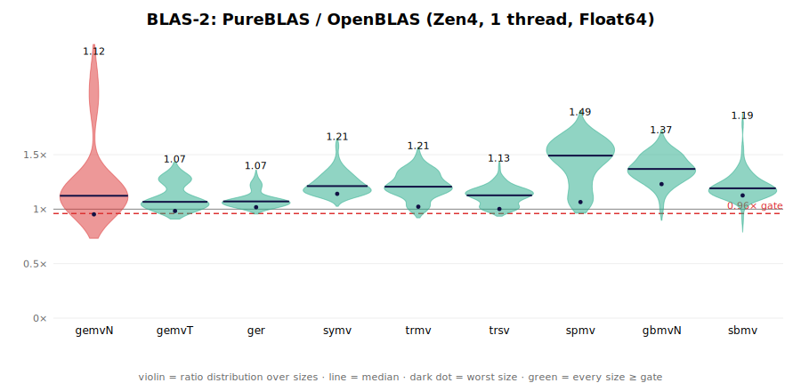

Gates fleet-wide with two exceptions, both on Zen5: `gemvN` (mid-n native-512 residual, worst
0.90) and `trmv`/`trsv` at large n (DRAM regime, worst 0.98–0.99). `spmv` is flat ≈ 1.9–2.2
across the fleet (AP-residency packed panel); `ger` sits at gate on all three boxes (worst
0.97–1.06) with a per-µarch-calibrated write-stream count.

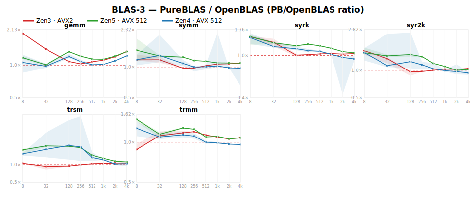

`gemm` gates every size on all three boxes (Strassen–Winograd at large n runs 1.2–1.4×). The
triangular/symmetric ops gate on AVX-512; on AVX2 the worst sizes of `trmm` (0.84) and `trsm`
(0.89) are still open.

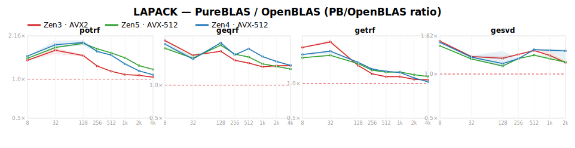

`potrf`/`geqrf`/`getrf`/`gesvd` gate on all three boxes (geomeans 1.25–1.52). The small-n `potrf`
campaign — block-small Cholesky plus a **fused** 12-accumulator `trsm`-R (downdate + triangular solve in
one register pass, in both the small-n and NB=128 panel drivers) — brings AVX2 `potrf` to **BLASFEO
parity** (the MKL proxy): 0.91–1.04× its column-major `dpotrf` at n≤224 and 0.87–0.91× at n≥256, and
1.5–2.2× vs OpenBLAS fleet-wide.

## Complex (ComplexF64): CL1 / CL2 / CL3 / complex LAPACK

The complex surface is SIMD across all levels, in portable SIMD.jl kernels (no x86 intrinsics);
the generic scalar path remains for AD.

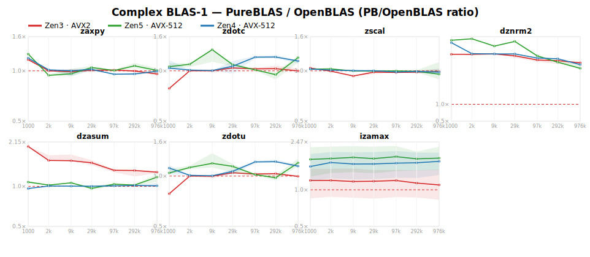

At parity or better fleet-wide. `dznrm2` is 7–9× (same scaled-accumulation story as real `nrm2`);
`izamax` 1.2–1.8×. The former AVX2 `zdotc`/`zdotu` small-n dip is closed by a parity-preserving fold
epilogue (shared with complex gemv-T/C). Residuals: `zaxpy` at the L3 edge (0.94–0.96) and `zdotc`/
`zdotu` on Zen5 at DRAM sizes (0.89–0.94, bandwidth).

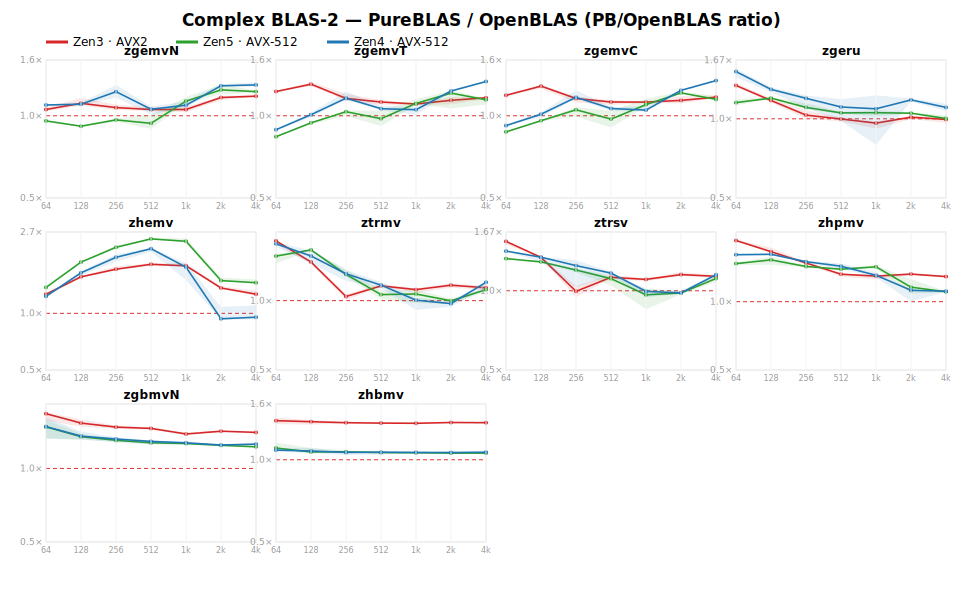

Gates broadly on all three boxes. The complex gemv-T/C small-n dip on AVX-512 (was 0.68–0.74 at
n=32) is closed by a parity-preserving fold epilogue (Vec{2W} deinterleave + two horizontal sums →
one halving fold to [Σeven,Σodd]); `zgemvN` on Zen5 (was ~0.91 across small/mid n) by sign-folding
the `ci` broadcast so the per-row epilogue drops an FMA-port op. `ztrsv`/`ztrmv` large-n on AVX-512
were closed (2048: 0.97→1.22) by routing the triangular off-diagonal scatter through the tuned `ri`
gemv — a stale branch had used the older row-tile kernel. Remaining shallow residuals: `ztrsv` n=1024
(~0.91, a coupled upper/lower-triangular tradeoff), `zgeru` mid-n and `zhemv` large-n (~0.97, near the
DRAM roofline), and `zgemvN` Zen5 at n=512.

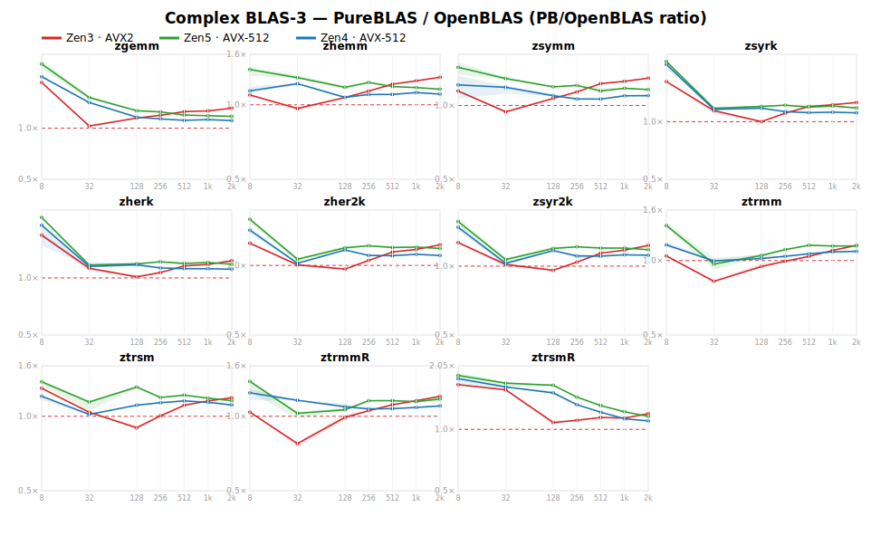

`zgemm` beats OpenBLAS fleet-wide (geomean 1.26–1.40; Karatsuba 3M at mid/large n). The
rank-k ops gate within a few percent. `@simd ivdep` on the complex microkernel's k-loop (4 FMA/cell)
helped the small-n complex trmm. The deepest AVX2 (Zen3) small-n dips remain open: `ztrmm`/`ztrmmR`
n=32 (~0.8), `ztrsm` 0.89 (n=128), and a `zsymm`/`zhemm`/rank-2k small-n dip (0.94–0.97) — materialize+
microkernel overhead on the small-n complex-L3 path. A direct-read fused-triangle base closed the trmm
dips in development but its runtime `Val` args broke trim-safety and it was reverted; the trim-safe
refix (compile-time `Val` dispatch) is a follow-up. (A non-po2-scratch attempt was also measured neutral
and reverted.)

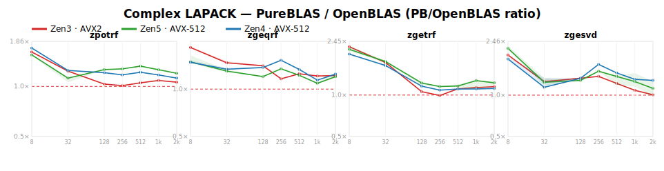

`zpotrf` gates fleet-wide. `zgetrf` **now gates fleet-wide** (was Zen3 worst 0.80): a rank-2
SIMD-`izamax` `getf2` panel, a derived complex block width, a base-32 crossover, and a po2-aliasing-dodge
scratch. The only residual is galen n=256 (0.94), localized to PB's complex gemm at the trailing
208×208×48 shape (a gemm-kernel gap, not a getrf-structure one). `zgeqrf` **gates at every size
fleet-wide** (1.07–1.83; was geomean 0.76–0.85): the complex trailing update was rebuilt to mirror the
real path (`herk` for VᴴV at half the flops + `trmm` for TᴴW), the reflector norm moved from per-element
`hypot` to SIMD `_nrm2`, the unblocked rank-2 panel runs while the matrix is L3-resident, and the AVX2
trailing update is chunked to bound the Karatsuba-3M scratch below ½L3. `zgesvd` — singular values only,
vs `zgesdd('N')` — **gates at every size** (real + ComplexF64): the large-n collapse was fixed by a
blocked complex bidiagonalization (zlabrd/zgebrd port), and the small-n floor by switching the values
path to **dqds** (`dlasq1–6`) — OpenBLAS's `gesdd('N')` uses the sqrt-free dqds recurrence, not
Golub–Kahan QR; matching it lifted n=32 from ~0.86 to ~1.07 (real *and* complex, since the bidiagonal is
real). ComplexF32 small-n (n=32/48 ≈ 0.9) is the remaining sub-gate, a `cgebrd` limit. `zgeqrf` was
validated on square inputs; tall/skinny QR is a separate benchmark shape.

## Numeric summary

The per-op numbers — **geomean (worst-size) ratio per op per µarch** — live in
[`bench/gen_table.md`](https://github.com/el-oso/PureBLAS.jl/blob/master/bench/gen_table.md).
That file is auto-generated from the fleet result caches by the same run that produces the
plots, with a provenance header (CPU model, code commit, timestamp per box), so it cannot
drift from the plots. It is the numeric source of truth; numbers are deliberately not
duplicated here.

## Where we are

**Zen4 (AVX-512, double-pumped).** The tuning target; gates essentially everywhere. Real
residuals are worst-size only (`syrk` 0.94, `syr2k` 0.97, `trmm` 0.97 — geomeans all ≥ 1.07).
Complex residuals are the shared LAPACK gaps plus small `zgemvT`/`zgemvC`/`ztrmv` worst-size
dips.

**Zen5 (AVX-512, native 512-bit).** Clears every AVX2 ceiling but shows a disjoint residual
profile — the reason the gate is per-machine. Open: `gemvN` mid-n (~0.90; the m-inner panel
that fixed Zen3/Zen4 regressed here and is gated off) and `trmv`/`trsv` in the DRAM regime at
n=4096.

**Zen3 (AVX2).** The hardest target: 16 ymm registers vs AVX-512's 32 zmm. Real surface gates
except `trmm`/`trsm` worst sizes; complex carries the widest residual set (`zdot`, `ztrmm`
both sides, `ztrsm`, `zgetrf`). The `potrf` small-n campaign (block-small Cholesky + a fused
12-accumulator `trsm`-R) reaches **BLASFEO column-major parity at n≤224** (0.91–1.04×), 1.5–2.2× vs OB.

**Known open items** (tracked in [`ROADMAP.md`](https://github.com/el-oso/PureBLAS.jl/blob/master/ROADMAP.md)):

- `gemvN` Zen5 mid-n (~0.90): needs a native-512 lever; no config fix found.
- `trmv`/`trsv` Zen5 n=4096 just under parity, and the Zen3 L2→L3 blocking edge at n=512.
- `hpmv` still per-column — port the spmv AP-residency panel to complex.
- `trsm`/`ztrsm` side-L remain the flagship AOCL gaps (4K power-of-two aliasing in the
  column-lane back-substitution); side-R (`trsmR`/`ztrsmR`) is now gate-measured and mostly clears.
- Real `geqrf` panel width is now hardware-derived (register-count floor `256/NVREG`, grown with
  the matrix vs L2) — it gates AOCL fleet-wide (worst ≥ 0.96), closing the former n=48 dip.
- Complex LAPACK: `zgeqrf` worst-size still just under gate on Zen5; `zgesvd` blocked-bidiagonalization
  port pending (values-only, capped at n=1024).
- Tuning-constant debt: several block-size literals remain to be re-derived as formulas over
  detected cache/register parameters.

Both consumption modes share one kernel set: the **native API** (`PureBLAS.gemm!(…)`,
AD-traceable) and the **LBT drop-in** `.so` (`@ccallable` ILP64 symbols via `juliac --trim`).

## vs AOCL — AMD's own Zen-tuned library (AOCL-BLIS + libFLAME)

OpenBLAS is the default oracle above; this section adds a **second, tougher baseline: AOCL**, AMD's
own optimizing library (AOCL-BLIS for BLAS, AOCL-libFLAME for LAPACK), hand-tuned for these exact Zen
chips. Everything here is **single-threaded** (BLIS pinned to one thread — verified: `dgemm` runs at
one-core throughput), boost-locked, same methodology; caches/SVGs carry an `_aocl` suffix and never mix
with the OpenBLAS artifacts. The plots below are **lite** (sizes capped at n=1024) — a fast pass that
covers the meaningful range; the summary numbers are from a size-controlled probe.

The AOCL binary is a genuinely optimized build, not a reference fallback: measured directly against
OpenBLAS, AOCL-BLIS `dgemm` matches it and AOCL-libFLAME `potrf`/`geqrf` **meet or beat** it (e.g.
geqrf 40 vs 30 GFlops) — a reference build would be slower, not faster.

Verified PB/AOCL at mid/large n (>1 = PureBLAS faster; wintermute Zen4, single-thread), alongside
PB/OpenBLAS for context:

| op | PB / OpenBLAS | PB / AOCL |
|---|---|---|
| gemm    | 1.05–1.11 | 1.08–1.24 |
| potrf   | 1.16–1.28 | 1.12–1.20 |
| geqrf   | 1.63–1.80 | 1.53–1.70 |
| getrf   | 1.14–2.24 | 1.59–1.78 |
| **trsm** (side-L)  | ~1.0    | **0.92–1.07** |
| **trsmR** (side-R) | 1.1–1.8 | 0.85–1.5      |

**PureBLAS matches-or-beats AMD's own library on gemm and every LAPACK factorization — real and
complex — by 5–80%.** The one residual vs AOCL is real **side-L `trsm` at mid-n** (worst-size
0.92–0.97): a codegen-scheduling gap on the fused-leaf kernel — the fused-back-substitution's
latency chain runs at ~2 IPC where BLIS's hand-scheduled assembly hides it — not a structural lever
(building AOCL's own packed-triangle structure in portable SIMD.jl lands at the same ~0.95). Side-R
`trsmR` (the potrf/getrf panel shape) PB *leads* overall (geomean 1.15–1.30); a former AVX2 `n=128`
dispatch dip (a batch-floor literal wrongly excluding square n≤128 from the fused panel, 0.74) is
fixed to 0.85. The former **small-n `gemm` dip** (~0.92× AOCL at
n≤256, where BLIS's lower packing overhead won) is now **closed** by a *direct-B microkernel* that skips
the B-pack entirely when B is contiguous in the k-index (col-major, no transpose) — dgemm now gates
**≥0.98× AOCL fleet-wide from n=128 up** (Zen3/Zen4/Zen5), with no large-n or OpenBLAS regression. AOCL
is a *mixed* competitor vs OpenBLAS, not uniformly tougher: its `geqrf` beats OpenBLAS (so `PB/AOCL <
PB/OpenBLAS` there — a smaller margin, the legit-competitor signature) while `getrf` trails it. This is
a single-thread comparison; AOCL is tuned first for multi-threaded EPYC, so on these single-thread Zen
parts it's a fair-but-not-dominant baseline.

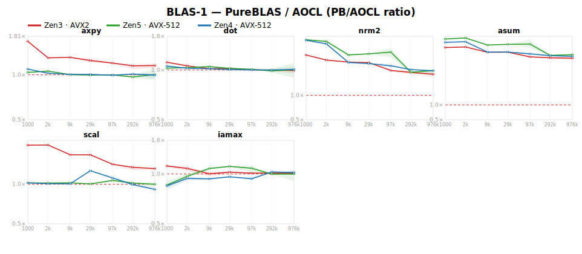
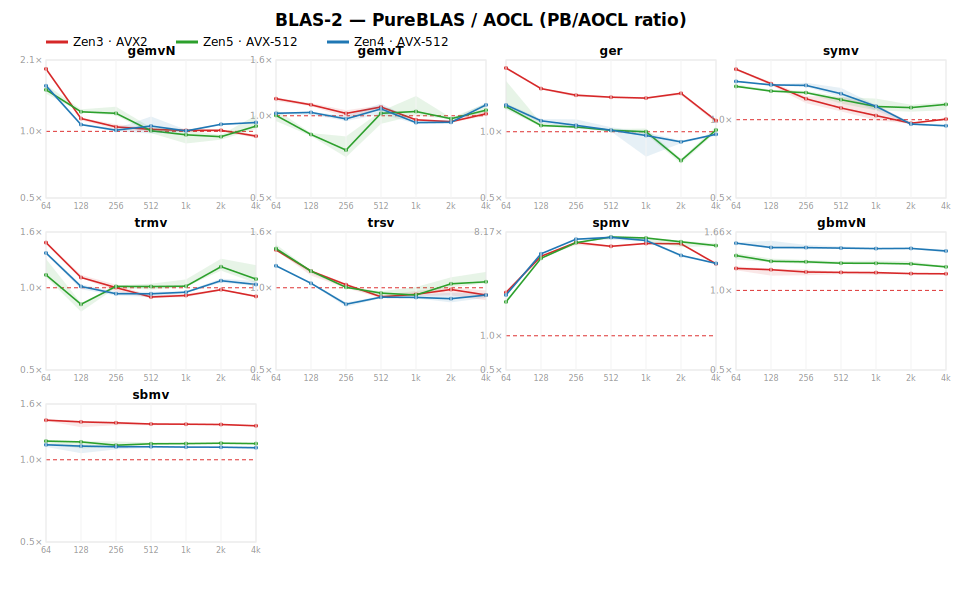
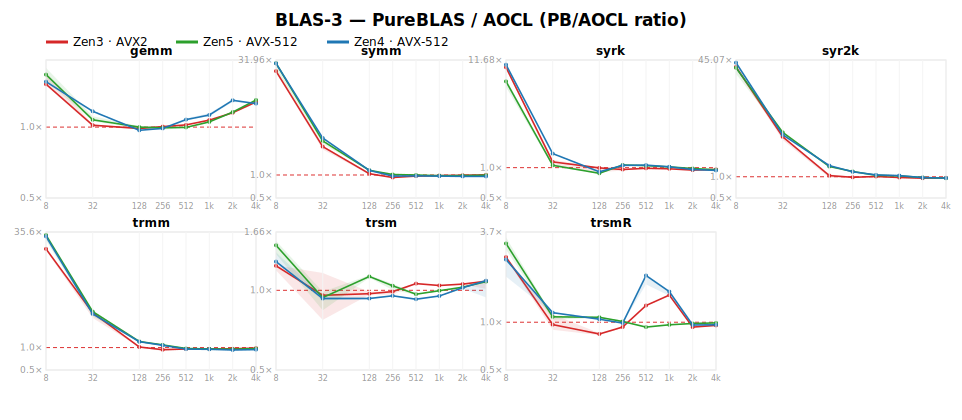
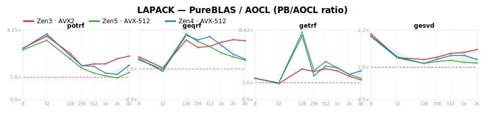
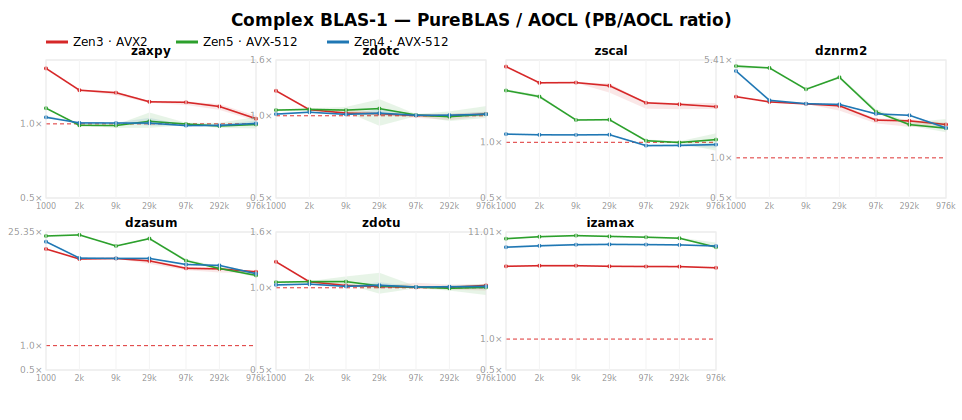
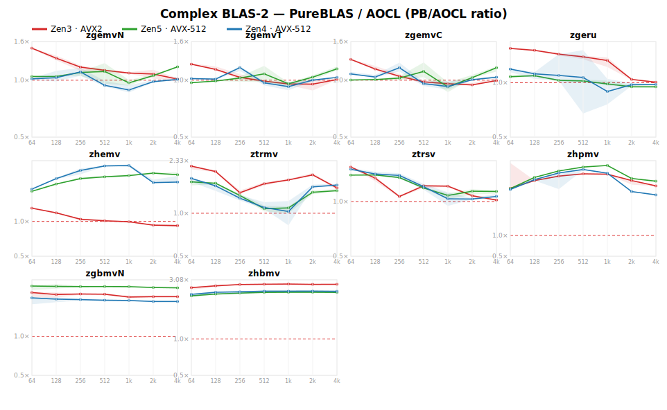
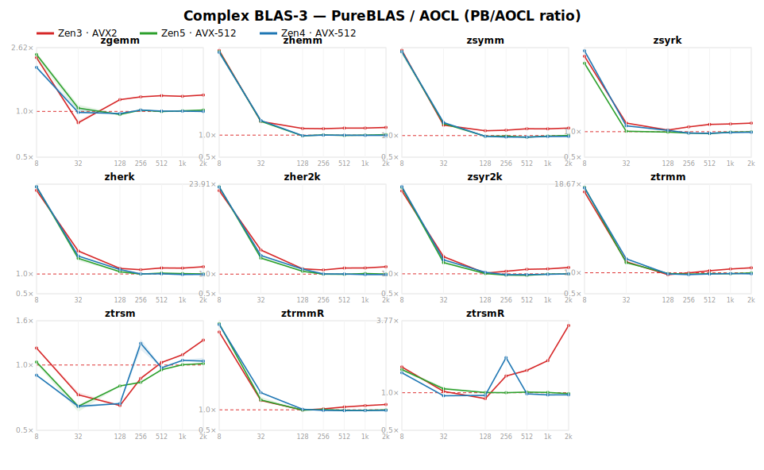
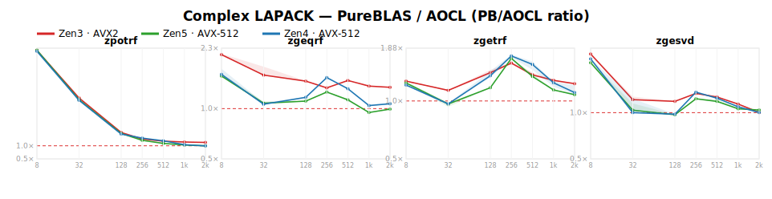

**Caveat on the small-n LAPACK ratios in the plots.** AOCL-libFLAME has heavy *per-call overhead* at
tiny n (e.g. `potrf`/`getrf` show 4–160× at n≤32), which flatters PureBLAS there — that is dispatch
overhead, not an algorithmic gap. The mid/large-n figures in the table are the honest signal. The
per-op numbers are generated to [`bench/gen_table_aocl.md`](https://github.com/el-oso/PureBLAS.jl/blob/master/bench/gen_table_aocl.md).

> **Freshness note (interim).** These AOCL plots use *freshly remeasured* Zen3 (galen) and Zen4
> (wintermute) caches (boost-locked); the Zen5 (neuromancer) line is from an earlier same-session run.
> The µarch labels are now stamped authoritatively into each cache header (`uarch=`), fixing a prior
> plot-labeling swap. A full same-commit fleet re-measure will follow.
