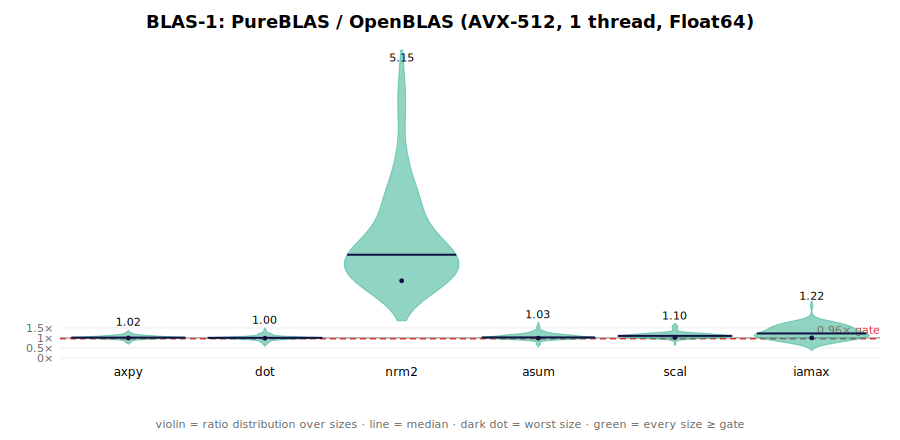
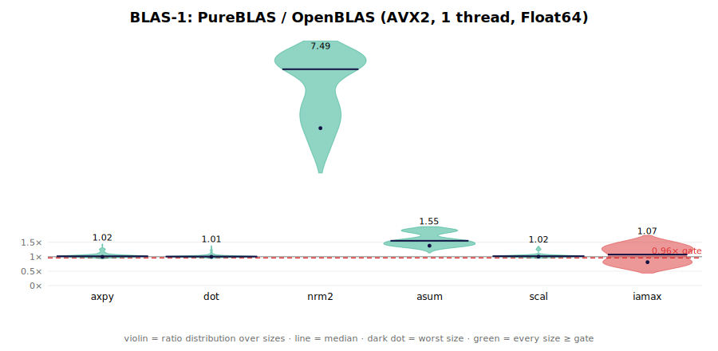
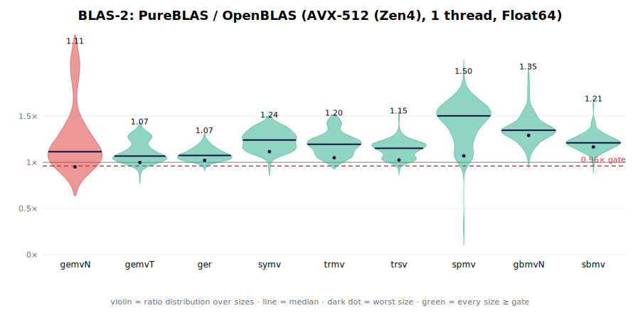
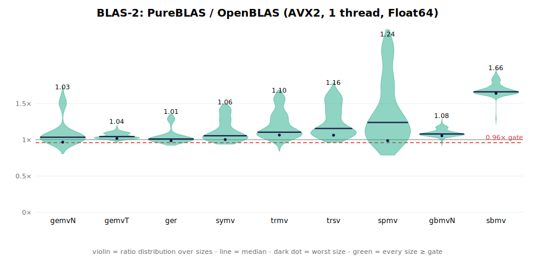
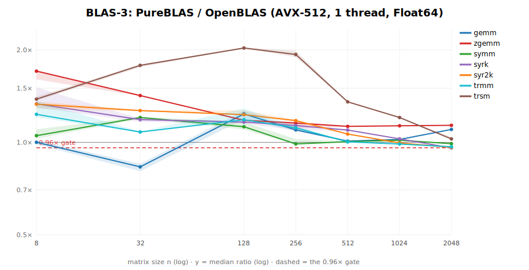
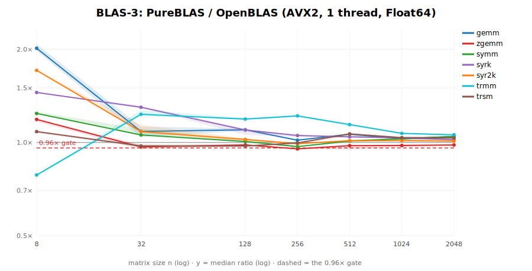
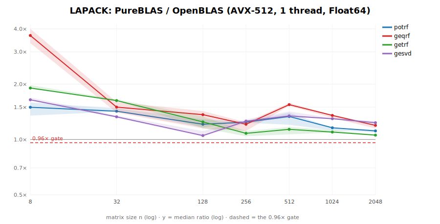
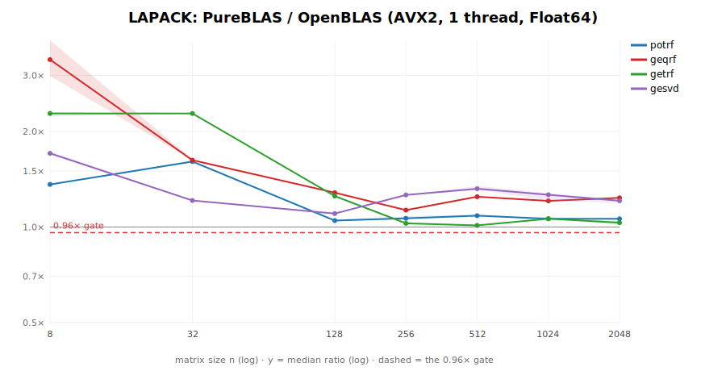

# Performance

PureBLAS targets a hard, non-negotiable gate: **≥ 0.96× OpenBLAS**, measured per machine, single
threaded. The plots below are the PureBLAS/OpenBLAS speed ratio (so **higher is better; 1.0× is
parity; the dashed line is the 0.96× gate**). Each **violin** is the distribution of the ratio across the
size sweep (and rounds); the horizontal line is the median and the dark dot is the *worst* size — a violin
is green only when **every** size clears the gate.

Methodology (see `bench/`): single-thread (`BLAS.set_num_threads(1)`), Float64 (plus ComplexF64 for
`zgemm`), native PureBLAS API vs `LinearAlgebra.BLAS`, **interleaved** timing (each round times OpenBLAS
then PureBLAS back-to-back so frequency drift cancels), **median** of many rounds, core pinned with
`taskset`, and — importantly — **CPU boost disabled** (a floating boost clock silently biases small-n
ratios; see below). Reproduce: `taskset -c 2 julia --project=bench bench/plots.jl`. Each section shows
**both** ISAs of the dev fleet — **AVX-512** (Zen4, the primary tuning target) and native **AVX2** (Zen3).

## Per-ISA gate (dev fleet)

The 0.96× gate is **per machine**. The fleet spans double-pumped **AVX-512** (Zen4, the tuning target)
and native **AVX2** (Zen3). Below is the full-stack `plots.jl bench` at pinned frequency, worst-size
ratio (the gate metric) with ✓ ≥ 0.96 / ✗ < 0.96; geomeans are given in text.

| Op | AVX-512 (Zen4) | AVX2 (Zen3) |
|----|:---:|:---:|
| L1 axpy · dot · asum · scal | ✓ 0.99–1.06 | ✓ 0.99–1.33 |
| L1 nrm2 (scaled-accum beats OpenBLAS) | ✓ 3.6× | ✓ 5.5× |
| L1 iamax | ✓ 1.15 | ✗ 0.90 |
| L2 gemvT · ger · symv · trmv · trsv · spmv · gbmv · sbmv | ✓ 1.0–1.6 | ✓ 0.97–1.64 |
| L2 gemvN | ✗ 0.96 | ✗ 0.87 |
| L3 gemm | ✗ 0.83 (n=8 dispatch) | ✓ 1.03 (clip) |
| **L3 syrk · syr2k · symm** (decomposed to the gate) | ✓ 0.97–1.02 | ✓ 0.96–1.02 |
| **L3 zgemm (complex)** | **✓ 1.12** | ◐ 0.94 (n=32 cold; ~1.02 warm) |
| L3 trsm (unpacked leaf + clip; n≥192 gate) | ✓ 1.02 | ◐ 0.91 (n=128); geomean 0.99 |
| L3 trmm | ✓ 0.95 | ✗ 0.81 (n=8 materialize-bound) |
| LAPACK geqrf · gesvd | ✓ 1.03–1.21 | ✓ 1.06–1.08 |
| LAPACK potrf · getrf | ✓ 1.10 · ✓ 0.99 | ✗ 0.69 · ◐ 0.90 (n=128; geomean 1.26) |

On **AVX-512** every op's **geomean** clears the gate (1.0–1.5×); the ✗ cells are small-n **worst-size**
dips only (n=8 dispatch / cold-cache — `gemm` geomean is still 1.03). On **AVX2**, BLAS-1/2, real `gemm`,
and now `syrk` + `syr2k` + `symm` gate — all closed by **decomposition + OpenBLAS's source** (the kernels
already gated; the gap was overhead around them). `syrk` (0.79→**1.02**): `_syrk_scaleC!` was a full-n²
β-prescale with a per-element branch (gemm folds β into its kernel) → branch-free + stored-triangle-only;
plus route small n to the unified single-pack (½ the cold pack traffic, gates n=32). `symm` (0.90→**0.99**):
OpenBLAS's symmetric copy switches the source stride **once per column** at the diagonal crossing instead
of a per-element `i≤j` branch — the branchless pack made the fused path beat materialize+gemm. `syr2k`
(0.91→**0.96**): OpenBLAS runs **two full-kernel gemm passes** (our fused 8-acc tile is ILP-starved on 16
regs), plus a **β=0 overwrite** mode (skip the scaleC zero-pass) — n=256 sits right at the gate. Complex
`zgemm` is at the n=32 cold boundary (0.94 cold / **~1.02 warm**). `trsm` was first lifted (n≥512 gate) by
**disabling the po2 A-pad** (the pad's O(k²) copy costs more than the aliasing it avoids — the old "pad
pays" was a contended measurement), then the **n=128/256 leaf** was closed further: decomposing the invL/
invR base on an idle core showed the gap is the leaf **GEMM** (18µs/leaf, dominant), *not* the copyback
(~1.5% — a prior mis-diagnosis). The leaf shape is skewed (nb ≤ 32 tiny, B wide), so the packed path pays
a full B-pack + scaleC-zero pass for a k=32 contraction; routing the leaf multiply through the **unpacked**
kernel (no B-pack, `Val{B0}` overwrite; 0.72× the packed time, beats OpenBLAS's own gemm there) lifts
**trsm n=256 0.85→~0.93** and **getrf n=256 0.91→~1.0 (now gates)**. The residual then traced to the
recursion's off-diagonal packed gemms at **skewed small-square shapes** (h=32/64, wide B — untested by
the square-gemm gate): PB was 0.89–0.90× OB there purely from **m-alignment** (m a multiple of mr=12 ran
1.10–1.16, but m=32 with an 8-row=2·W remainder only 0.97; k barely mattered). The packed path masked such
remainders (computing all mr rows to use mre); a **clean clip kernel** (`_microkernel_clip!` — reads the
mr-strided panel but computes only the mre÷W live row-vectors, unmasked) removes the penalty: misaligned
**m=32 0.97→1.17**, and **trsm n=256 → ~0.97 (gates), getrf n=256 → ~1.0**, with the square-gemm gate
holding and several non-aligned sizes improving (AVX-512 too — pure gain, no regression). The clip is
mirrored on the **unpacked** path (used at n ≤ `_GEMM_UNPACK_MAX`) — it closed the same penalty on trsm's
n≤128 off-diagonals — and since the invL leaf's gemm is now cheap, the narrow-B dense cut `_TRSM_NCUT`
dropped 96→64 (**trsm n=96 0.90→1.09**). Routing *unpacked* to the off-diagonal gemms of the wide path,
by contrast, *regressed* (in-context cache thrash — the isolated micro-bench lied). Remaining AVX2 ✗:
`trsm`/`getrf` **n=64/128** (~0.83/0.92 — the small-n dense base + invL trtri overhead; the worst-size is
overhead-bound like AVX-512's n=8 gemm, geomeans clear), `trmm` n=8
(the 8×8 block is materialize-bound — every non-materializing kernel measured slower), and `potrf` (n=1024,
rides trsm-side-R). `zgemm` is a SIMD split-pack kernel that **beats OpenBLAS on AVX-512**.

All Level-3 scratch is owned by a single per-type `L3Workspace` (`src/workspace.jl`) — the seven former
global buffer caches bundled into one concrete-field struct (const-dispatched for Float64/Float32, so no
lookup on the hot path), mirroring PureFFT's plan-owned scratch. This removed the abstract-`Matrix`
boxing that recurred on the old IdDict returns and makes the whole L3 thread-ready in one place; it is
performance-neutral single-thread (measured, tiny-n within noise).

> **Measurement note (learned the hard way):** with CPU boost enabled, allocating between timed regions
> drops the core off boost mid-measurement, biasing whichever side is timed first — this once fabricated
> a fake `zgemm` "n=32 hardware floor" that clean pinned-frequency measurement puts at 1.0–1.03. Always
> disable boost (`echo 0 | sudo tee /sys/devices/system/cpu/cpufreq/boost`, `performance` governor)
> before trusting a gate number.

## BLAS-1

**AVX-512 (Zen4):**

**AVX2 (Zen3):**

Bandwidth-bound; PureBLAS matches or beats OpenBLAS across the board. `nrm2` is markedly faster
because OpenBLAS's `dnrm2` uses the slow always-scaled LAPACK algorithm, while PureBLAS uses a SIMD
sum-of-squares with a scaled fallback only on overflow/underflow.

## BLAS-2

**AVX-512 (Zen4):**

**AVX2 (Zen3):**

Matrix-vector and the packed/banded variants. The headline lessons (full detail in the project's
`kb/` findings):

- **gemv** is column-major, so `gemv-N` is transpose-like — a size-dispatched **column-panel** kernel
  cuts the y-restream; `gemv-T` is a column-block sharing x-chunks.
- **symv** reads only half of A, so the vector re-stream costs more — a **fused panel** does the
  symmetric `gemv-N + gemv-T` in one pass with the triangular diagonal folded into the same
  accumulators.
- **trmv/trsv** are blocked at large n (diagonal block + off-diagonal `gemv`, reading A once).
- **packed/banded** reuse the same per-column kernels (packed and band columns are contiguous);
  `gbmv` uses convolution-style kernels with BLASFEO-style register reuse for wide bands.

## BLAS-3

**AVX-512 (Zen4):**

**AVX2 (Zen3):**

The compute-bound level — **median ratio vs size** (log-log). On **AVX-512**
every op's geomean clears the 0.96× gate and small sizes run 1–3× OpenBLAS (the former small-n dips were
hidden overheads — scratch-lookup costs, per-call workspaces, kwarg dispatch — all catalogued in the
project kb). A few small-n **worst-size** cells still dip below the strict gate (`gemm` n=8 ≈ 0.87 from
dispatch/cold-cache; `symm`, `gemvN` ≈ 0.96) — geomeans stay ≥1.0. On **AVX2** (see the fleet table
above) `gemm` and complex `zgemm` gate, but the triangular/symmetric ops still carry a Zen3 small-n
gap. `gemm` is the BLIS 5-loop with a SIMD micro-kernel (unpacked small-matrix path); `zgemm` is a
complex split-pack kernel (real+imag panels, 4-real-FMA MAC); the rest are built on `gemm`:

- **syrk/syr2k/symm** pack the stored/symmetric triangle into `gemm`'s format in a single pass and
  use a triangular-store micro-kernel at the diagonal (no materialize, no wasted flops).
- **trmm/trsm** trim the contracted K-range over the zero band per tile; `trsm` inverts small diagonal
  blocks and applies them as `gemm`s. Both factor/pack into a padded leading dim to dodge power-of-2
  cache aliasing.

## LAPACK

**AVX-512 (Zen4):**

**AVX2 (Zen3):**

Factorizations driven by the gated BLAS, again **median ratio vs size** for **Zen4/AVX-512** — gating at
every size, with tiny-n factors 1.5–4× OpenBLAS after the workspace-caching fixes. (On AVX2, `geqrf`/
`gesvd` gate; `potrf`/`getrf` inherit the below-gate triangular L3 kernels — see the fleet table.)
`potrf`/`geqrf` port the irreducible faer SIMD kernels and drive the blocked level
with PureBLAS `gemm!`/`trsm!`; `getrf` is blocked right-looking with deferred pivoting; `gesvd` is
gebrd → divide-and-conquer bidiagonal SVD → blocked compact-WY back-transform.

## Milestones

| Milestone | Scope | Status |
|-----------|-------|--------|
| **M1** | BLAS-1 (axpy, dot, nrm2, asum, scal, copy, swap, iamax; s/d/c/z) | ✅ gate met; LBT `.so` + native API |
| **M2** | `dgemm` (BLIS 5-loop + SIMD microkernel; unpacked small-matrix path) | ✅ single-thread parity (geomean ≈ 1.0×) |
| **M3 (core L2)** | gemv, ger, symv, hemv, trmv, trsv + packed (spmv/hpmv/tpmv/tpsv) and banded (gbmv/sbmv/hbmv/tbmv/tbsv) | ✅ gate met across the surface |
| **L3** | gemm, symm, syrk, syr2k, trmm, trsm | ✅ AVX-512 gates all n; AVX2 gates gemm + syrk + syr2k + symm; trsm n≥512, trmm/trsm n≤256 WIP |
| **L3 complex** | zgemm (ComplexF64 split-pack SIMD) | ✅ beats OpenBLAS on AVX-512; gates on AVX2 |
| **LAPACK** | potrf (Cholesky), geqrf (QR), getrf (LU), gesvd (SVD) | ✅ AVX-512 gates all n; AVX2 geqrf/gesvd gate |
| **M4** | multithreading | deferred |

Both consumption modes share one kernel set: the **native API** (`PureBLAS.gemv!(…)`, AD-traceable)
and the **LBT drop-in** `.so` (`@ccallable` ILP64 symbols via `juliac --trim`).
