# Performance

The gate: **≥ 1.0× OpenBLAS, per machine, single-threaded** (0.96× is the older floor and is
still drawn on the plots). All plots show the PureBLAS/OpenBLAS speed ratio — higher is better,
1.0 is parity.

The dev fleet is three machines, gated independently (tuning for one µarch does not transfer):

- **Zen4** (`wintermute`) — double-pumped AVX-512; the primary tuning target.
- **Zen3** (`galen`) — AVX2 (16 ymm registers); the hardest target and current campaign focus.
- **Zen5** (`neuromancer`) — native 512-bit AVX-512; clears the AVX2 pain points but has its own
  disjoint residuals.

**How the plots read:** one panel per op, the three µarchs overlaid as ratio-vs-size curves.
The grey line is 1.0 parity (the gate), the dashed line the 0.96 floor; the band on each curve
is the q10–q90 spread of the pooled per-round ratios.

**Methodology** (`bench/plots.jl`): single-thread (`BLAS.set_num_threads(1)`), native PureBLAS
API vs `LinearAlgebra.BLAS`, Float64 plus the full ComplexF64 surface. Each (op, size) is
measured over repeated rounds of ABBA-alternated windows; per-round ratios are pooled and the
median is the reported number. Runs are only valid at locked frequency — a floating boost clock
drifts between the two windows and fabricates ratios. Reproduce:

```
sudo bench/fleet_freqlock.sh lock       # passive governor, boost off, pin to base clock
taskset -c N julia --project=bench bench/plots.jl bench
```

## Real: BLAS-1 / BLAS-2 / BLAS-3 / LAPACK

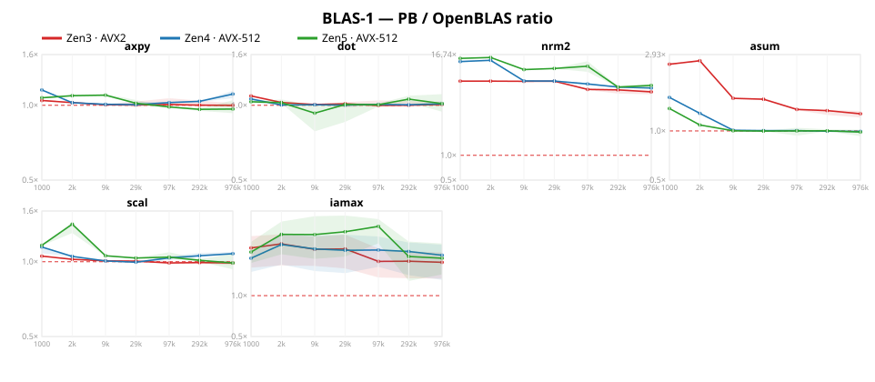

Bandwidth-bound; at parity fleet-wide (worst sizes ≥ 0.98, except `iamax` on AVX2 at 0.95).
`nrm2` runs 7–10× because OpenBLAS uses the always-scaled LAPACK algorithm; PureBLAS scales
only on overflow/underflow.

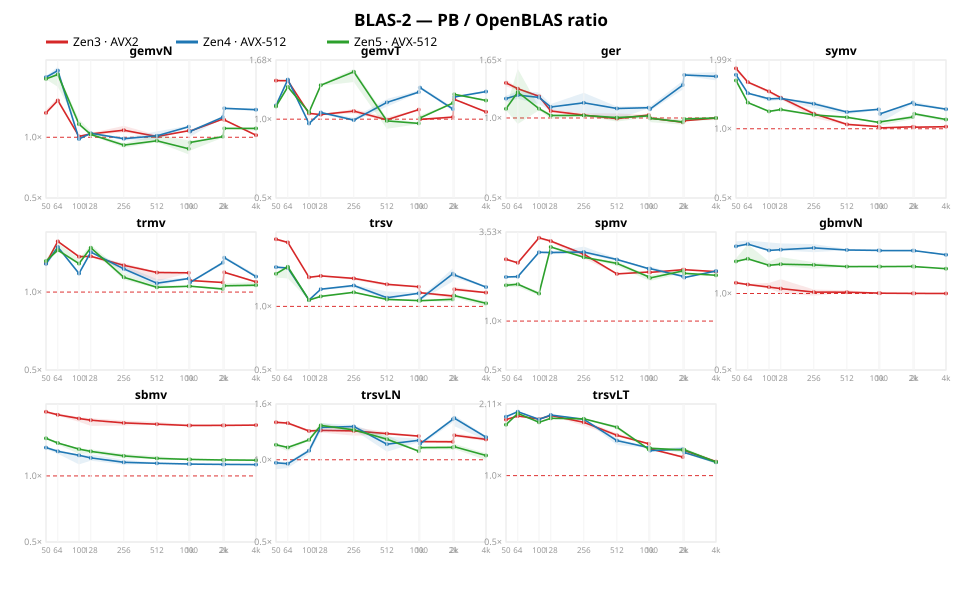

Gates fleet-wide with two exceptions, both on Zen5: `gemvN` (mid-n native-512 residual, worst
0.90) and `trmv`/`trsv` at large n (DRAM regime, worst 0.98–0.99). `spmv` is flat ≈ 1.9–2.2
across the fleet (AP-residency packed panel); `ger` sits at gate on all three boxes (worst
0.97–1.06) with a per-µarch-calibrated write-stream count.

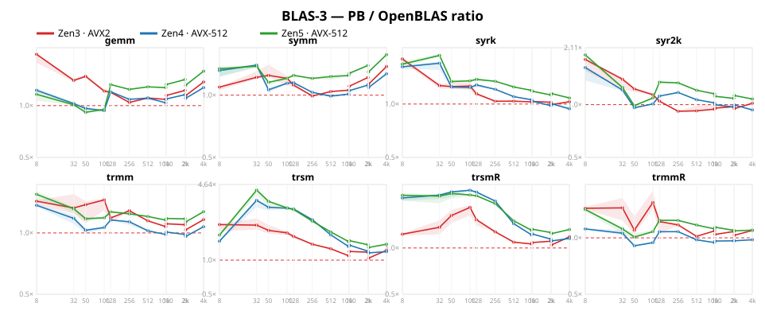

`gemm` gates every size on all three boxes (Strassen–Winograd at large n runs 1.2–1.4×). The
triangular/symmetric ops gate on AVX-512; on AVX2 the worst size of `trmm` (0.84) is still open,
while `trsm` now gates against OpenBLAS at every size on both available boxes (AVX2 worst 1.14).

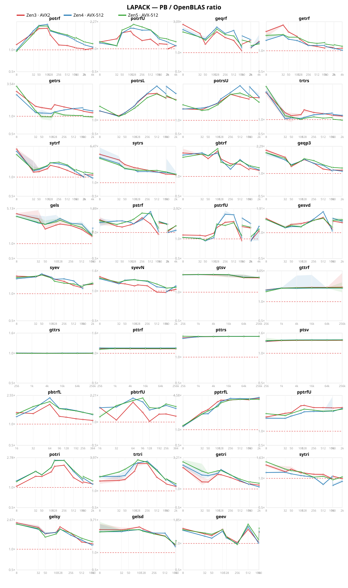

`potrf`/`geqrf`/`getrf`/`gesvd` gate on all three boxes (geomeans 1.25–1.52). The small-n `potrf`
campaign — block-small Cholesky plus a **fused** 12-accumulator `trsm`-R (downdate + triangular solve in
one register pass, in both the small-n and NB=128 panel drivers) — brings AVX2 `potrf` to **BLASFEO
parity** (the MKL proxy): 0.91–1.04× its column-major `dpotrf` at n≤224 and 0.87–0.91× at n≥256, and
1.5–2.2× vs OpenBLAS fleet-wide.

`potrf` is gated for **both triangles**. That is worth stating because it was not always true: the
benchmark harness passed `uplo='L'` to the `potrf`/`zpotrf` rows, so the upper path — a different route
(transpose into a padded scratch, factor with the gating lower kernels, transpose back) rather than a
mirror image — went unmeasured. Adding `potrfU`/`zpotrfU` rows surfaced a real miss at large `n`, whose
cause was the same power-of-two-`lda` cache-set aliasing that the factorizations already defend against,
this time inside the *copy*: the transpose read `A` strided across a row at its raw `lda`, and at
`lda·sizeof(T) % 4096 == 0` — precisely the benchmarked sizes — every column maps into one L1 set group.
Reordering the loops so the contiguous side is the read and the strided side is the (non-power-of-two)
scratch is bit-identical and worth 2.1–3.8× on the copy, taking real `potrfU` from 0.96 to 1.03 vs AOCL
on Zen4 and 0.98 → 1.04 on Zen3. Complex `zpotrfU` still sits at 0.95 for `n ≥ 1024` on Zen4 (it gates on
Zen3): the two transposes are the entire remaining gap — remove them and PureBLAS would be 3.4% *ahead*
of AOCL — but they cannot simply be deleted, since factoring the upper triangle natively measures slower
than the transpose route at every size and type.

### Tridiagonal

`gtsv`, `gttrf`, `gttrs`, `pttrf`, `pttrs`, `ptsv` gate `≥ max(OpenBLAS, AOCL)` on **all three µarchs**,
every result bit-identical to the reference. Worst-case vs AOCL: `gtsv` 1.20–1.22, `gttrf` 1.51–1.54,
`gttrs` 1.03–1.06, `pttrf` 1.11–1.12, `ptsv` 1.04–1.05; vs OpenBLAS the same ops run 1.31–1.57 and
`pttrs` 1.67–1.73.

These are `O(n)` serial three-term recurrences, so the limit is a divide→multiply→subtract **latency
chain** (~19.5 cyc/elem on Zen4), not flops — and every lever was about how data moves *around* that
chain rather than about the arithmetic. Three cost roughly 10 cyc/elem each: a live `fadd x, 0.0` left on
the real path of a complex-shaped expression (LLVM may only fold it under `nsz`, since `x + 0.0` is not
an identity for `x = -0.0`); re-reading a recurrence variable the previous iteration just stored; and a
per-element inner loop with a *runtime* trip count. A fourth, an extra store stream, cost 10.1 and was
hoisted into a bulk pass priced at 0.3. Unusually for this project these fixes **transfer across
µarchs** — they are properties of the generated code, not cache- or ISA-dependent tuning.

`pttrs` is the one cell at parity rather than above it (0.99 vs AOCL). Both libraries run at
~12.2 cyc/elem, which is exactly the analytic bound: the forward sweep's recurrence is
multiply+subtract (~6 cyc) and the backward sweep's divide sits *off* the chain, since `B[i]/D[i]` does
not depend on `B[i+1]`. Register-carrying the recurrence and hoisting the `uplo` test out of both loops
were each measured and are neutral — LLVM already does both.

### Triangular solves and the narrow-B `trsm`

`A \ b` with a **single** right-hand side — the most common solve there is — ran **14× slower than
OpenBLAS** until 2026-07-29. It had never been measured: `getrs`/`potrs`/`trtrs` existed only as
C-ABI shims, and the benchmark harness compares `PureBLAS.foo!` against `LAPACK.foo!`, so with no
native entry point there was nothing to call. Adding one turned up three separate defects, all in
`trsm` rather than the solves:

1. **The blocked setup is never repaid for narrow B.** It costs `O(k·nb²)` — a triangular inverse of
   the diagonal blocks — amortised over B's columns. Measured at k=1024: 1123 µs at `nrhs=1` and
   1197 µs at `nrhs=8`, i.e. eight solves for the price of one. Narrow B now sweeps `trsv`
   per column, which beat OpenBLAS's own `trsm` by 2.9× on that shape.
2. **A po2-`lda` A-pad that never paid.** When `stride(A,2)` was a power of two, all of A was copied
   into an odd-`ld` scratch to dodge cache-set aliasing — `O(k²)` work, charged even to a
   single-column B. Measured across **all sixteen** combinations of side × uplo × transA × B-width:
   it cost between **+3% and +357%** and won nowhere, including at square B, where removing it
   slightly *improved* the gate cell. Deleted.
3. **A ragged SIMD lane costs a full lane.** The kernel processes B's columns in `W`-wide lanes, so
   a partial lane is charged as a whole one. At k=512: `nrhs` = 1…7 cost 96/180/278/381/464/543/675 µs
   — about 95 µs *per column* — while `nrhs=8` cost 94 µs in total. Widening a ragged B into scratch
   before the solve collapses that (2.9–6.8× at k=512). This is the same defect the *upper* fused
   leaf had, fixed there in an earlier campaign; it survived in the lower/notrans path, which is
   exactly the one `getrs`/`potrs` use — hence `nrhs=1` being the worst case of all.

Result, Zen4 vs OpenBLAS, `nrhs=1`, n = 8…2048:

| | 8 | 32 | 64 | 128 | 256 | 512 | 1024 | 2048 |
|---|---|---|---|---|---|---|---|---|
| `getrs` before | 0.817 | 0.479 | 0.389 | 0.276 | 0.268 | 0.092 | **0.072** | 0.113 |
| `getrs` after | 1.142 | 1.013 | 1.084 | 1.095 | 1.036 | 0.994 | 0.984 | 1.162 |
| `potrs` after | 1.157 | 0.980 | 1.196 | 1.667 | 2.470 | **4.550** | **4.913** | 4.120 |

A residual remains at `nrhs = 8`, which falls between the two mechanisms — too wide for the
per-column sweep, and on Zen3 (`W=4`) already two full lanes, so the ragged-tail fix does not reach
it either.

The threshold guarding the sweep is worth recording as a tuning lesson: it was first written as
`nrhs ≤ k/(4·_TRSM_DBASE)`, on the reasoning that a larger `k` amortises the setup over more columns.
That was the wrong **shape** — blocked costs `setup + nrhs·b`, the sweep costs `nrhs·v`, and all three
terms scale as `k²`, so the crossover is **`k`-invariant**. The growing rule selected the sweep
exactly where it loses, and was itself the cause of the `nrhs=8` misses it was meant to fix.

## Complex (ComplexF64): CL1 / CL2 / CL3 / complex LAPACK

The complex surface is SIMD across all levels, in portable SIMD.jl kernels (no x86 intrinsics);
the generic scalar path remains for AD.

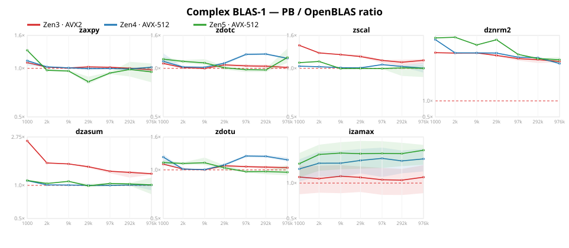

At parity or better fleet-wide. `dznrm2` is 7–9× (same scaled-accumulation story as real `nrm2`);
`izamax` 1.2–1.8×. The former AVX2 `zdotc`/`zdotu` small-n dip is closed by a parity-preserving fold
epilogue (shared with complex gemv-T/C). Residuals: `zaxpy` at the L3 edge (0.94–0.96) and `zdotc`/
`zdotu` on Zen5 at DRAM sizes (0.89–0.94, bandwidth).

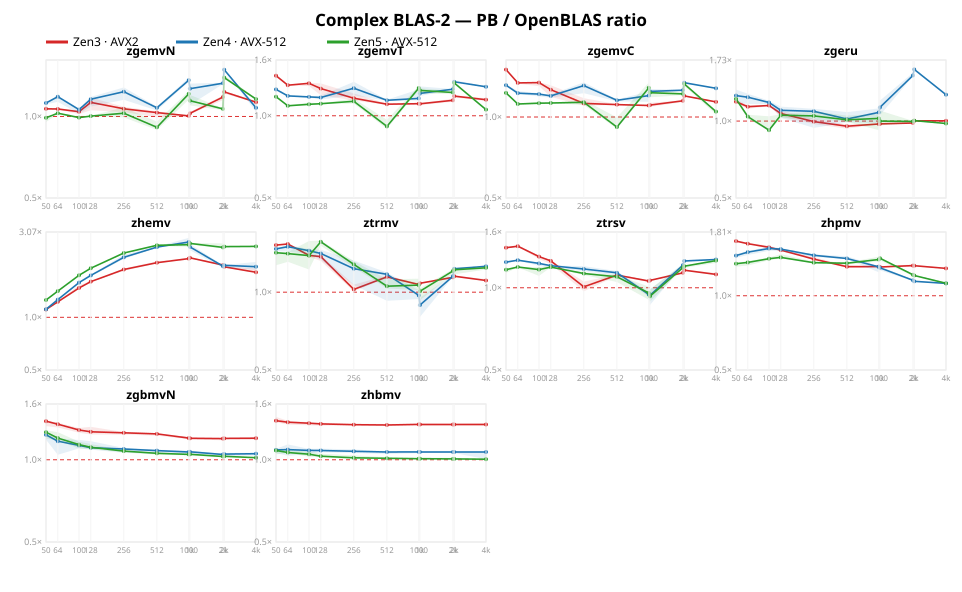

Gates broadly on all three boxes. The complex gemv-T/C small-n dip on AVX-512 (was 0.68–0.74 at
n=32) is closed by a parity-preserving fold epilogue (Vec{2W} deinterleave + two horizontal sums →
one halving fold to [Σeven,Σodd]); `zgemvN` on Zen5 (was ~0.91 across small/mid n) by sign-folding
the `ci` broadcast so the per-row epilogue drops an FMA-port op. `ztrsv`/`ztrmv` large-n on AVX-512
were largely closed (n=2048: `ztrmv` 1.13 Zen4 / 1.17 Zen5, `ztrsv` 1.12 Zen5 and 0.99 Zen4) by
routing the triangular off-diagonal scatter through the tuned `ri`
gemv — a stale branch had used the older row-tile kernel. Remaining residuals cluster at **n=1024** on
the AVX-512 boxes: `ztrsv` (0.948 Zen4, 0.936 Zen5) and `ztrmv` (0.948 Zen4) — a coupled upper/lower-
triangular tradeoff — alongside the complex gemv trio `zgemvN`/`zgemvT`/`zgemvC` (0.848–0.877 Zen4,
0.935–0.951 Zen5). `zgeru` dips mid/large-n (0.817 Zen4 at n=1024, 0.857 Zen5 at n=4096), and `zhemv`
misses only on Zen3 at large n (0.919 at n=2048, near the DRAM roofline) while gating 1.9–2.5× on both
AVX-512 boxes.

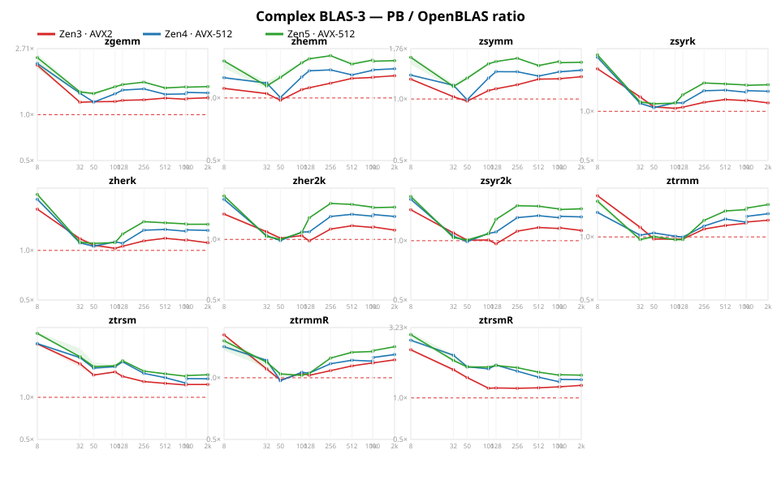

`zgemm` beats OpenBLAS fleet-wide (geomean 1.26–1.40; Karatsuba 3M at mid/large n). The
rank-k ops gate within a few percent. `@simd ivdep` on the complex microkernel's k-loop (4 FMA/cell)
helped the small-n complex trmm.

**`ztrsmR` (complex side-R) improved at every size on 2026-08-11**, and the cause was codegen rather
than blocking or cache. Four cells crossed into PASS — Zen4 n=32 0.974→1.196 and n=128 0.933→1.022,
Zen3 n=32 0.829→1.091 and n=256 0.975→1.111 — and the fleet's worst complex-BLAS-3 cell, Zen3 n=128,
went **0.768→0.926**. The cell was first *attributed*: it fits `1/GF = α + β/n` with an 83.5 GF
asymptote (predicting n=192 to 0.2%), so it was a 14% per-call fixed cost, not a size-specific
conflict; sum-of-parts came to 99.7% of the call, and PB's own `zgemm` is flat at ~42.6 GF from k=48
to k=512 (≈95% of Zen4's double-pumped AVX-512 ceiling), which left the register-tile leaf as the
whole target. Inside it, the update was written `muladd(V2(-cr), xv, …)` — the negation sitting on the
*scalar* coefficient between its load and its splat, which blocks both the `vfnmadd` opcode and
AVX-512's embedded broadcast `(mem){1to8}`. LLVM therefore emitted `vmovsd` + `vxorpd` +
`vbroadcastsd` per coefficient: 96 instructions of coefficient preparation against 64 useful FMAs.
Negating the B vector once per step instead is exact (`nswap(-v) == -nswap(v)`, so the swapped operand
needs no separate handling) and takes the loop from **2.95 to 1.96 instructions per useful FMA**, with
residuals identical to the last digit. Four cheaper hypotheses were falsified first — power-of-two
`lda`/`ldb`, a wider column block, load-slot pressure, and tile-loop interchange — and the same rewrite
applied to the complex *side-L* slab compiled byte-identical, because LLVM had already chosen `vfnmadd`
there on its own. Remaining: Zen3 n=128 (0.926) and Zen4 n≥512 (~0.99).

The complex `trmm` small-n dips were partly closed by a dispatch fix. `_uker_cmplx!` takes a `FULL`
flag that selects unmasked A-loads and unmasked stores, and the two small-`trmm` drivers hardwired it
off on every branch — so every tile ran masked even when full, which at these sizes is *every* tile.
Dispatching it the way the gemm sweep always has is worth **+16.7%/+13.1%** at n=8/32 on Zen3 and
**+0.4%/+3.6%/+3.8%/+2.7%** at n=8/32/48/128 on Zen4 (measured in one process with the arms
alternated and verified bit-identical). `n=8` now gates on both microarchitectures for both ops, and
Zen4 `ztrmmR` n=128 crossed AOCL (0.976 → 1.003). The split follows the ISA — a masked op is
`vmaskmovpd` on AVX2 and k-register predication on AVX-512 — though the residual Zen4 gain is not
fully explained by that alone.

What remains open on this path is smaller than the raw ratios suggest, and separating the two took a
second measurement. A targeted single-op run and a full sweep — same code, both with every arm inside
one run — disagreed by 3–4% at n=32 (`ztrmm` 0.933 vs 0.903, `ztrmmR` 0.871 vs 0.839), which is the
regime difference between measuring an operation alone and measuring it in sequence with the rest of
the suite. The full sweep is the canonical artifact, so those are the numbers quoted here. More
importantly, `bench/gate_gaps.jl` reports each cell's shortfall against its own round-to-round spread:

- `ztrmmR` n=32 on Zen3 — 0.839, a 16.3% gap against a 0.047 spread. **Real.**
- `ztrmm` n=128 on Zen3 vs AOCL — 0.917 at a spread of 0.003, the most tightly measured miss in the
  whole table. **Real**, and on the *packed* path, which the dispatch fix provably never reached (its
  control read exactly 1.000).
- `ztrmm` n=32 on Zen3 — a 9.5% shortfall against a **0.115** spread. That cell is *within spread*: it
  needs more rounds, not engineering, and optimising against it would be optimising against
  measurement error.

Also still open, and outside their spreads: `ztrsm` 0.89 (n=128) and a `zsymm`/`zhemm`/rank-2k small-n
dip — materialize+microkernel overhead on the small-n complex-L3 path.

That residual has since been decomposed rather than guessed at. Holding `k` at 32 and varying only the
number of columns of `B` separates per-call cost from per-column cost through the public entry point,
by fitting `1/GF = a·(1/c) + b`. At the gate shape `ztrmm` carries **15.9%** fixed per-call cost, while
`zgemm` at the same `k` — same kernel family, no triangle — carries **0.7%** and holds its rate flat to
within 0.8% across its whole sweep. Shared BLAS-3 entry cost is therefore negligible, and essentially
all of `trmm`'s fixed cost is the O(k²) triangle materialize. A direct-read fused-triangle base closed
the trmm dips in development but its runtime `Val` args broke trim-safety and it was reverted; the
trim-safe refix (compile-time `Val` dispatch) is the follow-up, and this puts its value at about 15%
against the 2.9–14.8% the individual cells need.

A second and unrelated inefficiency shows in the same fit: with the triangle amortized to nothing,
`trmm` still costs 0.1535 µs per column against `gemm`'s 0.2037 for *half* the multiply-accumulates —
66% efficiency. That is the granularity of the K-TRIM tiling in steady state, not a fixed cost, and the
triangle base would not address it. (Two scratch-layout attempts were measured neutral and reverted: a
non-po2 scratch, and sizing the shared `symm`/`hemm` scratch exactly — the latter is *slower* at
power-of-two n, where an exact leading dimension is itself an aliasing stride.)

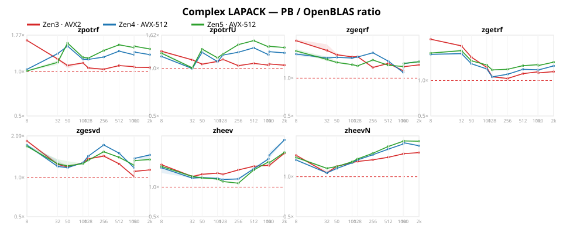

`zpotrf` gates fleet-wide. `zgetrf` **now gates fleet-wide** (was Zen3 worst 0.80): a rank-2
SIMD-`izamax` `getf2` panel, a derived complex block width, a base-32 crossover, and a po2-aliasing-dodge
scratch. The only residual is galen n=256 (0.94), localized to PB's complex gemm at the trailing
208×208×48 shape (a gemm-kernel gap, not a getrf-structure one). `zgeqrf` **gates at every size
fleet-wide** (1.07–1.83; was geomean 0.76–0.85): the complex trailing update was rebuilt to mirror the
real path (`herk` for VᴴV at half the flops + `trmm` for TᴴW), the reflector norm moved from per-element
`hypot` to SIMD `_nrm2`, the unblocked rank-2 panel runs while the matrix is L3-resident, and the AVX2
trailing update is chunked to bound the Karatsuba-3M scratch below ½L3. `zgesvd` — singular values only,
vs `zgesdd('N')` — **gates at every size** (real + ComplexF64): the large-n collapse was fixed by a
blocked complex bidiagonalization (zlabrd/zgebrd port), and the small-n floor by switching the values
path to **dqds** (`dlasq1–6`) — OpenBLAS's `gesdd('N')` uses the sqrt-free dqds recurrence, not
Golub–Kahan QR; matching it lifted n=32 from ~0.86 to ~1.07 (real *and* complex, since the bidiagonal is
real). ComplexF32 small-n (n=32/48 ≈ 0.9) is the remaining sub-gate, a `cgebrd` limit. `zgeqrf` was
validated on square inputs; tall/skinny QR is a separate benchmark shape.

## Numeric summary

The per-op numbers — **median (worst-cell) ratio per op per µarch** — live in
[`bench/gen_table.md`](https://github.com/el-oso/PureBLAS.jl/blob/master/bench/gen_table.md).
That file is auto-generated from the fleet result caches by the same run that produces the
plots, with a provenance header (CPU model, code commit, timestamp per box), so it cannot
drift from the plots. It is the numeric source of truth; numbers are deliberately not
duplicated here.

## Where we are

### BLAS-3 is where the work is, and the shape of it is the same on every µarch

`gemm` is the fastest thing on all three boxes and pulls *further* ahead as `n` grows — but the
routines that build on that same engine fall *behind* AOCL at exactly the sizes where `gemm` wins
most:

| vs max(OpenBLAS, AOCL) | n=2048 | n=4096 |
|---|---|---|
| `gemm` — Zen4 / Zen3 / Zen5 | 1.150 / 1.150 / 1.168 | **1.252 / 1.280 / 1.308** |
| `syrk` | 0.955 / 0.963 / 0.978 | **0.937 / 0.968 / 0.953** |
| `syr2k` | 0.976 / 0.974 / 0.977 | 0.966 / 0.983 / 0.957 |

`syrk`, `syr2k`, `symm`, `trmm` and `trsm` all route their trailing updates through the same
`_gemm_core!` / `_microkernel_db!` engine. That engine is demonstrably 25–31% faster than AOCL at
n=4096 on this silicon, so the ~30-point spread between it and the routines built on it is a
**conversion loss, not a hardware limit** — and it reproduces on three microarchitectures, which
makes it structural rather than a per-box tuning artifact. It is the single largest shared lever
currently on the board.

**`trsm` n=32 was one such invariant and is now CLOSED on both available boxes** (2026-08-10): Zen4
0.898 → 1.056 via interleaved back-substitution chains, and Zen3 0.927 → 1.102 by deleting a
`_GT_TRANSPOSE` conjunct that was using an ISA *capability* bit as an unmeasured *crossover* and so
pinned all of AVX2 to the scalar dense base — the fused leaf measured 15–52% faster there across the
whole tiny-`k` range. Zen5 has not been re-swept (box offline), so its 0.91 predates both fixes.

`trsm`'s residual has therefore MOVED from tiny-`n` to mid-`n` (Zen4 0.941 @ n=128), and it is now
decomposed rather than guessed: fitting the leaf's rate as `1/GF = α + β/KC` puts the asymptotic
microkernel rate at **44.4 GF, above PureBLAS's own dgemm (43.75)** — the inner loop is not the
problem — with an 18.6% per-slab *fixed* cost at KC=128. An opcode histogram of the emitted slab
prices that cost: scalar addressing ~22% and vector moves ~24% of it, against only ~3.2% of total leaf
time for the two 8×8 transposes and ~2.8% for the back-substitution arithmetic. Removing the largest
addressing population (recomputed `(jc + c)·ldb` products) was worth 3.0% at n=128, bit-identically.

**`syrk`/`syr2k` n=4096** remains a genuine cross-µarch invariant (the conversion gap above). By
contrast `symm` ≥ 256 and `trsmR` ≥ 2048 miss on Zen4/Zen3 but *gate* on Zen5, so those are
µarch-specific.

Complex BLAS-3 is further out and loses to AOCL almost across the board — `zgemm` 0.922, `zsyrk`
0.941, `zher2k` 0.908, `zsyr2k` 0.894, `ztrmm` 0.943 — with `ztrsm` (1.067) the one that gates, and
`ztrmmR` now within reach at 0.969 after the full-tile dispatch fix.

`symm`/`hemm` are the exception, and the reason is worth recording. Complex symm used to materialize a
dense n×n copy of the symmetric operand and call gemm; complex hemm avoided the copy but ran through a
*fork* of the complex gemm driver that had drifted, hardwiring off the two specializations (overwrite-C
when β=0, and the α=1 store) that the driver itself dispatches — precisely the case the benchmark
measures. Wiring those back in and routing complex symm through the same packing path removes the copy
entirely. Measured wrapper cost against a bare gemm of the same shape fell from 1.065/1.069/1.053/1.026
at n=128/256/512/1024 to 1.026/1.017/1.004/1.002. On Zen4 `zhemm` now gates at every size from 32 up
(1.004–1.012) and `zsymm`'s three remaining shortfalls are each smaller than that cell's own
round-to-round spread; on Zen3 both gate across 128–2048 at 1.18–1.28. What is left in this family is
tiny-n — n=8 and n=32, below the packing cut, still on the copy path — and real `symm` at n≥256, whose
packed path has not yet had the same β=0 fold applied.
Here the engine itself (`zgemm`) misses, so it is a different problem from the real case and has to
be fixed at the kernel before anything above it can convert.

### Per microarchitecture

**Zen4 (AVX-512, double-pumped).** The tuning target. Real BLAS-1/2 gate essentially everywhere;
the residuals are the BLAS-3 set above (`trsm` 0.941 @ n=128 — n=32 now gates at 1.056 — `syrk` 0.937
@ n=4096, `trmm` 0.958 @ n=2048, `symm` 0.955). `trmm`'s crossover between recursion-over-`gemm!` and
the packed routine is now derived as `5·_GEMM_UNPACK_MAX ÷ 2` rather than borrowed from gemm's own
unpacked/blocked cut: in a controlled same-process A/B the two sizes whose route changes gained 4.0%
and 5.1% (n=512, n=1024), which moved the worst cell to n=2048 — whose miss lies in the packed path
itself and is a separate defect. Figures on this page come from the full 2026-08-11 re-sweep at
`ee450bc`; treat sub-2% differences against an earlier snapshot as run-to-run spread rather than
change, and see the note on [coverage](coverage.md) for why.
The complex residuals are the shared LAPACK gaps plus a handful of BLAS-2 cells:
`zgeru` 0.906 (n=1024), `zgemvN` 0.954 (n=512) and `ztrsv` 0.865 (n=1024).

**Zen5 (AVX-512, native 512-bit).** Clears every AVX2 ceiling but shows a disjoint residual
profile — the reason the gate is per-machine. Open: `gemvN` (0.942, n=2048), `ger` (0.896,
n=2048) and the complex pair `zgemvN`/`zgeru` (0.895/0.892, n=2048).

::: warning Numbers on this page changed materially on 2026-08-09 — several were never real

`bench/plots.jl` merges its cache per arm, so an A/B run with a `PUREBLAS_FORCE_<knob>` variable
exported persisted its **deliberately non-default** PureBLAS arm next to reference arms measured in
a different run, and every render afterwards republished it as the gate number. The Zen5 `gemvT`
n=256 cell was published at **0.751** on that basis; measured with all three arms in one run it is
**1.09**, and `PUREBLAS_FORCE_gemvt_deep=0` reproduces the bad record exactly. `gemvT` n=128 and
`trmv` n=256 came from the same contamination.

Everything above is now re-measured with all arms in a single run per box, at one commit, under a
verified frequency lock. `save_cache` refuses to write while any `PUREBLAS_FORCE_*` is set, so this
class of error cannot recur silently. The corrections did **not** all favour PureBLAS — `ztrsv` on
Zen4 went from 0.991 to 0.865 and `ger` on Zen5 from 0.996 to 0.896.

One caveat that survives: `neuromancer` (Zen5) is a laptop rather than a dedicated bench box, and
repeated sweeps there move worst-cells by several points — `gemvT` n=2048 read 1.16 and 0.977 in two
runs an hour apart at the same commit. Treat Zen5 cells within a few points of 1.0 as unresolved
rather than as measurements; Zen3 and Zen4 are stable.
:::

**Zen3 (AVX2).** The hardest target: 16 ymm registers vs AVX-512's 32 zmm. Real surface gates
except `trmm`/`trsm` worst sizes; complex carries the widest residual set (`zdot`, `ztrmm`
both sides, `ztrsm`, `zgetrf`). The `potrf` small-n campaign (block-small Cholesky + a fused
12-accumulator `trsm`-R) reaches **BLASFEO column-major parity at n≤224** (0.91–1.04×), 1.5–2.2× vs OB.

**Known open items** (tracked in [`ROADMAP.md`](https://github.com/el-oso/PureBLAS.jl/blob/master/ROADMAP.md)):

- **BLAS-3 conversion gap** (above): `gemm` beats AOCL by 25–31% at n=4096 while `syrk`/`syr2k` on
  the same engine sit at 0.94–0.97. Largest shared lever; reproduces on all three µarchs.
- `trsm` n=32 **is closed** on both available boxes as of 2026-08-10 (Zen4 1.056, Zen3 1.102); the
  Zen5 figure predates the fixes (box offline). The residual moved to mid-`n` (Zen4 0.941 @ n=128),
  and the earlier "~0.95 codegen floor, latency-bound back-substitution, register-walled" reading is
  **superseded**: fitting `1/GF = α + β/KC` on the leaf puts the asymptotic microkernel rate at 44.4 GF
  — *above* PureBLAS's own dgemm — so the inner loop is not the limiter. The whole deficit is an 18.6%
  per-slab fixed cost, of which an opcode histogram attributes ~22% to scalar addressing and ~24% to
  vector moves, versus ~3.2% of total leaf time for the transposes and ~2.8% for the back-substitution.
- `gemvT` n=2048 is the one BLAS-2 cell that misses on **all three** µarchs (0.96 / 0.94 / 0.97) — a
  size-specific behaviour rather than three per-box stories, and the better-posed problem for it.
- `gemvN` Zen5 n=2048 (0.942) and `ger` Zen5 n=2048 (0.896).
- `trmv`/`trsv` Zen5 in the DRAM regime **now gate** (1.06 / 1.03 at n=4096) after the fuse-factor
  routing landed; the residual `trmv` cell moved to n=256.
- `hpmv` still per-column — port the spmv AP-residency panel to complex.
- `trsm`/`ztrsm` side-L remain the flagship AOCL gaps (4K power-of-two aliasing in the
  column-lane back-substitution); side-R (`trsmR`/`ztrsmR`) is now gate-measured and mostly clears —
  `ztrsmR`'s worst cells improved on both measured boxes on 2026-08-11 (sign placement in the
  register-tile leaf; see the CL3 section), leaving Zen3 n=128 at 0.926 and Zen4 n≥512 at ~0.99.
- Real `geqrf` panel width is now hardware-derived (register-count floor `256/NVREG`, grown with
  the matrix vs L2) — it gates AOCL fleet-wide (worst ≥ 0.96), closing the former n=48 dip.
- Complex LAPACK: `zgeqrf` worst-size still just under gate on Zen5; `zgesvd` blocked-bidiagonalization
  port pending (values-only, capped at n=1024).
- Tuning-constant debt: several block-size literals remain to be re-derived as formulas over
  detected cache/register parameters.

Both consumption modes share one kernel set: the **native API** (`PureBLAS.gemm!(…)`,
AD-traceable) and the **LBT drop-in** `.so` (`@ccallable` ILP64 symbols via `juliac --trim`).

## vs AOCL — AMD's own Zen-tuned library (AOCL-BLIS + libFLAME)

OpenBLAS is the default oracle above; this section adds a **second, tougher baseline: AOCL**, AMD's
own optimizing library (AOCL-BLIS for BLAS, AOCL-libFLAME for LAPACK), hand-tuned for these exact Zen
chips. Everything here is **single-threaded** (BLIS pinned to one thread — verified: `dgemm` runs at
one-core throughput), boost-locked, same methodology; caches/SVGs carry an `_aocl` suffix and never mix
with the OpenBLAS artifacts. The plots below are **lite** (sizes capped at n=1024) — a fast pass that
covers the meaningful range; the summary numbers are from a size-controlled probe.

The AOCL binary is a genuinely optimized build, not a reference fallback: measured directly against
OpenBLAS, AOCL-BLIS `dgemm` matches it and AOCL-libFLAME `potrf`/`geqrf` **meet or beat** it (e.g.
geqrf 40 vs 30 GFlops) — a reference build would be slower, not faster.

Verified PB/AOCL at mid/large n (>1 = PureBLAS faster; wintermute Zen4, single-thread), alongside
PB/OpenBLAS for context:

| op | PB / OpenBLAS | PB / AOCL |
|---|---|---|
| gemm    | 1.05–1.11 | 1.08–1.24 |
| potrf   | 1.16–1.28 | 1.12–1.20 |
| geqrf   | 1.63–1.80 | 1.53–1.70 |
| getrf   | 1.14–2.24 | 1.59–1.78 |
| gtsv    | 1.41–1.43 | 1.20–1.22 |
| gttrf   | 1.53–1.57 | 1.51–1.54 |
| pttrf   | 1.11–1.13 | 1.11–1.12 |
| ptsv    | 1.31–1.33 | 1.04–1.05 |
| **pttrs** | 1.67–1.73 | **0.99** (shared chain bound) |
| **trsm** (side-L)  | 1.13–2.73 | **0.93–1.07** |
| **trsmR** (side-R) | 1.03–2.29 | 0.97–1.73     |

**PureBLAS matches-or-beats AMD's own library on gemm and every LAPACK factorization — real and
complex — by 5–80%.** The one residual vs AOCL is real **side-L `trsm` at mid-n** (worst-size
0.92–0.97): a codegen-scheduling gap on the fused-leaf kernel — the fused-back-substitution's
latency chain runs at ~2 IPC where BLIS's hand-scheduled assembly hides it — not a structural lever
(building AOCL's own packed-triangle structure in portable SIMD.jl lands at the same ~0.95). Side-R
`trsmR` (the potrf/getrf panel shape): both `transA` route through the fused leaf via the reflection
identity à = J·Aᵀ·J. Its long-standing AVX2 worst cell (n=128, 0.817 vs AOCL — the worst BLAS-3 cell on
the fleet, and recorded in the kb as unexplained after two falsified hypotheses) was closed to **0.917
on 2026-08-10**, with **n=512 and n=1024 crossing into PASS** (0.941→1.105, 0.985→1.086) and every size
improving. Cause: at `transA='T'` the reflection branch does not fire, so A reaches the leaf **verbatim
at the caller's lda**; for a square operand that is a power of two, and at k=128 the 1024-byte column
stride is a quarter L1 way period. Padding A into an odd-`ld` scratch recovers 11.5–15.1% at the leaf.
The pad is gated on whether the leaf actually **re-reads** A — i.e. whether it spills, which is true on
AVX2's 16 ymm and false on AVX-512's 32 zmm — because on a non-spilling box the same pad measured *null*
at n≥512 and 4.9% *slower* at n=128. Zen4 therefore never pads and is byte-identical to before; its worst
size remains ~0.95 (n=2048).
The former **small-n `gemm` dip** (~0.92× AOCL at
n≤256, where BLIS's lower packing overhead won) is now **closed** by a *direct-B microkernel* that skips
the B-pack entirely when B is contiguous in the k-index (col-major, no transpose) — dgemm now gates
**≥0.98× AOCL fleet-wide from n=128 up** (Zen3/Zen4/Zen5), with no large-n or OpenBLAS regression. AOCL
is a *mixed* competitor vs OpenBLAS, not uniformly tougher: its `geqrf` beats OpenBLAS (so `PB/AOCL <
PB/OpenBLAS` there — a smaller margin, the legit-competitor signature) while `getrf` trails it. This is
a single-thread comparison; AOCL is tuned first for multi-threaded EPYC, so on these single-thread Zen
parts it's a fair-but-not-dominant baseline.

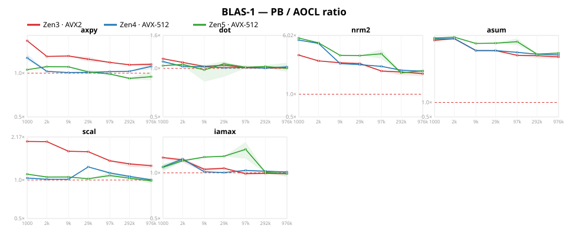
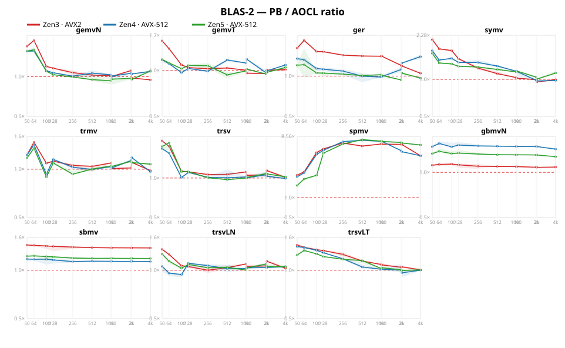
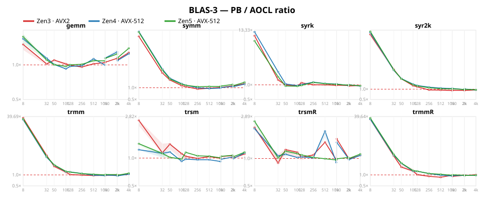
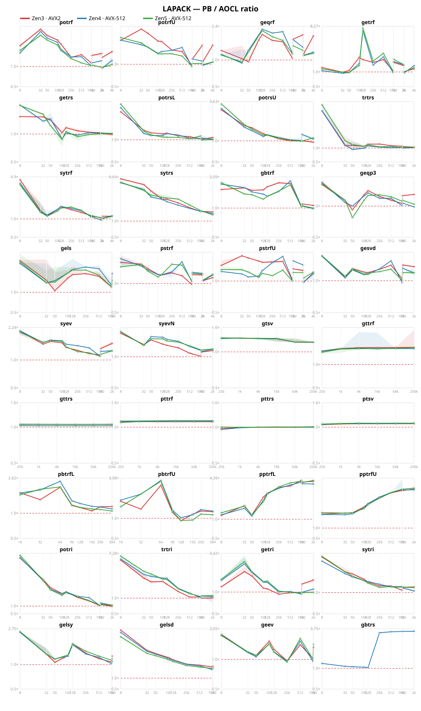
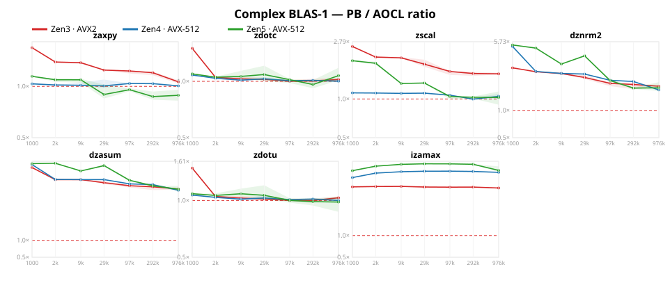
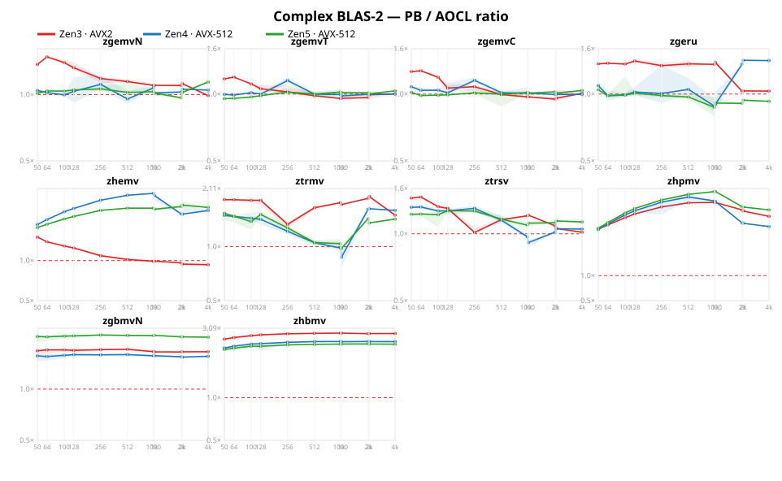
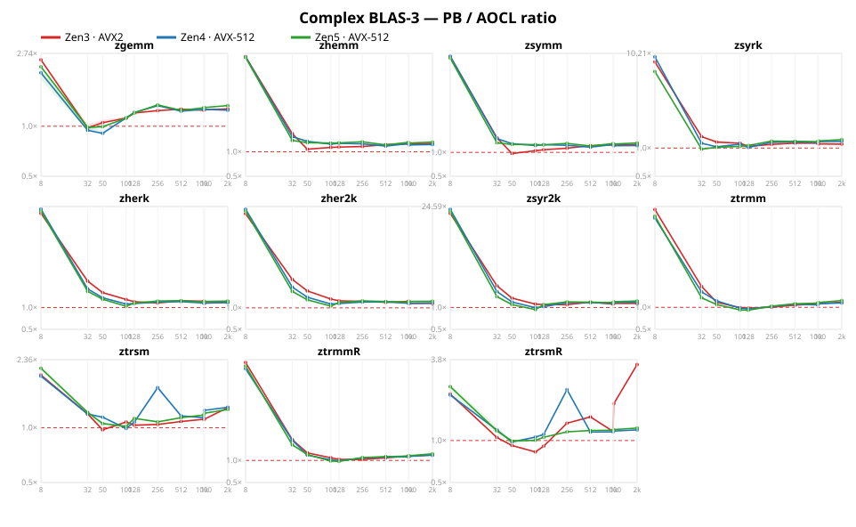
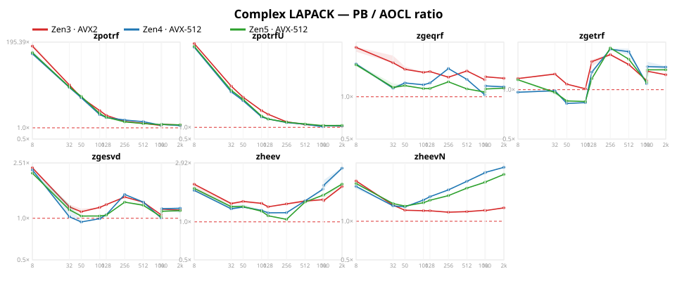

**Caveat on the small-n LAPACK ratios in the plots.** AOCL-libFLAME has heavy *per-call overhead* at
tiny n (e.g. `potrf`/`getrf` show 4–160× at n≤32), which flatters PureBLAS there — that is dispatch
overhead, not an algorithmic gap. The mid/large-n figures in the table are the honest signal. The
per-op numbers are generated to [`bench/gen_table_aocl.md`](https://github.com/el-oso/PureBLAS.jl/blob/master/bench/gen_table_aocl.md).

> **Freshness note (interim).** These AOCL plots use *freshly remeasured* Zen3 (galen) and Zen4
> (wintermute) caches (boost-locked); the Zen5 (neuromancer) line is from an earlier same-session run.
> The µarch labels are now stamped authoritatively into each cache header (`uarch=`), fixing a prior
> plot-labeling swap. A full same-commit fleet re-measure will follow.
