# Performance

Each plot shows how fast PureBLAS is relative to a reference, against problem size. Higher is better and
the dashed line is parity, so anything above it is a win. There is one curve per microarchitecture
(Zen3 · AVX2, Zen4 · AVX-512, Zen5 · AVX-512) and one panel per operation, and the band around a curve
is the q10–q90 spread of the pooled per-round ratios. Everything is single-threaded, Float64 and
ComplexF64.

Single-threaded is the gate, and it is the only thing compared against OpenBLAS and AOCL on this page.
For what PureBLAS's own threading buys — PureBLAS at six threads against PureBLAS at one, which is a
scaling measurement and **not** a gate — see [Multi-threading](threading.md).

Roughly 87% of the measured cells are at or above `max(OpenBLAS, AOCL)`. The ones that are not are
listed in [Notes](notes.md), and most of them sit within a few percent.

For the numbers behind the plots, see
[`bench/gen_table.md`](https://github.com/el-oso/PureBLAS.jl/blob/master/bench/gen_table.md) against
OpenBLAS and
[`bench/gen_table_aocl.md`](https://github.com/el-oso/PureBLAS.jl/blob/master/bench/gen_table_aocl.md)
against AOCL. [Methodology](methodology.md) covers how the measurements are taken and how to read a
cell; [Notes](notes.md) has the per-routine analysis and history.

## vs the gate

These plots divide by whichever reference is faster at each point — `max(OpenBLAS, AOCL)`, the same
number the coverage tables report. A point below the dashed line here is a real miss. The two sections
after it show each library on its own, so a miss against AOCL can look like a comfortable win on the
OpenBLAS plot; start here when you want to know where PureBLAS falls short.

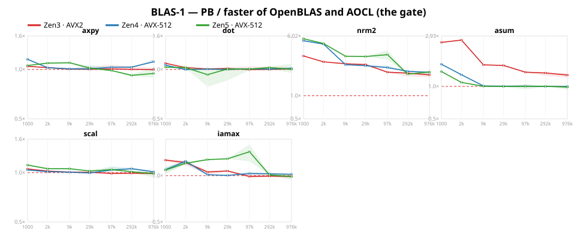
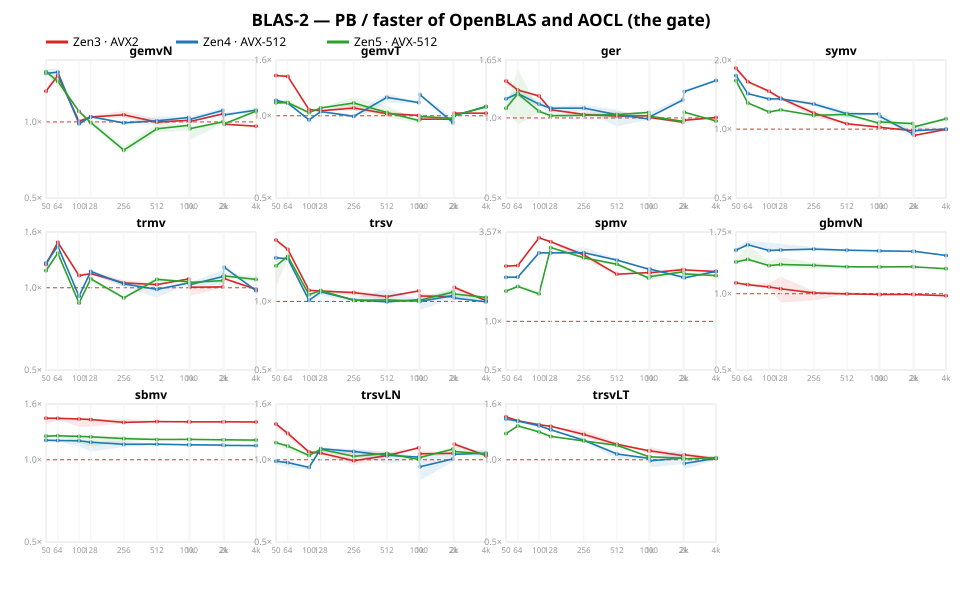
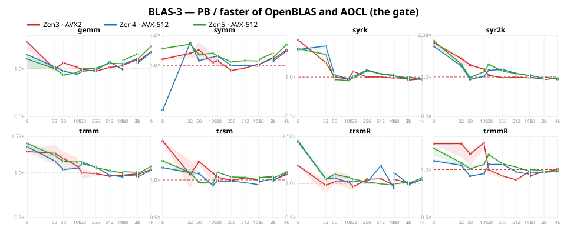
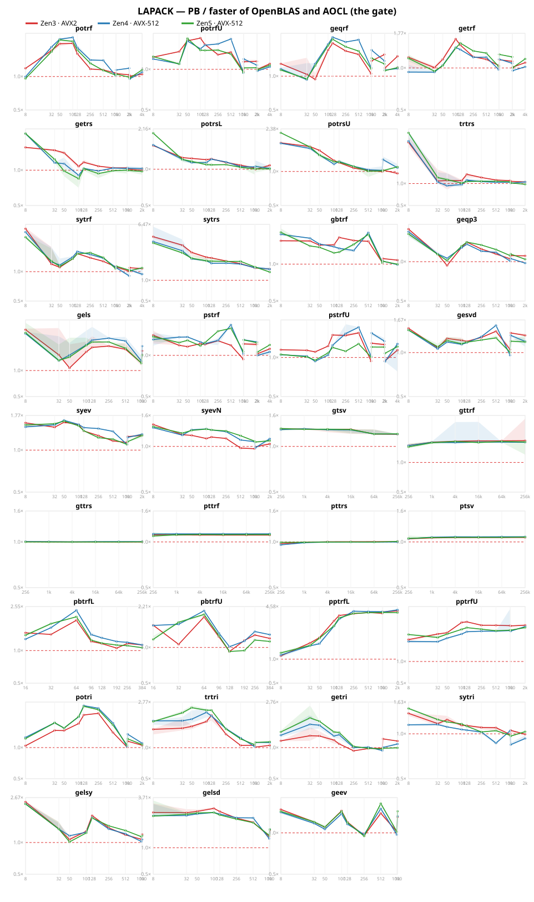
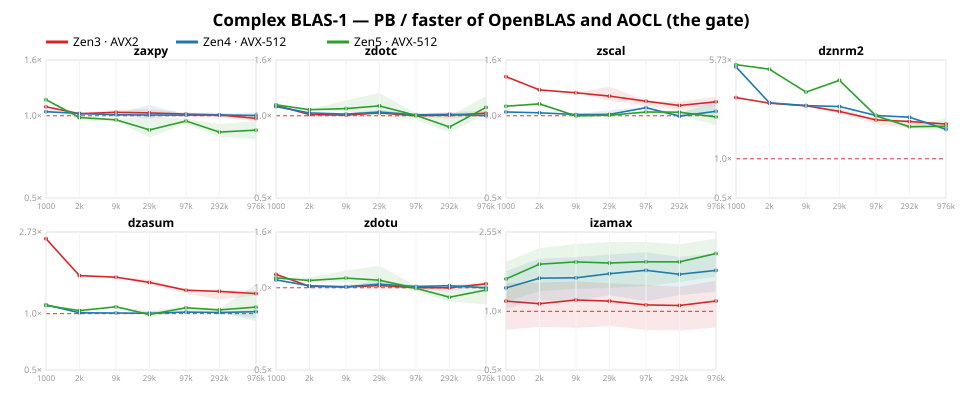
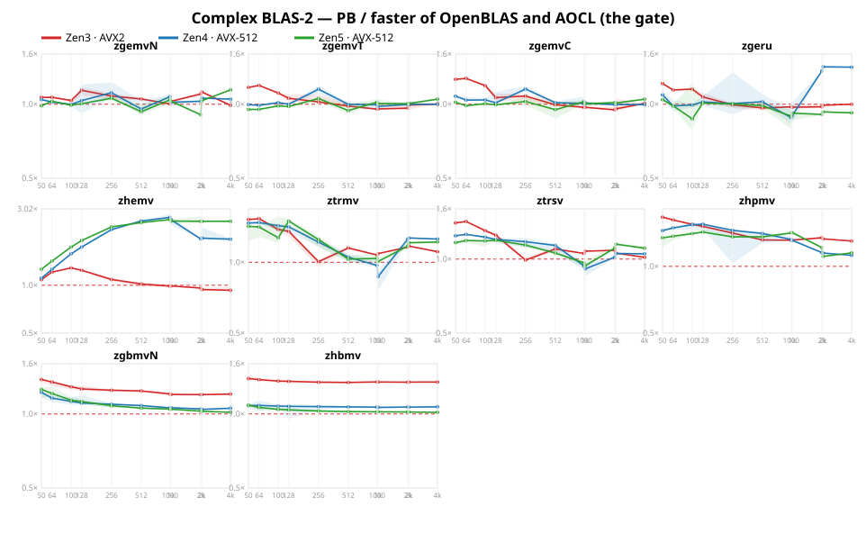
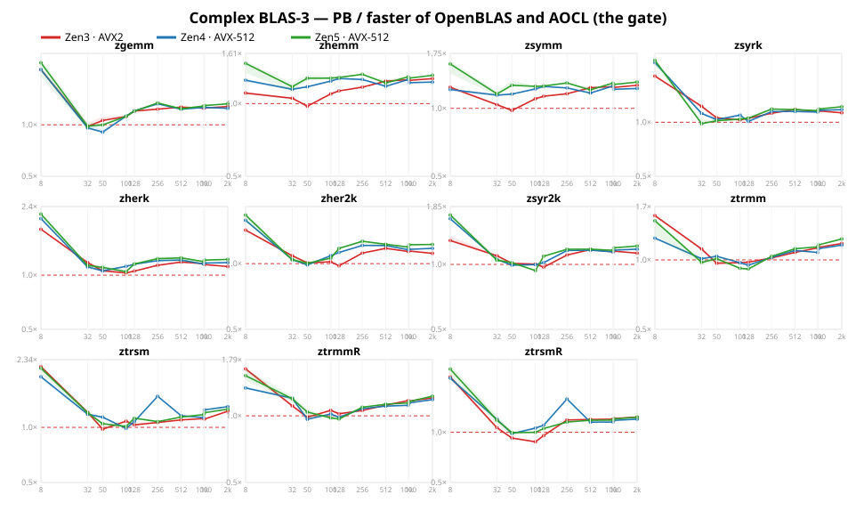
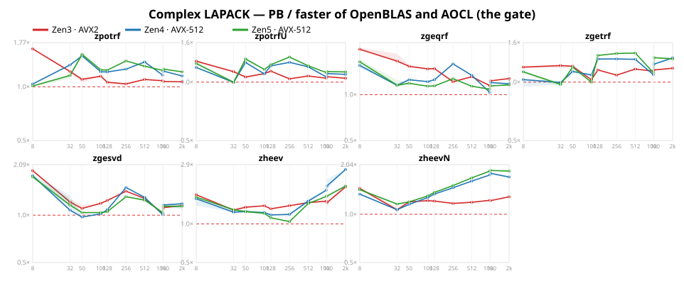

## vs OpenBLAS

## vs AOCL

## vs LinearAlgebra generic (dual numbers)

One section, not two, because there is no second reference to compare against.
`ForwardDiff.Dual{Tag,Float64,1}` is not a `BlasFloat`, so LinearAlgebra dispatches to its own generic
fallback and no vendor BLAS is ever reached — OpenBLAS and AOCL have no dual-number path at all. The
denominator here is therefore what a forward-mode AD user gets today *without* PureBLAS, and these
ratios are **not** gate verdicts: the gate is `PB ≥ max(OpenBLAS, AOCL)`, which is undefined for this
element type.

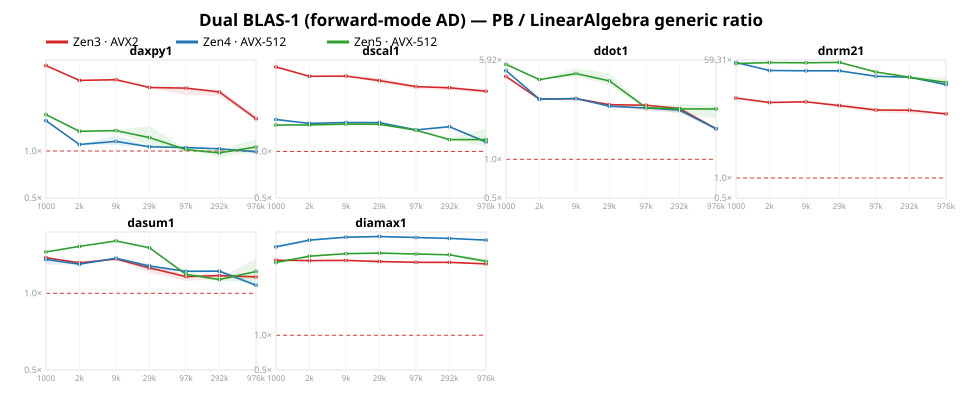
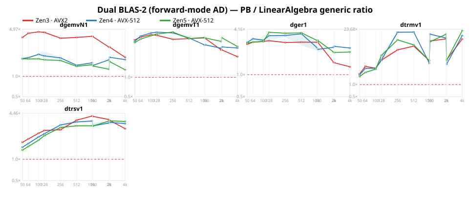
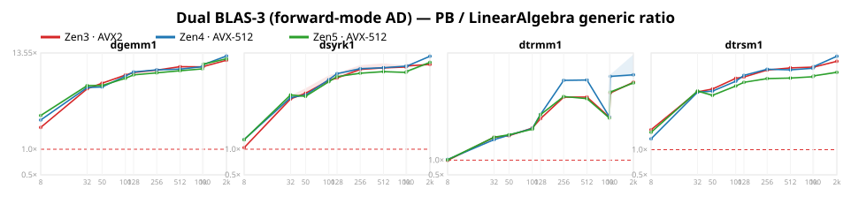
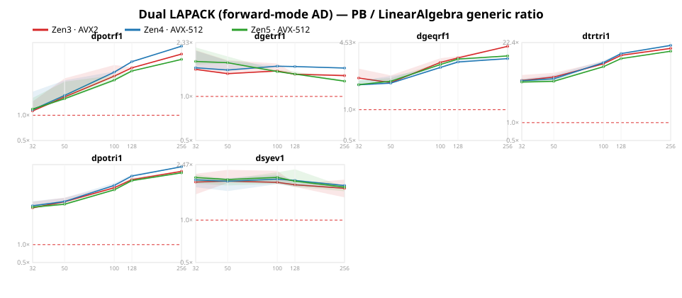

These numbers apply however you call PureBLAS. The native API (`PureBLAS.gemm!(…)`), the in-process
reroute through `activate()`, and the `libpureblas.so` built for C hosts all run the same kernels.
