# Apple Silicon

First-pass results on Apple Silicon (arm64/NEON), comparing PureBLAS against **OpenBLAS** and
**Accelerate** (Apple's own vecLib BLAS/LAPACK, forwarded via `libblastrampoline`'s ILP64
`$NEWLAPACK$ILP64` interface — see [Methodology](methodology.md#accelerate-on-apple-silicon)).
This is the first time PureBLAS has been benchmarked on this architecture; it is not yet part of the
[main fleet](performance.md), which stays AMD-only.

**Scope, deliberately limited for this first pass:** BLAS-1, BLAS-2, BLAS-3, and the four core LAPACK
factorizations (`potrf`, `getrf`, `geqrf`, `gesvd`), Float64 only, sizes capped at 2048. Complex,
ForwardDiff-dual, and the rest of LAPACK are not yet covered here.

**Caveat that does not apply to the AMD fleet:** macOS has no equivalent of the Linux `cpufreq`/`taskset`
locking [Methodology](methodology.md) treats as mandatory for a gate-quality measurement. These numbers
are **not frequency-locked** — read them as directional, not gate verdicts.

**Machine:** Apple M6 (ARM · NEON, `_vwidth(Float64)=2`), unlocked clock, commit `5c960578`, measured
2026-09-22. Full provenance: [`provenance.md`](assets/apple/provenance.md).

## Headline

Of the 29 real (Float64) cells measured, **1 gates outright** (`nrm2`, where OpenBLAS's always-scaled
algorithm is slow on every platform PureBLAS has been measured on) — but the gate figure (worst-cell)
understates BLAS-1: on the **median**, PureBLAS now *beats* Accelerate on `dot` (1.12×) and `axpy` (1.19×),
and sits near parity on `asum`/`scal`. See [Measurement artifact](#measurement-artifact-large-n-blas-1)
below — the first pass here read those four ops as losing to Accelerate by 3-5×, which was wrong.

PureBLAS is roughly at parity with **OpenBLAS** overall (0.5-2.1× across BLAS-1/2, 0.7-1.6× on BLAS-3/
LAPACK), and trails **Accelerate** substantially on BLAS-2/3/LAPACK (0.1-0.3× on most of BLAS-3). That
part of the gap is *not* a measurement artifact — it holds at genuinely DRAM/compute-bound sizes — and
most plausibly tracks Accelerate routing through Apple's AMX matrix coprocessor (confirmed at ~550
GFLOP/s single-core `dgemm`, single-threaded — see below), which pure-Julia NEON code (128-bit, 2 Float64
lanes) has no access to. Closing that is a tuning/architecture question for a future session.

## Measurement artifact: large-n BLAS-1

**The first pass through this page reported `dot`/`axpy`/`asum`/`scal` losing to Accelerate by 3-5× at
large n. That number was inflated by a benchmark-harness artifact, not a real hardware gap.**

`bench/plots.jl`'s `_L1REP(s) = clamp(8_000_000 ÷ s, 30, 20000)` amortizes per-call timer overhead by
running `reps` calls back-to-back **on the same operand buffer** inside one timed window. At n=1e6 that
buffer is 16MB (`x`+`y`) — small enough to plausibly stay resident in L2/SLC across all `reps=30` calls,
so the measurement can end up reading repeated-access-to-a-warm-buffer throughput rather than genuine
cold/DRAM-streaming throughput. A library whose inner loop pipelines especially well against a *hot*
buffer looks disproportionately faster than it is on real, once-through data.

Verified directly: with genuinely cold, single-shot, freshly-allocated arrays at sizes far too large for
any cache (10M-50M elements, 240MB-1.2GB), Accelerate's real advantage over OpenBLAS on `axpy` is only
**1.06-1.36×** — physically consistent with a modest per-core DRAM-bandwidth edge — not the ~4.3× the
reps-amortized measurement implied (`PB/openblas≈1.00`, `PB/accelerate≈0.23` ⟹ implied `accelerate/
openblas≈4.3×`).

**Fix, applied here:** `bench/plots.jl` gained a `cold` flag (opt-in, off by default) that forces
`reps=1` on the L1 sweep — `evals=1` already re-runs `setup()` fresh per Chairmarks sample, so `reps=1`
removes the one remaining reuse path. The table below reflects the `cold` re-measurement for all six L1
ops. This is **not the default** and changes nothing for the AMD fleet's existing methodology or caches.

**Open question, not yet answered:** whether the same artifact inflates large-n L1 numbers on the AMD
fleet. Zen3's 32 MiB L3 is large enough that n=1e6's 16MB working set would fit there too, by the same
argument that applies here. This was diagnosed on one Apple Silicon box; it has not been checked against
the AMD fleet's own caches or re-measured there with `cold`.

## vs OpenBLAS and Accelerate, per op

Ratio is PB / reference, **median (worst cell)** across the measured size ladder (capped at n=2048 for
BLAS-2/3/LAPACK; full 1e3..1e6 for BLAS-1, L1 measured `cold` — see above). Gate is PB / max(OpenBLAS,
Accelerate) — the same two-significant-digit rounding rule as the
[main fleet](methodology.md#the-gate) (`bench/gatecrit.jl`). The gate is a **worst-cell** figure, so a
FAIL can still have a winning median — true for `dot`/`axpy`/`asum` below.

| level | op | vs OpenBLAS | vs Accelerate | gate | verdict |
|---|---|---|---|---|---|
| L1 | `dot` | 1.00 (1.00) | **1.12** (0.43) | 0.427 | FAIL |
| L1 | `axpy` | 1.01 (1.00) | **1.19** (0.56) | 0.556 | FAIL |
| L1 | `nrm2` | 8.42 (7.00) | 1.95 (1.67) | 1.672 | **PASS** |
| L1 | `asum` | 1.01 (1.00) | **1.00** (0.53) | 0.533 | FAIL |
| L1 | `scal` | 0.99 (0.99) | 0.92 (0.35) | 0.355 | FAIL |
| L1 | `iamax` | 0.50 (0.49) | 0.93 (0.90) | 0.491 | FAIL |
| L2 | `gemvN` | 1.52 (0.84) | 0.17 (0.10) | 0.102 | FAIL |
| L2 | `gemvT` | 1.51 (0.94) | 0.34 (0.16) | 0.162 | FAIL |
| L2 | `ger` | 1.00 (0.92) | 0.37 (0.24) | 0.241 | FAIL |
| L2 | `symv` | 0.74 (0.59) | 1.19 (0.33) | 0.331 | FAIL |
| L2 | `trmv` | 1.81 (1.35) | 0.67 (0.16) | 0.156 | FAIL |
| L2 | `trsv` | 1.65 (1.37) | 0.94 (0.68) | 0.679 | FAIL |
| L2 | `trsvLN` | 1.42 (1.29) | 0.85 (0.67) | 0.670 | FAIL |
| L2 | `trsvLT` | 2.13 (1.40) | 1.06 (0.84) | 0.838 | FAIL |
| L2 | `spmv` | 1.54 (1.04) | 1.05 (0.67) | 0.672 | FAIL |
| L2 | `gbmvN` | 0.49 (0.47) | 0.46 (0.40) | 0.402 | FAIL |
| L2 | `sbmv` | 3.03 (2.98) | 0.78 (0.69) | 0.689 | FAIL |
| L3 | `gemm` | 0.70 (0.66) | 0.10 (0.07) | 0.075 | FAIL |
| L3 | `symm` | 0.81 (0.67) | 0.12 (0.08) | 0.084 | FAIL |
| L3 | `syrk` | 0.94 (0.83) | 0.13 (0.10) | 0.101 | FAIL |
| L3 | `syr2k` | 0.92 (0.81) | 0.13 (0.11) | 0.109 | FAIL |
| L3 | `trmm` | 0.76 (0.61) | 0.14 (0.08) | 0.079 | FAIL |
| L3 | `trmmR` | 0.70 (0.51) | 0.13 (0.08) | 0.077 | FAIL |
| L3 | `trsm` | 0.93 (0.68) | 0.24 (0.11) | 0.107 | FAIL |
| L3 | `trsmR` | 1.15 (0.93) | 0.29 (0.15) | 0.149 | FAIL |
| LP | `potrf` | 1.58 (0.99) | 0.50 (0.17) | 0.173 | FAIL |
| LP | `getrf` | 0.93 (0.71) | 0.61 (0.19) | 0.195 | FAIL |
| LP | `geqrf` | 1.28 (0.78) | 0.98 (0.18) | 0.180 | FAIL |
| LP | `gesvd` | 1.04 (0.97) | 0.80 (0.23) | 0.228 | FAIL |

Full machine-readable tables: [`gen_table.md`](assets/apple/gen_table.md) (vs OpenBLAS),
[`gen_table_accelerate.md`](assets/apple/gen_table_accelerate.md) (vs Accelerate).

## Plots

Ratio-vs-size, same style as the [main fleet pages](performance.md) (dashed line = parity, band = q10-q90
spread). "gate" divides by whichever reference is faster at each point.

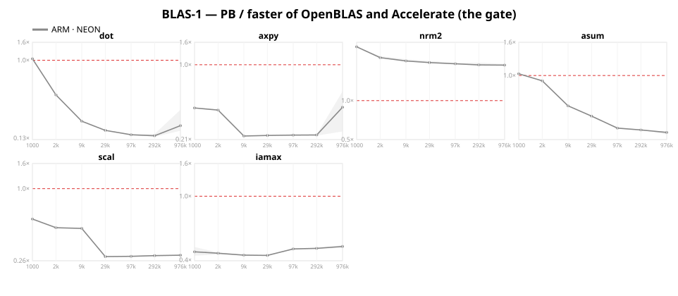
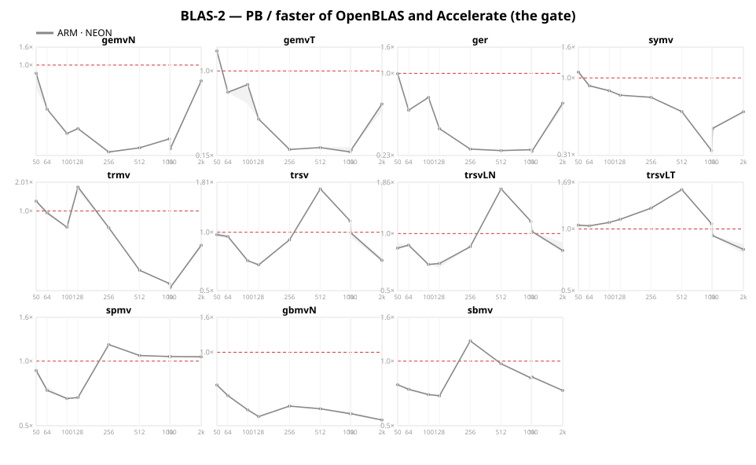
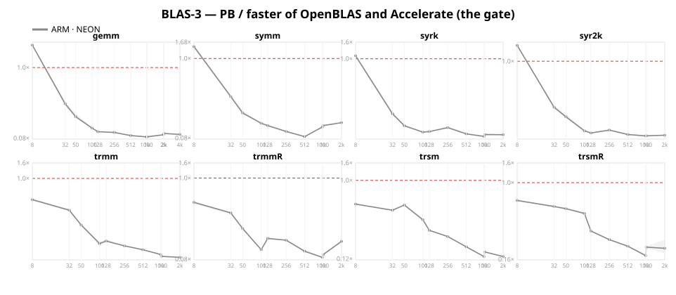
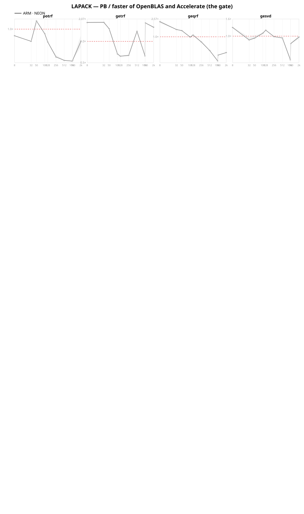
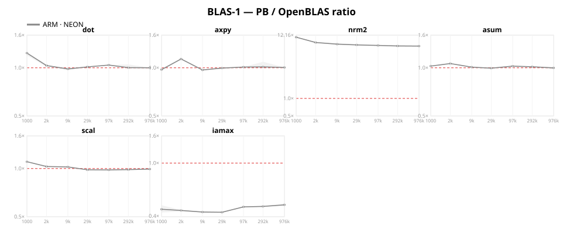
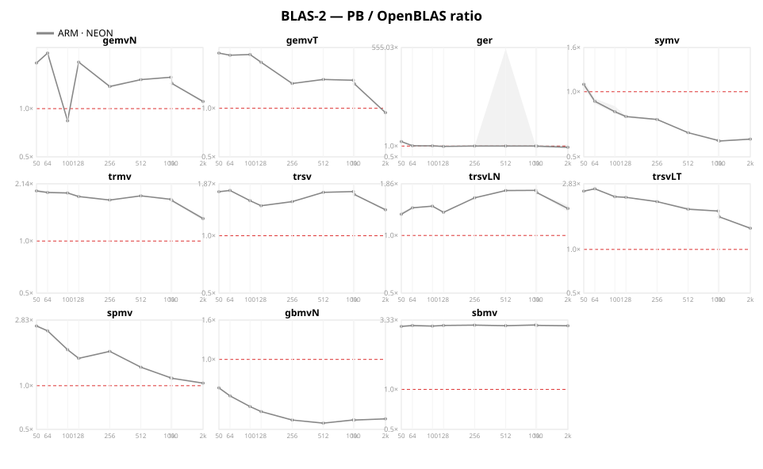
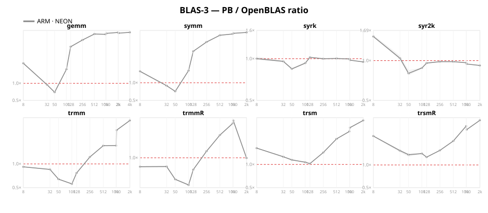
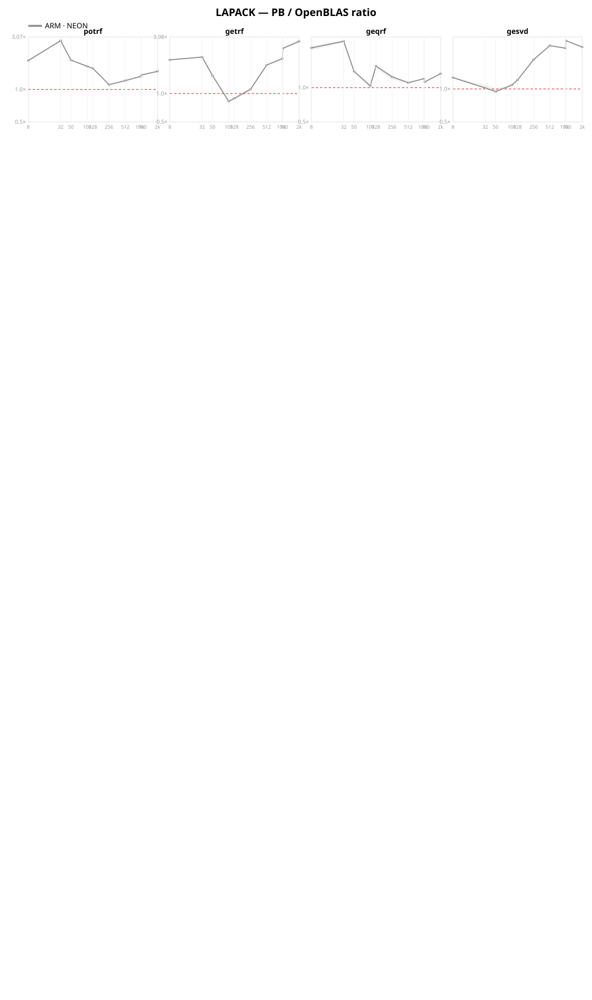
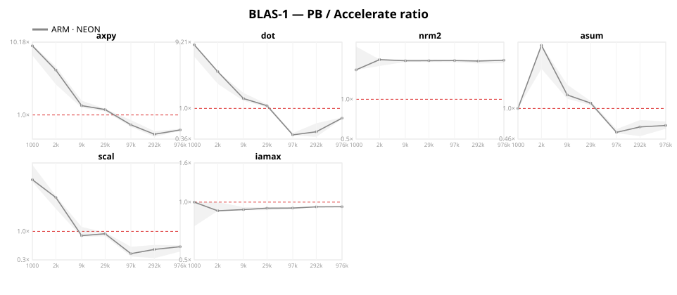
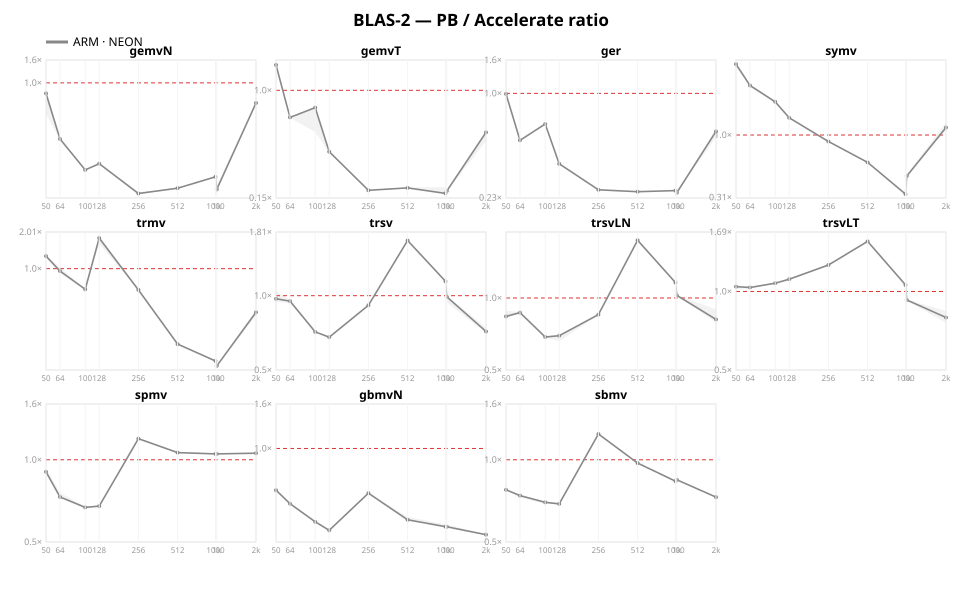
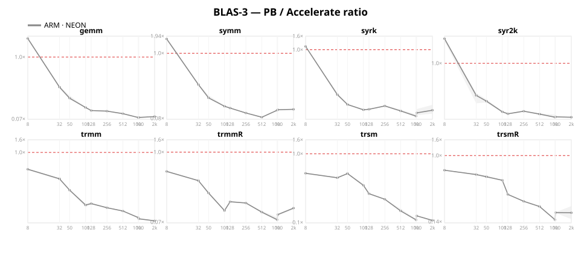
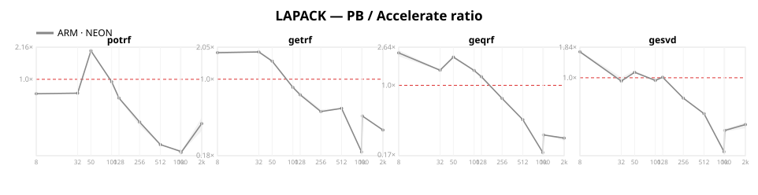

## Reproduce

```
julia --project=bench/apple bench/plots.jl bench group=L1 arms=pb,openblas,accelerate cold nodraw
julia --project=bench/apple bench/plots.jl bench group=L2 arms=pb,openblas,accelerate maxsize=2048 nodraw
julia --project=bench/apple bench/plots.jl bench group=L3 arms=pb,openblas,accelerate maxsize=2048 nodraw
julia --project=bench/apple bench/plots.jl bench op=potrf arms=pb,openblas,accelerate maxsize=2048 nodraw
julia --project=bench/apple bench/plots.jl bench op=getrf arms=pb,openblas,accelerate maxsize=2048 nodraw
julia --project=bench/apple bench/plots.jl bench op=geqrf arms=pb,openblas,accelerate maxsize=2048 nodraw
julia --project=bench/apple bench/plots.jl bench op=gesvd arms=pb,openblas,accelerate maxsize=2048 nodraw
julia --project=bench/apple bench/plots.jl outdir=docs/src/assets/apple
```

`bench/apple/Project.toml` is a separate bench environment from `bench/Project.toml`: it drops
`AOCL`/`AOCL_jll` (AMD-only, no aarch64-apple-darwin build) since Accelerate needs no package at all — it
is an OS framework, forwarded by raw dylib path exactly like OpenBLAS.
