# Apple Silicon

Results on Apple Silicon (arm64), comparing PureBLAS against **OpenBLAS** and **Accelerate** (Apple's
own vecLib BLAS/LAPACK, forwarded via `libblastrampoline`'s ILP64 `$NEWLAPACK$ILP64` interface — see
[Methodology](methodology.md#accelerate-on-apple-silicon)). This architecture is not part of the
[main fleet](performance.md), which stays AMD-only.

**SME**, the Scalable Matrix Extension, is a published Arm extension implemented on M4 and later. On
this machine it carries Float64 `gemm`, `gemv` in both the untransposed and transposed forms, and —
through them — `symm`, `syrk`, `syr2k`, `trmm`, `trsm`, `trmv`, `symv` and the LAPACK
factorizations. Anything the eligibility predicates decline runs on NEON, whose Float64 vector is 2
lanes wide. Those two paths differ by roughly an order of magnitude, so the ratios below split by
size rather than averaging into one figure.

**Scope:** BLAS-1, BLAS-2, BLAS-3 and the four core LAPACK factorizations (`potrf`, `getrf`, `geqrf`,
`gesvd`), Float64 only. Complex, ForwardDiff-dual and the rest of LAPACK are not covered here.

**Caveat that does not apply to the AMD fleet:** macOS has no equivalent of the Linux
`cpufreq`/`taskset` locking [Methodology](methodology.md) treats as mandatory for a gate-quality
measurement. These numbers are **not frequency-locked** — read them as directional, not gate verdicts.
Measured round-to-round spread on this box is nonetheless small: across eight rounds the q10-q90
band is 0.04% on the anchor workload and 0.3-1.7% on `gemm` cells
(`bench/probes/apple_unlocked_spread.jl`).

**Machine:** Apple M6 (`_vwidth(Float64)=2`, `sme_max_svl_b=64` ⇒ 8 FP64 lanes in a ZA tile), unlocked
clock, commit `e120c0c2`, measured 2026-09-28. The PureBLAS arm of every cell was measured at that
commit; the OpenBLAS and Accelerate arms are reused from earlier runs, with all 279 cells' anchors
agreeing to within 5% (`bench/check_arm_anchors.sh`). Full provenance:
[`provenance.md`](assets/apple/provenance.md).

## Headline

**The median and the worst cell tell opposite stories here, and the gate reports the worst cell.**
On the median PureBLAS beats Accelerate on `iamax` (1.85x), `symv` (1.59x), `getrf` (1.42x),
`gesvd` (1.22x), `axpy` (1.22x), `dot` (1.19x), `spmv` (1.05x), `trsvLT` (1.04x) and `nrm2`
(1.92x), and beats OpenBLAS on the median of every BLAS-3 and LAPACK op measured. `dot` and `nrm2`
pass the gate; every other op has at least one size where it does not.

Where the remaining gap lives, by op family:

| family | shape of the gap |
|---|---|
| BLAS-3 `gemm`-fed | strong from n≈128 up; the loss is concentrated at n ≤ 100 |
| `trmm` / `trmmR` | low across the whole ladder (0.10-0.30), the largest open gap |
| BLAS-2 | closed at mid and large n; `gemvT`, `trmv` dip where their routing cuts sit |
| BLAS-1 | parity with OpenBLAS; Accelerate leads at the largest sizes, where DRAM binds |

`gemm` against Accelerate across the ladder:

| n | 32 | 50 | 100 | 128 | 256 | 512 | 1000 | 1024+ |
|---|---|---|---|---|---|---|---|---|
| ratio | 0.86 | **0.23** | 0.36 | 0.90 | 0.82 | 0.95 | 0.86 | **passes** |

n = 50 is the binding cell and is what the `gemm` gate figure reports.

## What reaches SME, and when

Eligibility is governed by TILE OCCUPANCY, not size alone, and the two floors differ because the
costs differ. A shape that divides the 16-row panel exactly pays no remainder panel at all and
qualifies from **two whole tiles, n = 32**. A shape with a remainder must also amortize the padded
block, and qualifies from **n = 48**. So `_sme_tile_ok(32,32)` and `(48,48)` and `(49,49)` are true
while `(33,33)` and `(40,40)` are false; n = 33 and n = 40 measure 0.66x and 0.93x of the NEON path
they stay on.

The routines that reach the unit through `gemm` do so by declining their own private packed paths:
`syrk` and `syr2k` both hand off from n = 96, and `trmm` side-R keeps its packed kernel only above
k = 1792, where that kernel — not a size — is what makes a threaded call bit-reproducible against a
serial one.

`gemv` reaches SME in both forms, with floors that are not the same quantity: the untransposed form
asks for `m·n` work (half of L1 in elements), the transposed form asks for **m alone** (256 rows),
because its per-column-group fold is O(1) against O(m) of streamed column and does not care how many
columns follow. `trmv` hands its off-diagonal scatter to `gemv` from n = 512; `symv` splits its
off-diagonal into a `gemv`-N and a `gemv`-T from n = 384, reading that block twice in exchange for
the bandwidth.

## Two harness properties this page depends on

Both were defects once; both are now part of how the numbers are produced, and a reproduction that
skips either will not match.

**BLAS-1 at large n is measured `cold`.** `bench/plots.jl`'s `_L1REP(s) = clamp(8_000_000 ÷ s, 30,
20000)` amortizes per-call timer overhead by running `reps` calls back-to-back **on the same operand
buffer** inside one timed window. At n=1e6 that buffer is 16 MB — small enough to stay resident in
L2/SLC across all 30 calls, so the window measures repeated access to a warm buffer rather than
DRAM streaming. With genuinely cold, freshly allocated arrays far too large for any cache (10M-50M
elements, 240 MB-1.2 GB), Accelerate's real `axpy` advantage over OpenBLAS is **1.06-1.36x** — a
modest per-core DRAM-bandwidth edge, not the ~4.3x the reps-amortized form implies. The `cold` flag
forces `reps=1` and is used for every L1 figure on this page. It is opt-in and changes nothing for
the AMD fleet. **Open question:** whether the same artifact affects the AMD fleet's own large-n L1
cells — Zen3's 32 MiB L3 also holds a 16 MB working set — diagnosed here, unconfirmed on x86.

**Accelerate is held to one thread by an environment variable, not by LBT.**
`LinearAlgebra.BLAS.set_num_threads(1)` constrains OpenBLAS, AOCL and MKL. It does **not** constrain
vecLib, which reads `VECLIB_MAXIMUM_THREADS` at its own first use, independently of LBT's knob. Left
unset, a `dgemm` at n=4000 pins process CPU at a sustained ~190-200% despite the call. `plots.jl`
therefore sets `ENV["VECLIB_MAXIMUM_THREADS"]` at load time, before Accelerate can be forwarded;
the same workload then holds ~99-100%. The single-thread `dgemm` figure this yields is ~469
GFLOP/s — the second thread buys only ~16%, consistent with SME being one unit per cluster rather
than a per-core datapath. LAPACK is unaffected: `potrf` at n=2048 sampled clean single-threaded
either way, so vecLib appears to auto-parallelize only certain BLAS-3 routines at this size.

## Tuning: `tune!()` and its limits

`PureBLAS.tune!(dryrun=true, unlocked=true)` — the project's Measure-tier auto-calibrator, see
`src/tune.jl` — found two unpinned wins on this box when it was last run: `gemvT` routing switching
to per-column mode at n≥2048 for +11-13%, and `potrf`'s upper-direct cutoff moving from 20 to 8 for
+10-11%. **The `gemvT` finding predates the SME transposed path and has not been re-run against it**,
so treat it as unverified for the current tree; the `potrf` one is independent of that path.
Everything else it checks — gemv tile shape, `ger` panel width, `sytrf`, banded LU — the shipped
default already wins or it is a wash.

**`tune!()` does not reach the thing driving the broad L3 gap.** `gemm`'s microkernel tile shape
(`_MR`x`_NR`) is governed by `_ILP_TARGET=16`, a *Derive-tier* formula carrying an explicit x86
FMA-latency/port assumption, applied here unvalidated. There is no calibrator for it on any
architecture. Closing it needs either an ARM-specific derivation or a new Measure-tier calibrator —
separate, larger work than a data-generation pass.

⚠ **A routing cut is only as current as its slower arm.** Several cuts on this page choose between a
private kernel and a route that reaches SME, and every one of them is a frozen comparison: when the
`gemm` under it changes, the cut keeps steering by the old answer and nothing in the build notices.
`bench/probes/sme_syr2k_route_recheck.jl` and `bench/probes/sme_min_crossover.jl` re-derive the two
that matter most; re-run them whenever the kernel moves.

## vs OpenBLAS and Accelerate, per op

Ratio is PB / reference, **median (worst cell)** across the measured size ladder (capped at n=2048 for
BLAS-2/3/LAPACK; full 1e3..1e6 for BLAS-1, L1 measured `cold` — see above). Gate is PB / max(OpenBLAS,
Accelerate) — the same two-significant-digit rounding rule as the
[main fleet](methodology.md#the-gate) (`bench/gatecrit.jl`). The gate is a **worst-cell** figure, so a
FAIL can still have a winning median — true for `axpy`, `asum`, `scal`, `symv`, `getrf` and `gesvd` below.

| level | op | vs OpenBLAS | vs Accelerate | gate | verdict |
|---|---|---|---|---|---|
| L1 | `dot` | 1.10 (1.00) | **1.19** (1.02) | 1.000 | **PASS** |
| L1 | `axpy` | **1.17** (1.00) | **1.22** (0.98) | 0.979 | FAIL |
| L1 | `nrm2` | **8.29** (7.00) | **1.92** (1.67) | 1.672 | **PASS** |
| L1 | `asum` | 1.10 (1.00) | **1.03** (0.87) | 0.866 | FAIL |
| L1 | `scal` | 1.00 (0.99) | 0.98 (0.83) | 0.834 | FAIL |
| L1 | `iamax` | 0.99 (0.50) | **1.85** (1.00) | 0.503 | FAIL |
| L2 | `gemvN` | **7.47** (1.92) | 0.86 (0.48) | 0.480 | FAIL |
| L2 | `gemvT` | **2.14** (1.76) | 0.74 (0.34) | 0.338 | FAIL |
| L2 | `ger` | **2.54** (0.99) | 0.95 (0.64) | 0.638 | FAIL |
| L2 | `symv` | 1.15 (0.74) | **1.59** (0.94) | 0.744 | FAIL |
| L2 | `trmv` | **1.99** (1.73) | 0.72 (0.24) | 0.245 | FAIL |
| L2 | `trsv` | 1.63 (1.27) | 0.92 (0.68) | 0.676 | FAIL |
| L2 | `trsvLN` | 1.43 (1.30) | 0.85 (0.69) | 0.692 | FAIL |
| L2 | `trsvLT` | **2.13** (1.32) | **1.04** (0.79) | 0.794 | FAIL |
| L2 | `spmv` | 1.55 (1.04) | **1.05** (0.67) | 0.668 | FAIL |
| L2 | `gbmvN` | 0.84 (0.80) | 0.80 (0.69) | 0.689 | FAIL |
| L2 | `sbmv` | **3.03** (3.00) | 0.77 (0.68) | 0.677 | FAIL |
| L3 | `gemm` | **6.76** (0.98) | 0.92 (0.23) | 0.228 | FAIL |
| L3 | `symm` | **4.65** (0.93) | 0.76 (0.25) | 0.251 | FAIL |
| L3 | `syrk` | **4.12** (0.83) | 0.57 (0.15) | 0.149 | FAIL |
| L3 | `syr2k` | **4.95** (1.05) | 0.70 (0.27) | 0.275 | FAIL |
| L3 | `trmm` | 1.07 (0.55) | 0.23 (0.12) | 0.124 | FAIL |
| L3 | `trmmR` | 1.00 (0.45) | 0.22 (0.10) | 0.096 | FAIL |
| L3 | `trsm` | **1.87** (1.02) | 0.52 (0.27) | 0.268 | FAIL |
| L3 | `trsmR` | **1.82** (1.27) | 0.57 (0.32) | 0.316 | FAIL |
| LP | `potrf` | **1.88** (1.42) | 0.59 (0.34) | 0.344 | FAIL |
| LP | `getrf` | **2.12** (1.08) | **1.42** (0.69) | 0.692 | FAIL |
| LP | `geqrf` | 1.25 (1.14) | 0.94 (0.28) | 0.280 | FAIL |
| LP | `gesvd` | **1.76** (1.00) | **1.22** (0.78) | 0.782 | FAIL |

198 of 279 measured cells sit below the gate. The worst are `trmmR` and `trmm` at n = 100-128 and
`syrk` at n = 32-100; `trmmR`'s binding cell carries a round-to-round spread as large as its own
value, so it is not yet a number worth tuning against.

Full machine-readable tables: [`gen_table.md`](assets/apple/gen_table.md) (vs OpenBLAS),
[`gen_table_accelerate.md`](assets/apple/gen_table_accelerate.md) (vs Accelerate).

## Plots

Ratio-vs-size, same style as the [main fleet pages](performance.md) (dashed line = parity, band = q10-q90
spread). "gate" divides by whichever reference is faster at each point.

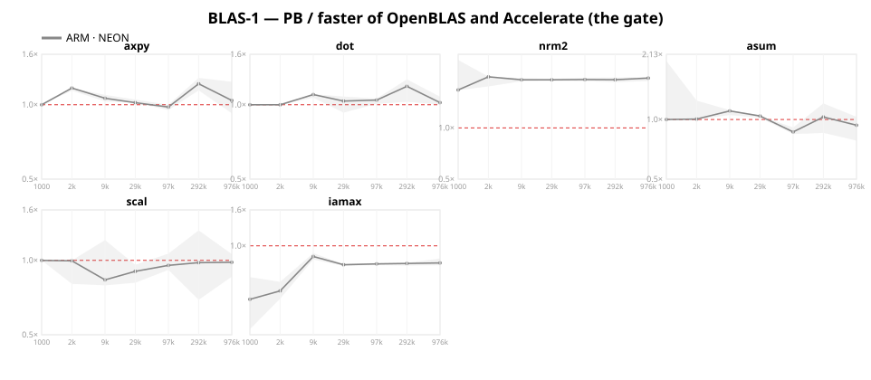
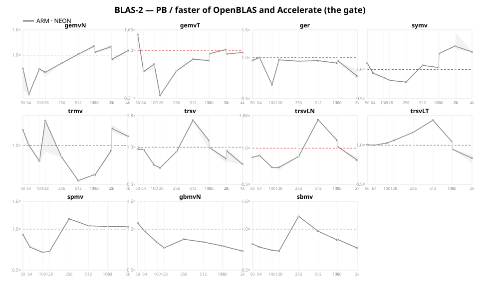
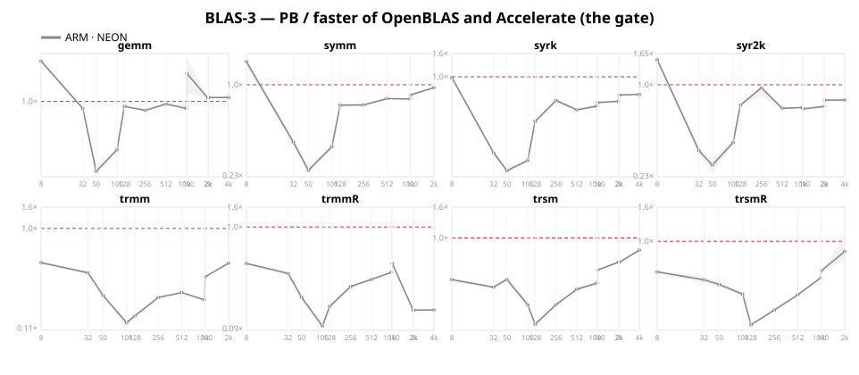
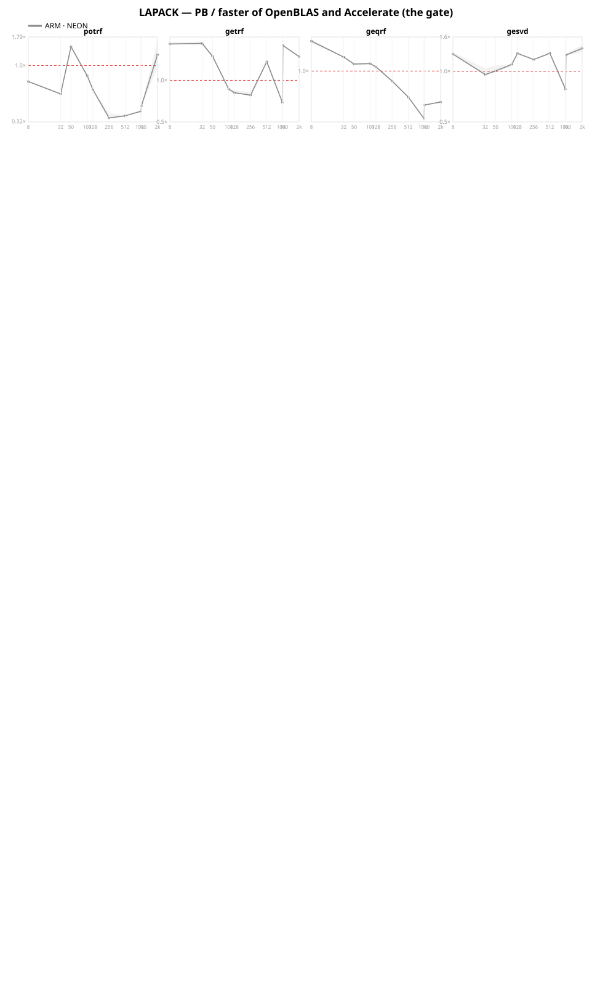
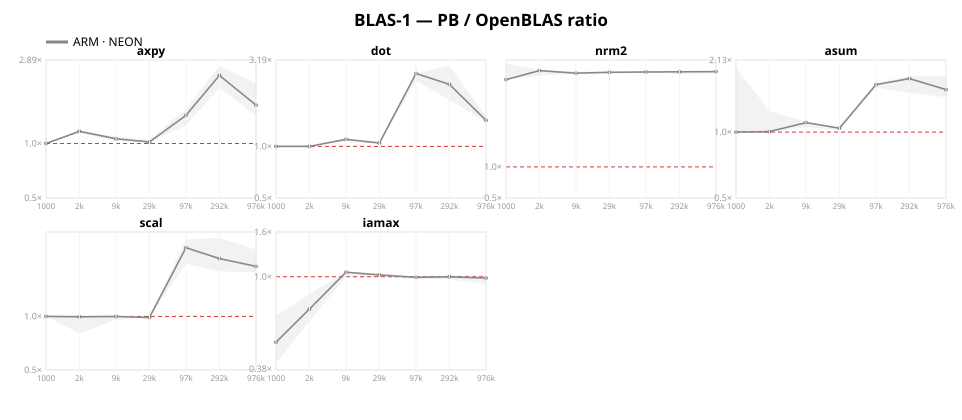
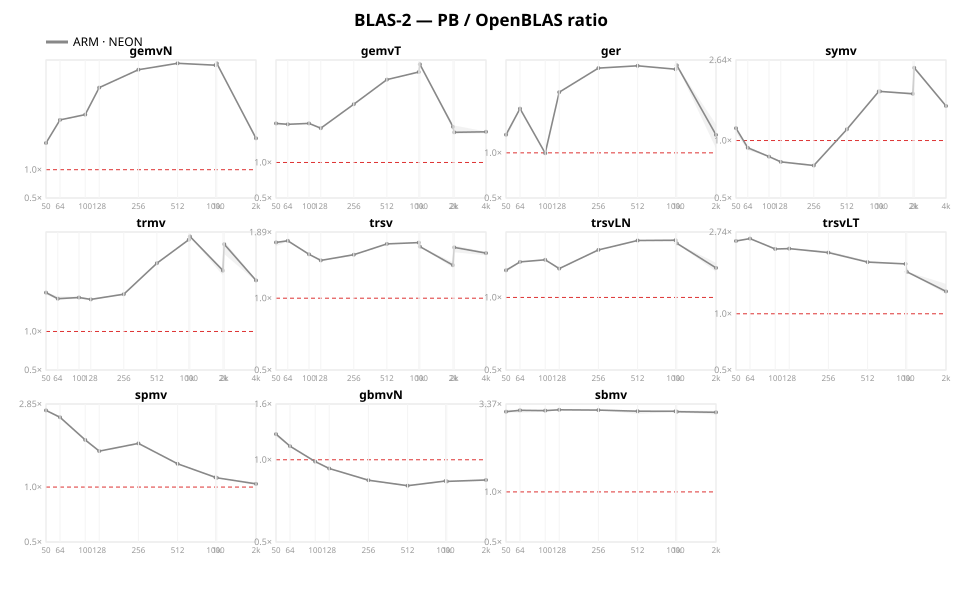
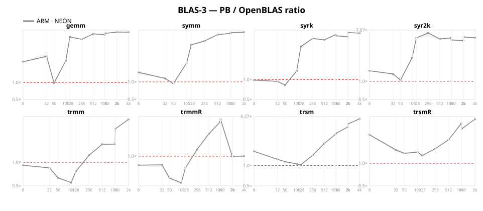
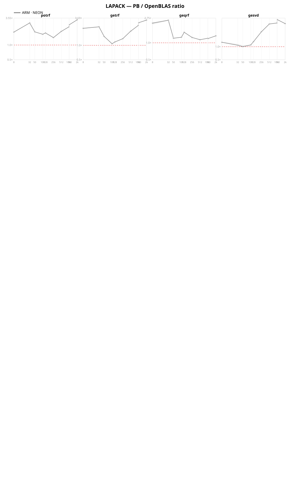
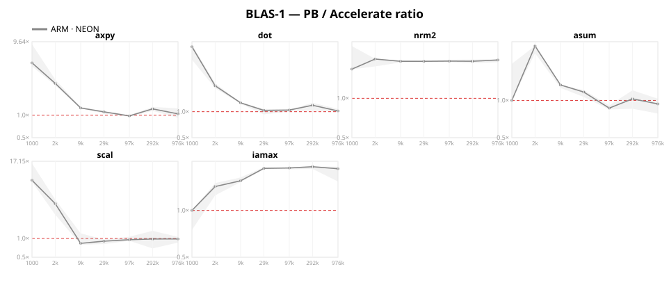
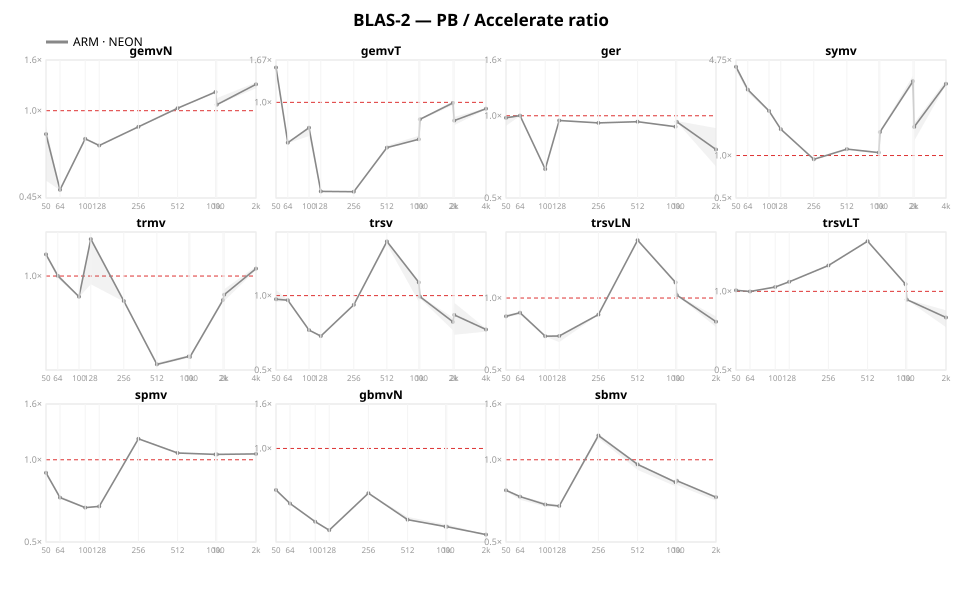
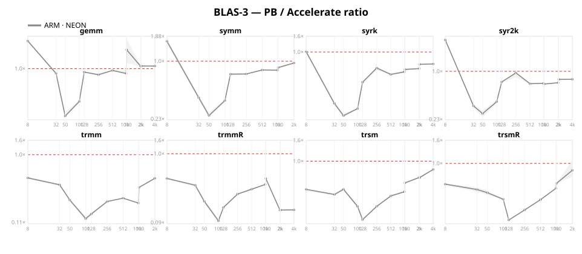


## Reproduce

```
julia --project=bench bench/plots.jl bench group=L1 arms=pb,openblas,accelerate cold nodraw
julia --project=bench bench/plots.jl bench group=L2 arms=pb,openblas,accelerate maxsize=2048 nodraw
julia --project=bench bench/plots.jl bench group=L3 arms=pb,openblas,accelerate maxsize=2048 nodraw
julia --project=bench bench/plots.jl bench op=potrf arms=pb,openblas,accelerate maxsize=2048 nodraw
julia --project=bench bench/plots.jl bench op=getrf arms=pb,openblas,accelerate maxsize=2048 nodraw
julia --project=bench bench/plots.jl bench op=geqrf arms=pb,openblas,accelerate maxsize=2048 nodraw
julia --project=bench bench/plots.jl bench op=gesvd arms=pb,openblas,accelerate maxsize=2048 nodraw
julia --project=bench bench/plots.jl outdir=docs/src/assets/apple
```

`bench/Project.toml` is the one bench environment on every box, Apple included. Accelerate needs no
package at all — it is an OS framework, forwarded by raw dylib path exactly like OpenBLAS — and
`AOCL_jll` resolves everywhere, reporting `is_available() == false` where AMD ships no artifact, so
the `aocl` arm simply is not offered on Apple silicon.
