# Apple Silicon

Results on Apple Silicon (arm64), comparing PureBLAS against **OpenBLAS** and **Accelerate** (Apple's
own vecLib BLAS/LAPACK, forwarded via `libblastrampoline`'s ILP64 `$NEWLAPACK$ILP64` interface — see
[Methodology](methodology.md#accelerate-on-apple-silicon)). This architecture is not part of the
[main fleet](performance.md), which stays AMD-only.

**SME**, the Scalable Matrix Extension, is a published Arm extension implemented on M4 and later. On
this machine it carries Float64 `gemm`, `gemv` in both the untransposed and transposed forms, and —
through them — `symm`, `syrk`, `syr2k`, `trmm`, `trsm`, `trmv`, `symv` and the LAPACK
factorizations. Float32 `gemm` has a second route to the unit, gated on its own feature constant,
its own register tile and its own published entry pointer: the 32-bit outer product is base SME
where the 64-bit one is an extension, so neither precision implies the other and neither arm may
stand in for the other. Anything the eligibility predicates decline runs on NEON, whose Float64
vector is 2 lanes wide. Those two paths differ by roughly an order of magnitude, so the ratios
below split by size rather than averaging into one figure.

**Scope:** BLAS-1, BLAS-2, BLAS-3 and the four core LAPACK factorizations (`potrf`, `getrf`, `geqrf`,
`gesvd`), Float64 only. Complex, ForwardDiff-dual and the rest of LAPACK are not covered here.

**Caveat that does not apply to the AMD fleet:** macOS has no equivalent of the Linux
`cpufreq`/`taskset` locking [Methodology](methodology.md) treats as mandatory for a gate-quality
measurement. These numbers are **not frequency-locked** — read them as directional, not gate verdicts.
Measured round-to-round spread on this box is nonetheless small: across eight rounds the q10-q90
band is 0.04% on the anchor workload and 0.3-1.7% on `gemm` cells
(`bench/probes/apple_unlocked_spread.jl`). That is the spread of ROUND MEDIANS; the spread of
individual samples inside a round is far wider in the small BLAS-3 cells — 1.1-1.2x at the binding
`syrk` and `trmm` sizes, and 2.15x in Accelerate's `gemm` at n = 1024, which is why that one cell
is not a usable figure.

**Machine:** Apple M6 (`_vwidth(Float64)=2`, `sme_max_svl_b=64` ⇒ 8 FP64 lanes in a ZA tile), unlocked
clock. The PureBLAS arm of `dot`, `nrm2`, `dznrm2`, `gemvT`, `gemvTrect`, `trsvLT`, `geqp3` and `gesvd`
was measured at commit `5e289bae2` on 2026-11-26, and of every other cell at `11f9f346d` on
2026-11-16; the OpenBLAS and Accelerate arms are reused from runs between 2026-09-22 and 2026-09-28.
Full provenance: [`provenance.md`](assets/apple/provenance.md).

⚠ **The two arms of this cache are seven to nine weeks apart.** The OpenBLAS and Accelerate arms date
from 2026-09-22 to 2026-09-28 and the PureBLAS arm from 2026-11-16 and 2026-11-26. The anchor
workload — a fixed kernel measured once per run, independent of any op here — reads within 1% between
the two on the median, but 49 of 281 comparison cells carry arm anchors more than 5% apart (worst
7.1%, `trsvLT` at n = 50; all of them in `asum`, `gemvN`, `gemvT`, `symv` and `trsvLT`;
`bench/check_arm_anchors.sh`), and against the gate's own 2% tolerance 11 ops have a binding cell
that is not adjudicable at all. **Read any single ratio here as carrying a machine-state term of up
to about 7%**; only a run that measures all three arms in one pass removes it. The box also has no
frequency pin, so `bench/check_arm_clocks.sh` has nothing to compare against and
`bench/check_cache_busy.sh` has no busy field to read — on macOS `plots.jl`'s contention guard needs
`/proc` and skips.

Measured PureBLAS-against-PureBLAS, with no reference involved, the 2026-11-16 run is 8.6% faster
than the 2026-11-09 one on the median of the 629 cells they share, while the anchor moved 1.2%. Six
ops gained more than 25%: `potri` 46%, `potrsL` 35%, `pstrfU` 30%, `syrk` 29%, `symm` 28% and
`trmm` 27%. `nrm2` reads 25% slower only because its 2026-11-09 cells were measured with the derived
FMA chain count that the 2026-11-26 cells use and the 2026-11-16 cells do not. A few single cells
moved the other way — `symm` at n = 32 (0.74x), `trmv` at n = 256 and `gemvNrect` at n = 2880
(0.84x), `syr2k` at n = 32 (0.85x). Those are regression candidates, not confirmed regressions,
until a re-measure settles them.

Between the 2026-11-16 and 2026-11-26 runs the OpenBLAS arm is the same, so the change in the median
ratio against it is a PureBLAS-against-PureBLAS change: `nrm2` 9.52 → 12.85, `dot` 1.14 → 1.39,
`gesvd` 1.95 → 2.02, `gemvT` 2.15 → 2.12 and `trsvLT` 2.14 → 1.89. The `trsvLT` loss is not settled:
its binding cell, n = 2048, has a round-to-round spread of 0.36 in `bench/gate_gaps.jl`, and nine of
its eleven cells, n = 2048 among them, carry arm anchors 7.1% apart.

## Headline

**The median and the worst cell tell opposite stories here, and the gate reports the worst cell.**
On the median PureBLAS beats Accelerate on `nrm2` (2.99x), `symv` (1.63x), `getrf` (1.43x), `gesvd`
(1.37x), `dot` (1.28x), `axpy` and `iamax` (1.20x), `geqrf` (1.08x), `spmv` (1.05x) and `gemm`
(1.04x), ties it on `asum`, and beats OpenBLAS on the median of every BLAS-3 and LAPACK op measured.
`gemvT` (0.99x) and `trsvLT` (0.97x) are within the machine-state term above. Only `dot` and `nrm2`
pass the gate — `dot` at 0.998, which rounds to 1.0 at two significant digits; every other op has at
least one size where it does not.

Where the remaining gap lives, by op family:

| family | shape of the gap |
|---|---|
| BLAS-3 `gemm`-fed | ahead from n = 2048 (1.07-1.11); the loss sits at n = 50-1000, 0.88-0.97 |
| `syrk` / `syr2k` | the largest open gap: `syrk` is 0.18 at n = 50 and 0.59 on the median |
| `trmm` / `trmmR` | both bottom at n = 100 — 0.21 side L, 0.18 side R — on medians of 0.42 and 0.47 |
| BLAS-2 | the losses sit at n = 64-128 (`gemvN` 0.50 at n = 64, `gemvT` 0.34 at n = 128), at `trmv`'s hand-off to `gemv` (0.40-0.49 at n = 512-1024), and in banded `gbmvN` and `sbmv` at most sizes |
| BLAS-1 | at or above OpenBLAS except `iamax` (0.62-0.77); against Accelerate the loss sits at n = 1e5 — `axpy` 0.68, `asum` 0.54, `scal` 0.39 — and is within 5% by n = 1e6 |

`gemm` against Accelerate across the ladder:

| n | 8 | 32 | 50 | 100 | 128 | 256 | 512 | 1000 | 2048 | 2100 | 4096 |
|---|---|---|---|---|---|---|---|---|---|---|---|
| ratio | 2.33 | 1.28 | 0.94 | **0.88** | 0.97 | 1.02 | 0.97 | 0.96 | 1.07 | 1.11 | 1.10 |

n = 100 is the binding cell and is what the `gemm` gate figure reports. n = 1024 reads 1.84, but
Accelerate's own q10-q90 spread in that one cell is 2.17x, so it is not a usable number — the cells
either side of it read 0.96 and 1.07, and both sit under a 1.17x spread. From n = 2048 up PureBLAS
leads by 7-11%.

## What reaches SME, and when

Eligibility is governed by TILE OCCUPANCY, not size alone, and the two floors differ because the
costs differ. A shape that divides the 16-row panel exactly pays no remainder panel at all and
qualifies from **two whole tiles, n = 32**. A shape with a remainder must also amortize the padded
block, and qualifies from **n = 48**. So `_sme_tile_ok(32,32)` and `(48,48)` and `(49,49)` are true
while `(33,33)` and `(40,40)` are false; n = 33 and n = 40 measure 0.66x and 0.93x of the NEON path
they stay on (those two figures come from the earlier probe run and were not re-measured on
2026-11-09 or 2026-11-16).

The Float32 twin `_sme_tile_ok32` admits **one** whole register tile each way where the Float64 path
requires two, over a 32-row tile rather than a 16-row one: it takes `min(m,n) ≥ 32`, passes any
shape dividing 32 exactly, and otherwise asks `max(m,n) ≥ 96`. Which multiple that ragged floor
lands on is measured, not inherited from the Float64 arm. Every ratio on this page is Float64, so
none of them exercises it.

The routines that reach the unit through `gemm` do so by declining their own private packed paths:
`syrk` and `syr2k` both hand off from n = 96, and `trmm` side-R declines its packed kernel wherever
the panel gemms it would replace are themselves eligible — the predicate asks `_sme_eligible` with
those gemms' own operands and shape rather than restating part of it. Above k = 1792 that packed
kernel is also what makes a threaded call bit-reproducible against a serial one, because the flat
panel loop keys its kernel choice on the band's own row count; so the same predicate declines the
thread pool, and a banded flat loop is never reachable. The side-R recursion bottoms out two SME
tiles down rather than at `_L3_NB`, and `trmm!`'s tiny fast path carries the same base so the two
cannot disagree about which calls it may answer directly.

`gemv` reaches SME in both forms, with floors that are not the same quantity: the untransposed form
asks for `m·n` work (half of L1 in elements), the transposed form asks for **m alone** (256 rows),
because its per-column-group fold is O(1) against O(m) of streamed column and does not care how many
columns follow. `trmv` hands its off-diagonal scatter to `gemv` from n = 512; `symv` splits its
off-diagonal into a `gemv`-N and a `gemv`-T from n = 384, reading that block twice in exchange for
the bandwidth.

## Two harness properties this page depends on

Both were defects once; both are now part of how the numbers are produced, and a reproduction that
skips either will not match.

**BLAS-1 at large n is measured `cold`.** `bench/plots.jl`'s `_L1REP(s) = clamp(8_000_000 ÷ s, 30,
20000)` amortizes per-call timer overhead by running `reps` calls back-to-back **on the same operand
buffer** inside one timed window. At n=1e6 that buffer is 16 MB — small enough to stay resident in
L2/SLC across all 30 calls, so the window measures repeated access to a warm buffer rather than
DRAM streaming. With genuinely cold, freshly allocated arrays far too large for any cache (10M-50M
elements, 240 MB-1.2 GB), Accelerate's real `axpy` advantage over OpenBLAS is **1.06-1.36x** — a
modest per-core DRAM-bandwidth edge, not the ~4.3x the reps-amortized form implies. The `cold` flag
forces `reps=1` and is used for every L1 figure on this page. It is opt-in and changes nothing for
the AMD fleet. **Open question:** whether the same artifact affects the AMD fleet's own large-n L1
cells — Zen3's 32 MiB L3 also holds a 16 MB working set — diagnosed here, unconfirmed on x86.

**Accelerate is held to one thread by an environment variable, not by LBT.**
`LinearAlgebra.BLAS.set_num_threads(1)` constrains OpenBLAS, AOCL and MKL. It does **not** constrain
vecLib, which reads `VECLIB_MAXIMUM_THREADS` at its own first use, independently of LBT's knob. Left
unset, a `dgemm` at n=4000 pins process CPU at a sustained ~190-200% despite the call. `plots.jl`
therefore sets `ENV["VECLIB_MAXIMUM_THREADS"]` at load time, before Accelerate can be forwarded;
the same workload then holds ~99-100%. The single-thread `dgemm` figure this yields is ~469
GFLOP/s — the second thread buys only ~16%, consistent with SME being one unit per cluster rather
than a per-core datapath. LAPACK is unaffected: `potrf` at n=2048 sampled clean single-threaded
either way, so vecLib appears to auto-parallelize only certain BLAS-3 routines at this size.

## Tuning: `tune!()` and its limits

`PureBLAS.tune!(dryrun=true, unlocked=true)` — the project's Measure-tier auto-calibrator, see
`src/tune.jl` — found two unpinned wins on this box when it was last run: `gemvT` routing switching
to per-column mode at n≥2048 for +11-13%, and `potrf`'s upper-direct cutoff moving from 20 to 8 for
+10-11%. **The `gemvT` finding predates the SME transposed path and has not been re-run against it**,
so treat it as unverified for the current tree; the `potrf` one is independent of that path.
Everything else it checks — gemv tile shape, `ger` panel width, `sytrf`, banded LU — the shipped
default already wins or it is a wash.

**`tune!()` does not reach the thing driving the broad L3 gap.** `gemm`'s microkernel tile shape
(`_MR`x`_NR`) is governed by `_ILP_TARGET=16`, a *Derive-tier* formula carrying an explicit x86
FMA-latency/port assumption, applied here unvalidated. There is no calibrator for it on any
architecture. Closing it needs either an ARM-specific derivation or a new Measure-tier calibrator —
separate, larger work than a data-generation pass.

⚠ **A routing cut is only as current as its slower arm.** Several cuts on this page choose between a
private kernel and a route that reaches SME, and every one of them is a frozen comparison: when the
`gemm` under it changes, the cut keeps steering by the old answer and nothing in the build notices.
`bench/probes/sme_syr2k_route_recheck.jl` and `bench/probes/sme_min_crossover.jl` re-derive the two
that matter most; re-run them whenever the kernel moves.

## vs OpenBLAS and Accelerate, per op

Ratio is PB / reference, **median (worst cell)** across the measured size ladder — BLAS-2 and BLAS-3
reach n = 4096, LAPACK caps at n = 2048, and BLAS-1 runs the full 1e3..1e6 measured `cold` (see
above). Gate is PB / max(OpenBLAS, Accelerate) — the same two-significant-digit rounding rule as
the [main fleet](methodology.md#the-gate) (`bench/gatecrit.jl`). The gate is a **worst-cell** figure, so a
FAIL can still have a winning median — true below for every op except `scal` and `gbmvN`.

| level | op | vs OpenBLAS | vs Accelerate | gate | verdict |
|---|---|---|---|---|---|
| L1 | `axpy` | **1.07** (1.00) | **1.20** (0.68) | 0.685 | FAIL |
| L1 | `dot` | **1.39** (1.06) | **1.28** (1.00) | 0.998 | **PASS** |
| L1 | `nrm2` | **12.85** (11.22) | **2.99** (2.67) | 2.667 | **PASS** |
| L1 | `asum` | **1.06** (1.00) | 1.00 (0.54) | 0.542 | FAIL |
| L1 | `scal` | 1.00 (0.99) | 0.98 (0.39) | 0.388 | FAIL |
| L1 | `iamax` | 0.64 (0.51) | **1.20** (1.00) | 0.506 | FAIL |
| L2 | `gemvN` | **7.48** (1.90) | 0.89 (0.50) | 0.500 | FAIL |
| L2 | `gemvT` | **2.12** (1.74) | 0.99 (0.35) | 0.345 | FAIL |
| L2 | `ger` | **2.55** (1.03) | 0.95 (0.66) | 0.657 | FAIL |
| L2 | `symv` | **1.29** (0.74) | **1.63** (0.94) | 0.742 | FAIL |
| L2 | `trmv` | **2.49** (1.64) | 0.88 (0.40) | 0.396 | FAIL |
| L2 | `trsv` | **1.64** (1.36) | 0.94 (0.68) | 0.678 | FAIL |
| L2 | `trsvLN` | **1.43** (1.29) | 0.85 (0.69) | 0.690 | FAIL |
| L2 | `trsvLT` | **1.89** (1.20) | 0.97 (0.69) | 0.692 | FAIL |
| L2 | `spmv` | **1.60** (1.05) | **1.05** (0.68) | 0.677 | FAIL |
| L2 | `gbmvN` | 0.81 (0.77) | 0.77 (0.66) | 0.657 | FAIL |
| L2 | `sbmv` | **3.06** (3.02) | 0.77 (0.68) | 0.684 | FAIL |
| L3 | `gemm` | **7.36** (2.30) | **1.04** (0.88) | 0.882 | FAIL |
| L3 | `symm` | **4.91** (1.15) | 0.79 (0.39) | 0.390 | FAIL |
| L3 | `syrk` | **3.91** (0.97) | 0.59 (0.18) | 0.175 | FAIL |
| L3 | `syr2k` | **5.14** (1.41) | 0.79 (0.36) | 0.363 | FAIL |
| L3 | `trmm` | **1.92** (0.69) | 0.42 (0.21) | 0.207 | FAIL |
| L3 | `trmmR` | **3.01** (0.64) | 0.47 (0.18) | 0.181 | FAIL |
| L3 | `trsm` | **2.30** (1.22) | 0.58 (0.35) | 0.354 | FAIL |
| L3 | `trsmR` | **3.05** (1.44) | 0.74 (0.49) | 0.492 | FAIL |
| LP | `potrf` | **2.22** (1.71) | 0.61 (0.42) | 0.420 | FAIL |
| LP | `getrf` | **2.17** (1.17) | **1.43** (0.75) | 0.746 | FAIL |
| LP | `geqrf` | **1.34** (1.18) | **1.08** (0.28) | 0.284 | FAIL |
| LP | `gesvd` | **2.02** (1.07) | **1.37** (0.93) | 0.929 | FAIL |

184 of 281 measured cells sit below the gate. The worst are `syrk` at n = 32-100 (0.18-0.26),
`trmmR` at n = 50-100 (0.18-0.23) and `trmm` at n = 50-128 (0.21-0.31). In the two binding cells
PureBLAS's own q10-q90 sample spread is 1.01x (`syrk` at n = 50) and 1.02x (`trmmR` at n = 100),
while their Accelerate arms spread 1.15x and 1.10x, so the noise in those ratios, about 10-15%,
comes from the reference arm, and a tuning change smaller than that is not separable from it in
this cache.

Full machine-readable tables: [`gen_table.md`](assets/apple/gen_table.md) (vs OpenBLAS),
[`gen_table_accelerate.md`](assets/apple/gen_table_accelerate.md) (vs Accelerate).

## Plots

Ratio-vs-size, same style as the [main fleet pages](performance.md) (dashed line = parity, band = q10-q90
spread). "gate" divides by whichever reference is faster at each point.

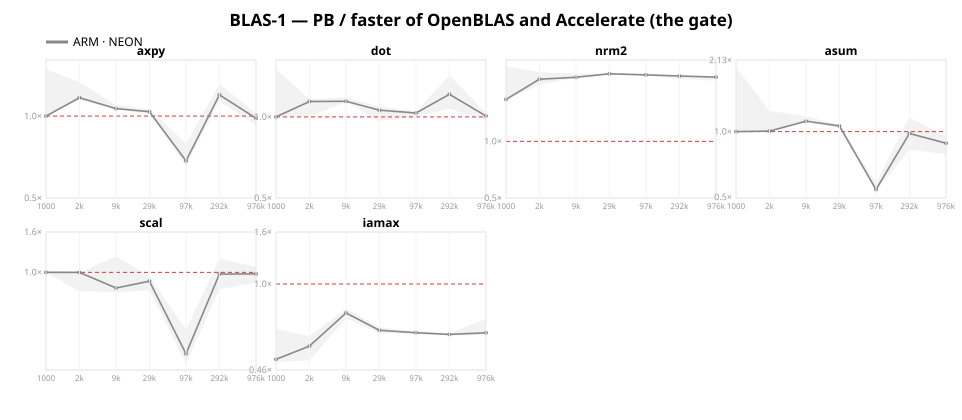
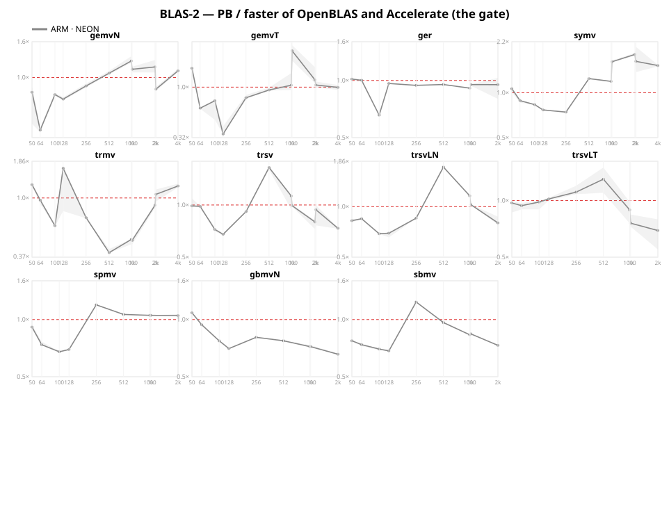
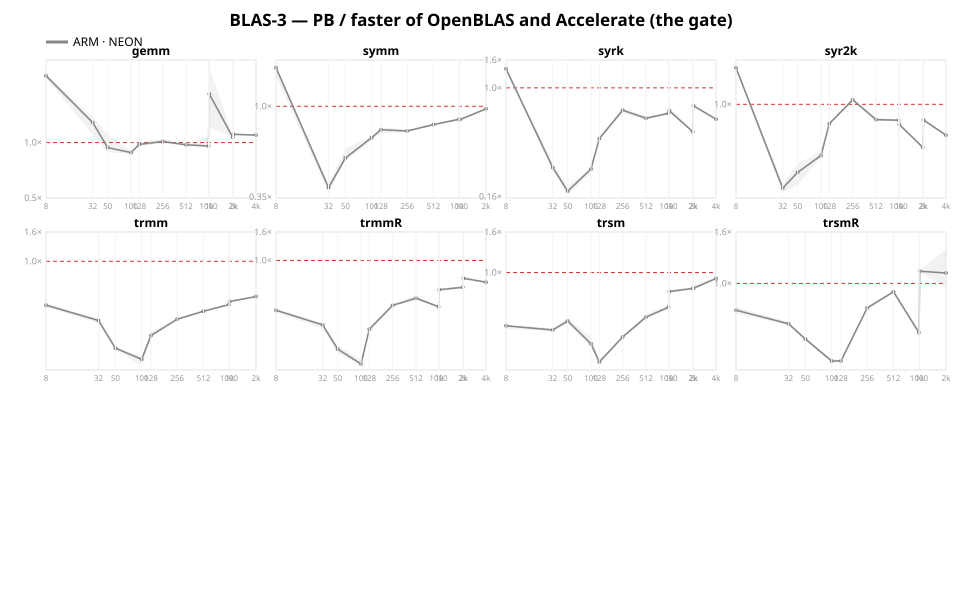
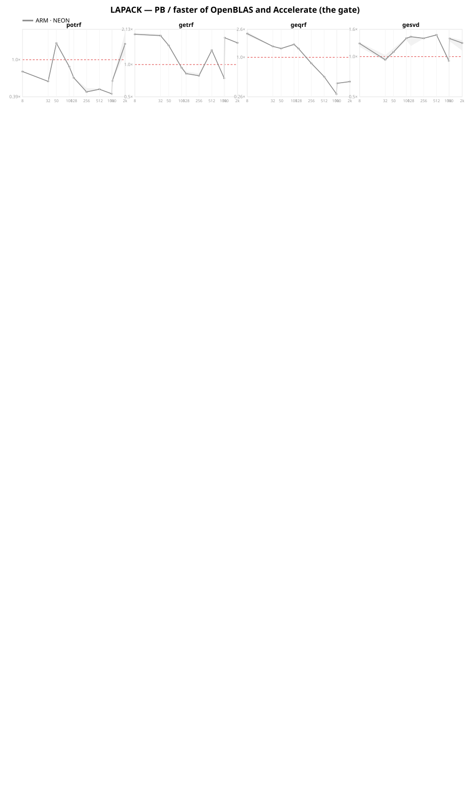
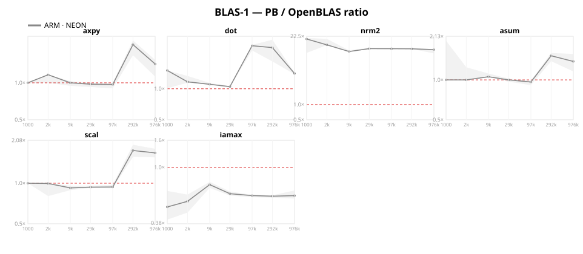
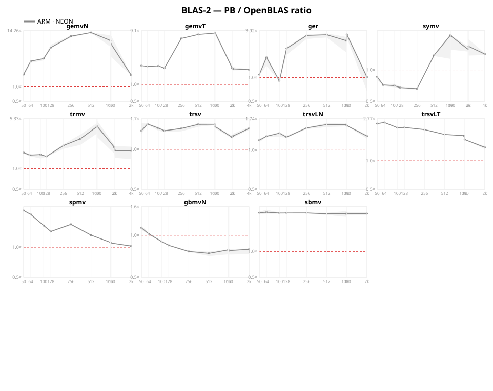
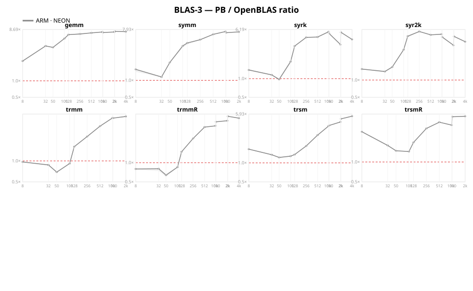
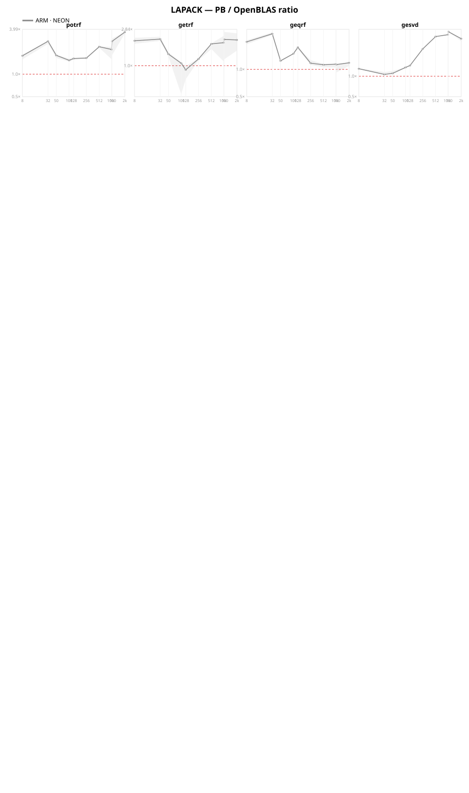
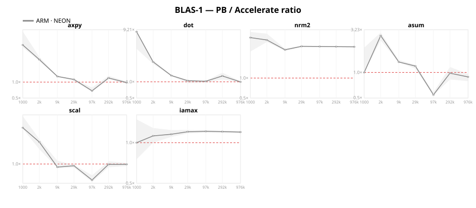
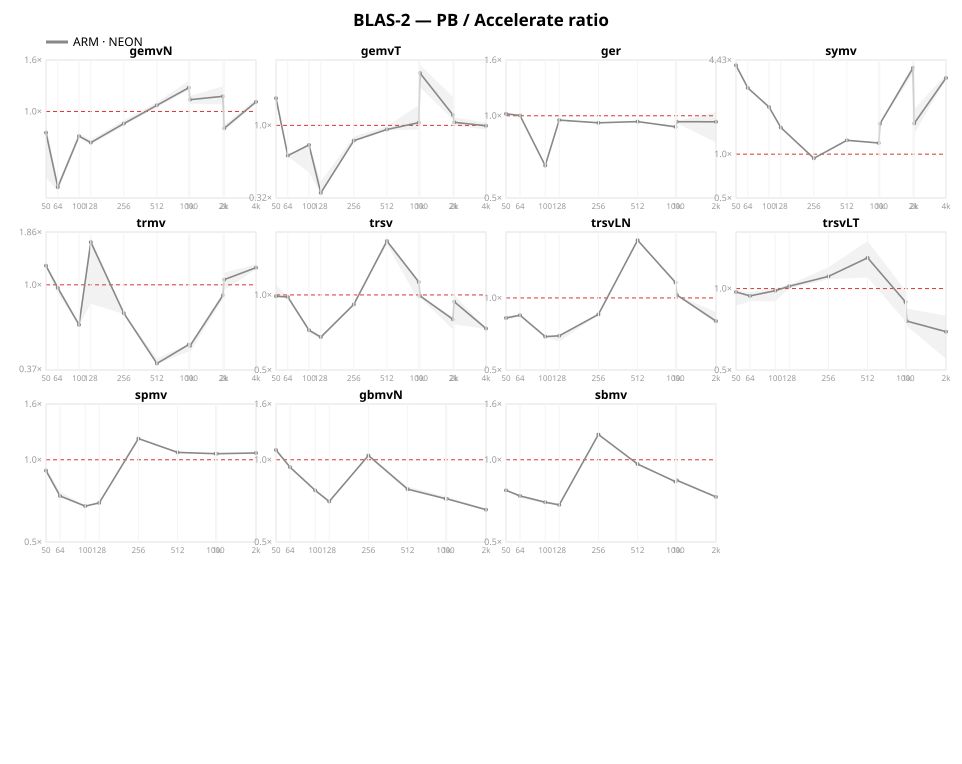
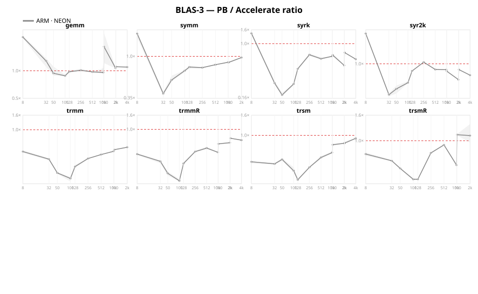
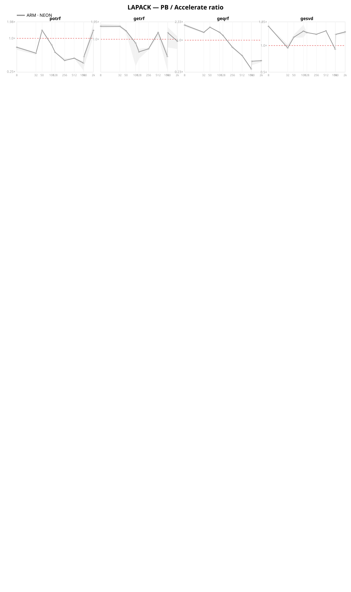

## Reproduce

```
julia --project=bench bench/plots.jl bench group=L1 arms=pb,openblas,accelerate cold nodraw
julia --project=bench bench/plots.jl bench group=L2 arms=pb,openblas,accelerate nodraw
julia --project=bench bench/plots.jl bench group=L3 arms=pb,openblas,accelerate nodraw
julia --project=bench bench/plots.jl bench op=potrf arms=pb,openblas,accelerate maxsize=2048 nodraw
julia --project=bench bench/plots.jl bench op=getrf arms=pb,openblas,accelerate maxsize=2048 nodraw
julia --project=bench bench/plots.jl bench op=geqrf arms=pb,openblas,accelerate maxsize=2048 nodraw
julia --project=bench bench/plots.jl bench op=gesvd arms=pb,openblas,accelerate maxsize=2048 nodraw
julia --project=bench bench/plots.jl outdir=docs/src/assets/apple
```

That is the full-arm form, and it is the only one whose ratios are free of the machine-state term
above. The 2026-11-16 figures came from a PureBLAS-only refresh over the September reference arms,
one launch per group because `group=` is an exact match and a comma list matches nothing:

```
for g in L1 L2 L3 LP CL1 CL2 CL3 CLP DL1 DL2 DL3 DLP; do
    julia --project=bench bench/plots.jl bench group=$g arms=pb cold nodraw
done
julia --project=bench bench/plots.jl outdir=docs/src/assets/apple
```

The 2026-11-26 refresh re-measured only the eight ops that reach the BLAS-1 reduction kernels, over
that cache, one op per launch:

```
for op in dot nrm2 dznrm2 gemvT gemvTrect trsvLT; do
    julia --project=bench bench/plots.jl bench op=$op arms=pb cold nodraw
done
for op in geqp3 gesvd; do
    julia --project=bench bench/plots.jl bench op=$op arms=pb maxsize=2048 cold nodraw
done
julia --project=bench bench/plots.jl outdir=docs/src/assets/apple
```

`group=` and `op=` runs MERGE per arm per cell; a `bench` run without either REPLACES the cache
whole, so the same command without `group=` would drop both reference arms and `plots.jl` refuses
it. `outdir=` is not optional here: the default render draws every host cache on disk into
`docs/src/assets`, and this box holds only the Apple cache, so a bare `bench/publish.sh` would
overwrite the fleet figures and drop three microarchitectures.

`bench/Project.toml` is the one bench environment on every box, Apple included. Accelerate needs no
package at all — it is an OS framework, forwarded by raw dylib path exactly like OpenBLAS — and
`AOCL_jll` resolves everywhere, reporting `is_available() == false` where AMD ships no artifact, so
the `aocl` arm simply is not offered on Apple silicon.
