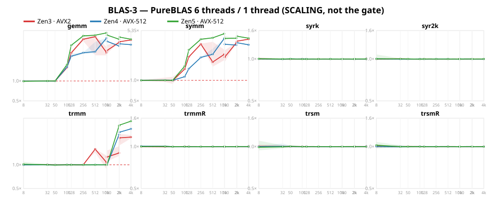
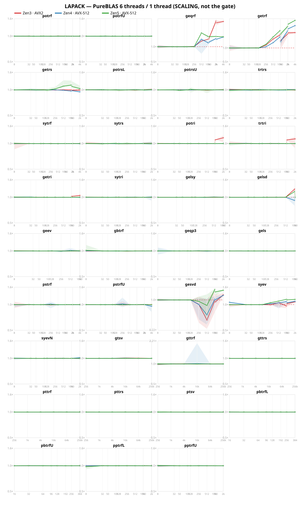

# Multi-threading

PureBLAS threads `gemm` — one split, over the columns of C, across a parked worker pool. Routines that
call `gemm!` inherit it for free. Threading is **off** until you ask for it:

```julia
PureBLAS.set_num_threads(6)     # opt in; same shape as openblas_set_num_threads
PureBLAS.get_num_threads()
```

## These numbers are NOT the gate

The gate is `PB ≥ max(OpenBLAS, AOCL)`, **single-threaded**, and nothing on this page changes it. Every
figure here is a **scaling** measurement: the same PureBLAS, on the same box, in the same process, with
six threads instead of one.

A threaded PureBLAS compared against a single-threaded OpenBLAS would be flattery, not parity, so that
comparison is not made anywhere here. A real threaded gate needs freshly measured **threaded reference
arms**, which is six to eight hours per box and has not been done.

## How it is measured

- **Six threads on every box**, pinned one per *physical* core. The Zen3 part has twelve cores and is
  capped to six so the three boxes stay comparable, and its six are taken from a single L3 so it matches
  the single-CCX shape of the other two. A second thread on a core shares the same FMA units, so pinning
  to logical cores would measure contention rather than parallelism — and the sibling numbering differs
  between parts, which is a trap: `0,2,4,6,8,10` is six distinct cores on one of these boxes and only
  three on the others.
- **`pb` and `pb_mt` are measured in one process, in rotated rounds**, so a speedup divides two windows
  that saw the same machine state. It is a paired A/B, not two runs compared afterwards.
- **A separate cache.** The gate sweep is pinned to ONE core on purpose; the mt arm needs six. Since the
  two cannot share an invocation's affinity, an mt run writes `bench/mt_data_<uarch>_<host>.txt` and
  never touches the gate cache. The name sits outside the `plots_data_*` glob that the artifact
  generators and audits use, so these numbers cannot leak into a gate verdict.
- **Median of per-round medians**, the same estimator the gate uses. The round spread is reported
  because it is the precision of the thing doing the measuring.
- Frequency-locked with boost off, verified by achieved clock **under load** — not by reading sysfs,
  which on one box reported a perfect lock while the core ran at 4772 MHz against a 2000 MHz pin.

Reproduce with:

```bash
taskset -c 0,1,2,3,4,5 julia --project=bench -t 6 bench/plots.jl bench arms=pb,pb_mt nodraw
julia --project=bench bench/mt_summary.jl bench/mt_data_*.txt
```

## What is threaded, and what is deliberately not

**There is exactly ONE splitter, in `gemm!`.** No other routine contains threading code. `_symm!` is
the only other place that calls the threaded driver, and it does so by routing its already-materialised
product through that same splitter. Everything else that speeds up — `getrf`, `geqrf`, `trmm` — does so
because it *calls* `gemm!`; not a line was written for them.

That is why this page lists 13 operations and not 60. Of the real-typed ops measured, 47 do not move
beyond the noise floor, because nothing threads them.

Flat at 1.00 **by design**, because no reference threads them either: `trsv`, `tbsv`, `tpsv`, `copy`,
`asum`, `iamax`, and gemm's k-loop. Their cells are a control — if one ever moves off 1.00, something
is wrong with the measurement rather than right with the library.

`syrk`, `syr2k`, `hemm` and the rest of Level-3 inherit nothing for a structural reason worth knowing:
they reach `_gemm_core!` **directly**, which sits *below* the split point. Threading them is Phase 4 of
the plan and is not started.

`trsm` is also flat, but for a different reason: it wraps its body in an arena scope, and a threaded
`gemm` refuses to run while any scope is live (see [the arena](arena.md)). That guard is what makes
per-thread workspaces safe, so the flatness is a deliberate trade, not an oversight.

### Why `Dual` gets nothing — and why that is wiring, not a law

The dual groups carry no `pb_mt` arm at all, because their reference is LinearAlgebra's generic
fallback, which replaces the arm list. But the interesting part is what would happen if they did.

**A dual gemm is already three REAL `Float64` gemms.** `_gemm_dual3!` splits the operands into value
and partial planes and computes `P1 = Av·Bv`, `P2 = Av·Bp`, `P2 += Ap·Bv`, then combines. Those three
products are ordinary real gemms of the same shape as the original — exactly the kind of call that
threads well. So there is no type-level reason a `Dual` gemm cannot be threaded.

Two concrete things block it today, and neither is fundamental:

1. **It calls `_gemm_core!` directly**, which sits *below* the split point — the same structural reason
   `syrk` and `syr2k` inherit nothing. The guard in `gemm!` never even runs for these.
2. **The plane scratch is per-THREAD and held across all three products.** The buffers come from
   `L3Workspace`, whose owner is safe today only because it is claimed *inside* a chunk body, which
   never yields. A driver holding it across a threaded join is precisely the shape that made concurrent
   `getrf!` return wrong answers 20 times in 96 — it would need the same per-task conversion `symm`
   received.

There is also a parallel opportunity the column split does not reach: `P1` and the `P2` pair are
**independent products**, so they could run concurrently as whole gemms rather than being split
internally. That is task-level parallelism on the same three-plane structure.

None of this is scheduled. It belongs with Phase 4, and it is recorded here so the absence reads as a
decision rather than an oversight.

## Plots

One panel per operation, one curve per microarchitecture, against problem size. The dashed line is
1.00× — **no gain** — so a curve above it means threading paid and a curve below it means threading
cost. The band is the q10–q90 spread of the pooled per-round ratios.

Read the SHAPE, not just the peak. A curve that climbs with `n` is a routine amortising the fork-join
correctly; one that falls is a routine that is not. The flat lines sitting exactly on 1.00 — `syrk`,
`syr2k`, `trsm`, `trmmR`, every Level-1 and Level-2 panel — are the controls described above, and they
are supposed to be flat.




Only Level-3 and LAPACK are plotted, because they are the only groups anything threads. Level-1 and
Level-2 have no splitter, and complex and dual cannot reach one — so their panels would be flat lines
by construction rather than by measurement.

Within these two panels the flat curves ARE informative, and they are kept for exactly that reason:
`syrk`, `syr2k`, `trsm`, `trmmR` and `potrf` sit on 1.00 next to `gemm` climbing to ~5×. They reach
`_gemm_core!` *below* the split point — or, when these plots were last rendered, were refused threading
because their `gemm!` sat inside a live arena scope; that admission guard is gone (the driver pins itself
to its thread for the join instead, see `arena.md`), so the scope-blocked curves are due a re-render.
Seeing flat curves in the same picture is what shows the measurement discriminates rather than
flattering everything.

Regenerate them with `julia --project=bench bench/plots.jl mtdraw`. That mode renders only
`perf_mt_*.svg` and exits before the gate rendering, so it cannot touch a gate artifact.

## Results

Best speedup per operation, six threads against one, on each box.

| op | Zen3 · AVX2 | Zen4 · AVX-512 | Zen5 · AVX-512 |
|---|---|---|---|
| L3 `gemm` | 4.68× @512 | 4.42× @1000 | 5.34× @1000 |
| L3 `symm` | 4.00× @4096 | 4.10× @1000 | 4.82× @1000 |
| LP `getrf` | 2.12× @4096 | 3.05× @4096 | 3.96× @4096 |
| L3 `trmm` | 2.24× @4096 | 2.86× @4096 | 3.58× @4096 |
| LP `geqrf` | 3.23× @2048 | 1.55× @4096 | 1.87× @512 |
| LP `gesvd` | 1.28× @2048 | 1.25× @2048 | 1.70× @1000 |
| LP `gelsd` | 1.25× @1000 | 1.00× @256 | 1.17× @1000 |
| LP `potri` | 1.16× @2048 | 1.00× @512 | 1.00× @50 |
| LP `syev` | 1.08× @2048 | 1.09× @2048 | 1.16× @1000 |
| LP `getrs` | 1.00× @100 | 1.00× @8 | 1.13× @1000 |
| LP `trtri` | 1.12× @2048 | 1.00× @32 | 1.00× @32 |
| LP `getri` | 1.05× @2048 | 1.00× @32 | 1.01× @8 |

### Zen3 · AVX2

Measured 2026-09-18T18:27 at commit `c1e0222e`, AMD Ryzen 9 5900X 12-Core Processor, pinned at 3701 MHz with boost off.

1104 cells measured, 0 off-lock. Listed below: the threadable ops whose best cell moves further than the 3.7% noise floor.

**Where threading pays.** Best cell per operation:

| op | best speedup | at n | round spread |
|---|---|---|---|
| L3 `gemm` | **4.68×** | 512 | 46% |
| L3 `symm` | **4.00×** | 4096 | 0% |
| LP `geqrf` | **3.23×** | 2048 | 4% |
| L3 `trmm` | **2.24×** | 4096 | 8% |
| LP `getrf` | **2.12×** | 4096 | 6% |
| LP `gesvd` | **1.28×** | 2048 | 9% |
| LP `gelsd` | **1.25×** | 1000 | 0% |
| LP `potri` | **1.16×** | 2048 | 4% |
| LP `trtri` | **1.12×** | 2048 | 5% |
| LP `syev` | **1.08×** | 2048 | 3% |
| LP `getri` | **1.05×** | 2048 | 2% |

**Where threading COSTS.** Every cell that got slower with six threads:

| op | n | speedup | round spread |
|---|---|---|---|
| LP `gesvd` | 512 | **0.36×** | 9% |
| LP `gesvd` | 256 | **0.80×** | 6% |
| LP `gesvd` | 1000 | **0.88×** | 86% |
| LP `gesvd` | 1024 | **0.89×** | 82% |
| LP `syev` | 8 | **0.94×** | 7% |

### Zen4 · AVX-512

Measured 2026-09-18T16:12 at commit `c1e0222e`, AMD Ryzen 5 7640U w/ Radeon 760M Graphics, pinned at 2813 MHz with boost off.

1104 cells measured, 0 off-lock. Listed below: the threadable ops whose best cell moves further than the 3.7% noise floor.

**Where threading pays.** Best cell per operation:

| op | best speedup | at n | round spread |
|---|---|---|---|
| L3 `gemm` | **4.42×** | 1000 | 3% |
| L3 `symm` | **4.10×** | 1000 | 0% |
| LP `getrf` | **3.05×** | 4096 | 1% |
| L3 `trmm` | **2.86×** | 4096 | 1% |
| LP `geqrf` | **1.55×** | 4096 | 1% |
| LP `gesvd` | **1.25×** | 2048 | 4% |
| LP `syev` | **1.09×** | 2048 | 5% |

**Where threading COSTS.** Every cell that got slower with six threads:

| op | n | speedup | round spread |
|---|---|---|---|
| LP `gesvd` | 512 | **0.47×** | 115% |
| LP `gesvd` | 256 | **0.79×** | 9% |
| LP `pstrfU` | 4096 | **0.90×** | 13% |
| LP `gelsd` | 1000 | **0.90×** | 12% |
| LP `gesvd` | 1024 | **0.94×** | 26% |
| LP `getrs` | 2048 | **0.94×** | 5% |

### Zen5 · AVX-512

Measured 2026-09-18T22:01 at commit `c1e0222e`, AMD Ryzen AI 5 340 w/ Radeon 840M, pinned at 2000 MHz with boost off.

1104 cells measured, 0 off-lock. Listed below: the threadable ops whose best cell moves further than the 3.7% noise floor.

**Where threading pays.** Best cell per operation:

| op | best speedup | at n | round spread |
|---|---|---|---|
| L3 `gemm` | **5.34×** | 1000 | 1% |
| L3 `symm` | **4.82×** | 1000 | 0% |
| LP `getrf` | **3.96×** | 4096 | 0% |
| L3 `trmm` | **3.58×** | 4096 | 1% |
| LP `geqrf` | **1.87×** | 512 | 2% |
| LP `gesvd` | **1.70×** | 1000 | 3% |
| LP `gelsd` | **1.17×** | 1000 | 1% |
| LP `syev` | **1.16×** | 1000 | 0% |
| LP `getrs` | **1.13×** | 1000 | 3% |

**Where threading COSTS.** Every cell that got slower with six threads:

| op | n | speedup | round spread |
|---|---|---|---|
| LP `gesvd` | 512 | **0.70×** | 88% |
| LP `gesvd` | 256 | **0.92×** | 28% |

## Open: `gesvd` gets slower with threads

`gesvd` is the one routine that is **worse** with threads, and it reproduces on all three
microarchitectures — though not equally, which is itself a clue:

| box | n=256 | n=512 | n=1000 | n=1024 | n=2048 |
|---|---|---|---|---|---|
| Zen3 · AVX2 | 0.80× | 0.36× | 0.88× | 0.89× | 1.28× |
| Zen4 · AVX-512 | 0.79× | 0.47× | 1.04× | 0.94× | 1.25× |
| Zen5 · AVX-512 | 0.92× | 0.70× | 1.70× | 1.50× | 1.62× |

The root cause is **not yet known**. Three plausible explanations have been measured and rejected:

- **Not the fork-join price.** A gemm is only allowed to thread when it is at least 32× the measured
  join cost, so aggregate join overhead cannot exceed about 3%. The measured cost is ~1.29 ms per
  dispatch against a 616 ns join — roughly 2000×, and still ~300× a full sleep-wake.
- **Not the operand shape.** Skinny gemms were suspected, since every worker packs the whole of A. But
  a shape grid shows thin-`n`, thin-`k` and thin-`m` gemms mostly speeding up 1.9–3.7×.
- **Not the spin budget.** Setting the worker spin window to zero moved the bad band rather than
  removing it, and left n≥512 unchanged.

What is established: the threaded path genuinely runs (72 dispatches witnessed at n=512 via the pool's
generation counter, zero at one thread), and `gemm` itself is unstable under threading at n=256 while
being stable and fast at n≥512. Until this is understood, **do not enable threading for a workload
dominated by SVD at these sizes**.

