# Multi-threading

PureBLAS threads `gemm`, `symm`, `syrk`, `syr2k`, both sides of `trsm`, and — through them —
`getrf` and `potrf`. Threading is **off** until you ask for it:


```julia
PureBLAS.set_num_threads(6)     # opt in; same shape as openblas_set_num_threads
PureBLAS.get_num_threads()
```

## What these numbers are

A **scaling** measurement: the same PureBLAS, on the same box, in the same process, with six threads
instead of one. The gate is a separate, single-threaded criterion and this page does not speak to it.

A threaded gate would need freshly measured threaded reference arms, six to eight hours per box.

## How it is measured

- **Six threads on every box**, pinned one per *physical* core. The Zen3 part has twelve cores and is
  capped to six so the three boxes stay comparable, and its six are taken from a single L3 so it matches
  the single-CCX shape of the other two. A second thread on a core shares the same FMA units, so pinning
  to logical cores would measure contention rather than parallelism — and the sibling numbering differs
  between parts, which is a trap: `0,2,4,6,8,10` is six distinct cores on one of these boxes and only
  three on the others.
- **`pb` and `pb_mt` are measured in one process, in rotated rounds**, so a speedup divides two windows
  that saw the same machine state. It is a paired A/B, not two runs compared afterwards.
- **A separate cache.** The gate sweep is pinned to ONE core on purpose; the mt arm needs six. Since the
  two cannot share an invocation's affinity, an mt run writes `bench/mt_data_<uarch>_<host>.txt` and
  never touches the gate cache. The name sits outside the `plots_data_*` glob that the artifact
  generators and audits use, so these numbers cannot leak into a gate verdict.
- **Median of per-round medians**, the same estimator the gate uses. The round spread is reported
  because it is the precision of the thing doing the measuring.
- Frequency-locked with boost off, verified by achieved clock **under load** — not by reading sysfs,
  which on one box reported a perfect lock while the core ran at 4772 MHz against a 2000 MHz pin.

Reproduce with:

```bash
# The mask is one CPU per physical core PLUS one spare for the runtime threads, and CPU numbering
# differs per box — `bench/plots.jl`'s `_ARM_PB_MT` comment carries the mask for each.
taskset -c 0,2,4,6,8,10,1 julia --project=bench -t 6 bench/plots.jl bench arms=pb,pb_mt nodraw
julia --project=bench bench/mt_summary.jl bench/mt_data_*.txt
```

## What is threaded

The worker pool runs five kinds of job. `gemm` splits the columns of C. `syrk`, `syr2k` and `symm`
reach the kernel below that split point, so they carry their own kind: a triangular output needs a
flop-balanced column split, since equal widths hand the first worker roughly twice the work of the
last. `trsm` splits the columns of B on side L and its rows on side R — every column of one and
every row of the other is an independent solve, so the bands are write-disjoint and need no barrier.
`getrf` adds one more: it factors the next panel on one worker while the rest apply the current
panel's update.

`getrf` and `potrf` reach the pool through those, and `potrf` reaches it at every size — its leaf
routes its trailing update through the public `syrk!` rather than a private kernel.

**A band must route from the unsplit problem's dimensions.** Several kernel choices key on
`max(m, n, k)`, so a band whose width lands on one of those constants would take a different kernel
from the call it belongs to. That is not a slower answer, it is a different one, and it is why the
route token reaches the kernel switches themselves — `getrf` lost its thread-count invariance until
it did.

## Plots

One panel per operation, one curve per microarchitecture, against problem size. The dashed line is
1.00×, the band is the q10–q90 spread of the pooled per-round ratios.

### The gate, with threads on

This is the criterion of req#1 measured threaded: **PureBLAS at N threads over whichever THREADED
vendor is faster in that cell**, `max(OpenBLAS, AOCL)`, chosen per size — so one curve may switch
references along its own x-axis, exactly as the gate does. Above 1.00× is a pass.

Every group appears here, including the ones that do not thread at all. That is deliberate: a group
with no splitter still has to be measured against a vendor that has one, and that gap IS the finding
for BLAS-2 and for the complex groups.

A cell with no threaded reference arm is DROPPED rather than compared against a serial one — a
threaded PureBLAS arm over a single-thread vendor is not the gate and must not be drawn as if it were.

!!! warning "The Zen4 curve is not yet adjudicable"
    That box is a laptop mainboard with no battery, and it was running on a supply that could not hold
    its pin once every core was busy: one core held 2795 MHz indefinitely while six oscillated
    2332–2804 MHz, at 52–58 °C, far below any thermal limit. 1208 of its cached arms are stamped
    below the pin and 413 cells compare two power states rather than two libraries. The error runs in
    PureBLAS's favour, because a throttled reference is a slower reference. A larger supply has since
    moved its sustainable pin to 3501 MHz and `fleet_freqlock.sh verify-mt` confirms six cores hold
    it, so those cells are being re-measured with both arms in one machine state; until then read the
    Zen3 and Zen5 curves, whose cross-arm clocks agree on 929 of 937 and 951 of 951 cells.

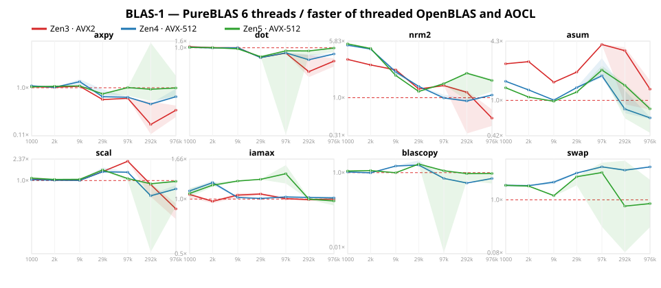
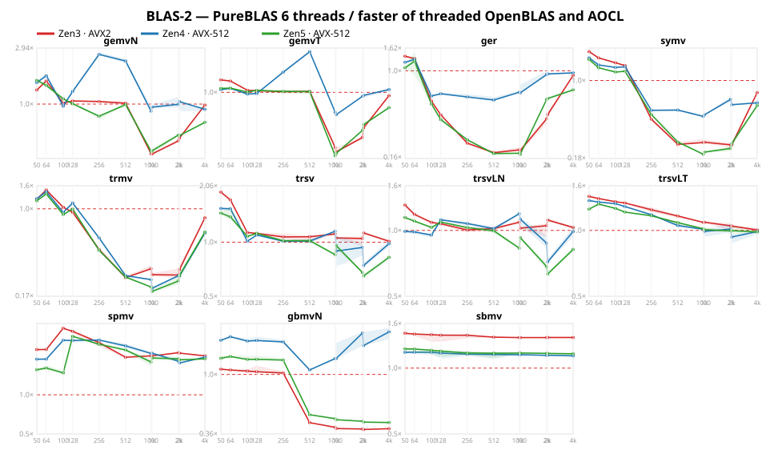
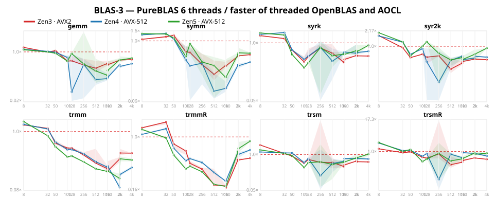
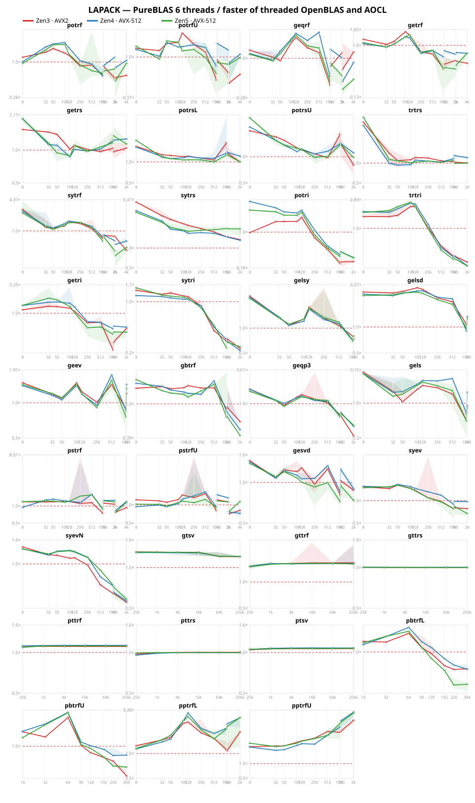
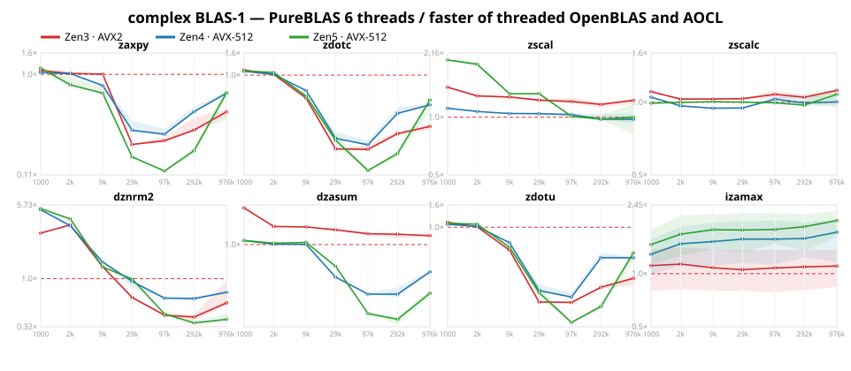
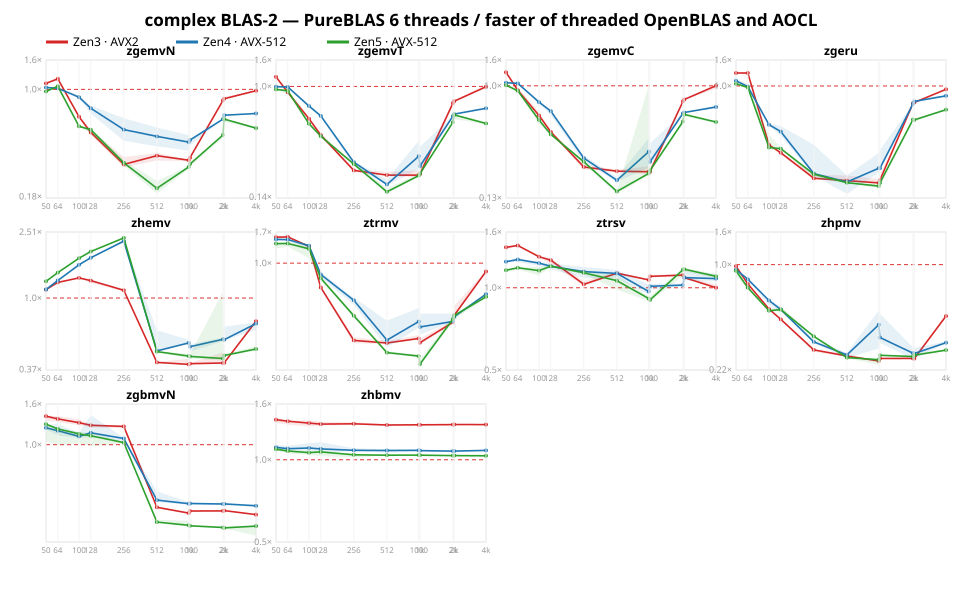
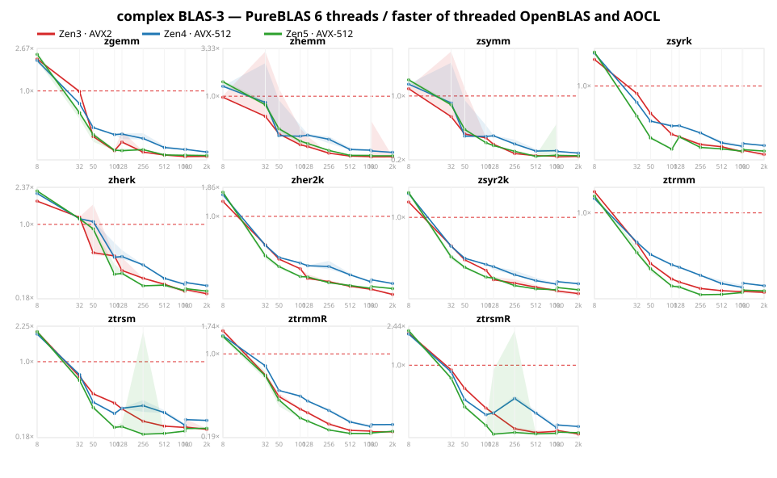
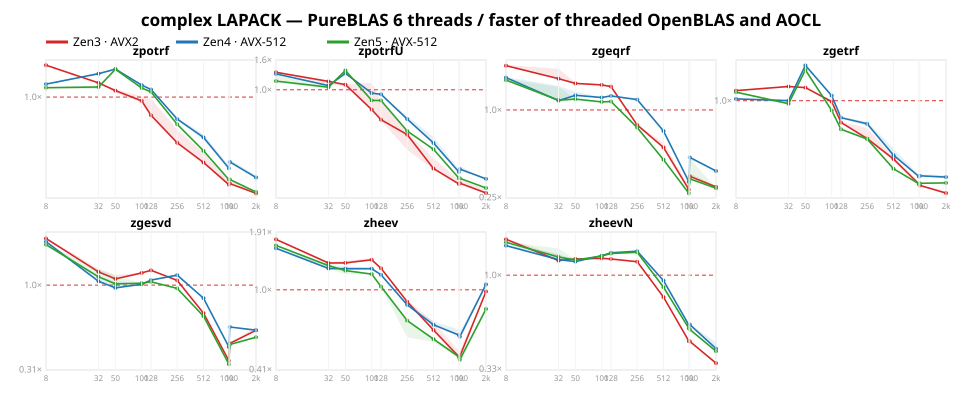

### What threading bought

The panels below ask a different question and are NOT the gate: both arms are PureBLAS, so they show
N threads over 1 thread — what the pool won, with no vendor in it. A panel appears when its routine
reaches at least 1.25× somewhere on the fleet, which is well clear of the harness's own 3.7% noise
floor; a routine with no splitter would draw a flat line at 1.00× and reports the harness rather than
the library.

Read the SHAPE, not just the peak: a curve that climbs with `n` is a routine amortising the
fork-join correctly.

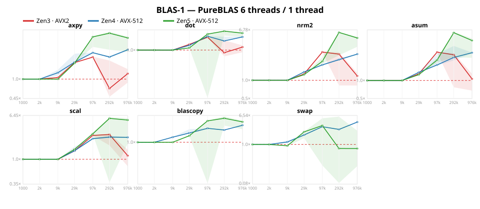
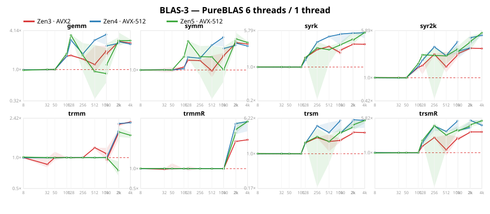
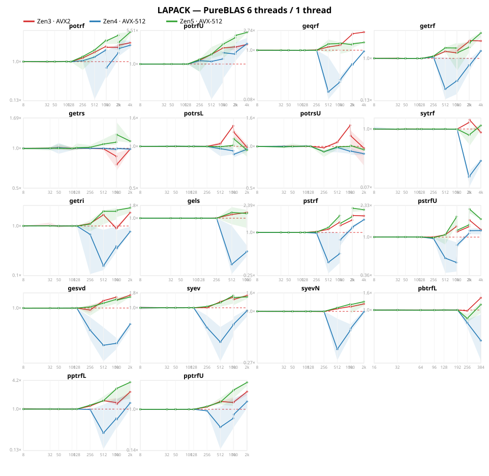

Regenerate both sets with `julia --project=bench bench/plots.jl mtdraw`, which writes
`perf_mtgate_*.svg` and `perf_mt_*.svg` and exits before the gate rendering.

## Results

Best speedup per operation, six threads against one, on each box.

| op | Zen3 · AVX2 | Zen4 · AVX-512 | Zen5 · AVX-512 |
|---|---|---|---|
| L1 `blascopy` | — | — | 7.11× @300000 |
| L1 `axpy` | 2.48× @100000 | 2.22× @100000 | 6.71× @300000 |
| L1 `asum` | 2.97× @100000 | 2.03× @100000 | 6.26× @300000 |
| L1 `nrm2` | 2.92× @100000 | 2.05× @100000 | 6.16× @300000 |
| L1 `dot` | 3.35× @100000 | 2.45× @100000 | 5.93× @300000 |
| L3 `trsm` | 3.02× @2100 | 3.36× @4096 | 5.55× @4096 |
| L3 `syr2k` | 3.04× @2100 | 2.98× @4096 | 5.40× @4096 |
| L3 `syrk` | 3.02× @2100 | 3.40× @4096 | 5.26× @4096 |
| L1 `scal` | 2.88× @300000 | 1.61× @100000 | 5.21× @300000 |
| L3 `trmmR` | 2.73× @4096 | 3.21× @4096 | 5.14× @4096 |
| L3 `trsmR` | 2.89× @2100 | 3.30× @4096 | 5.10× @4096 |
| LP `potrfU` | 2.71× @4096 | 2.75× @4096 | 5.00× @4096 |
| LP `potrf` | 2.71× @4096 | 2.27× @4096 | 4.74× @4096 |
| LP `pptrfL` | 2.36× @2048 | 1.20× @2048 | 3.81× @2048 |
| LP `pptrfU` | 2.34× @2048 | 1.45× @2048 | 3.64× @2048 |
| L3 `gemm` | 2.79× @2100 | 1.62× @100 | 3.50× @128 |
| LP `getrf` | 2.39× @2100 | 1.42× @4096 | 3.42× @4096 |
| L1 `swap` | — | — | 3.40× @100000 |
| L3 `symm` | 2.72× @2100 | 1.63× @4096 | 3.04× @2100 |
| LP `geqrf` | 2.52× @4096 | 1.00× @8 | 1.49× @4096 |
| LP `getri` | 1.86× @2048 | 1.00× @32 | 2.34× @2048 |
| L3 `trmm` | 2.22× @4096 | 1.04× @4096 | 1.76× @2100 |
| LP `pstrf` | 1.73× @2100 | 1.51× @4096 | 2.19× @2100 |
| LP `pstrfU` | 1.58× @2100 | 1.17× @2100 | 2.11× @2100 |
| LP `gesvd` | 1.64× @2048 | 1.00× @50 | 1.53× @2048 |
| LP `syev` | 1.62× @2048 | 1.00× @128 | 1.62× @1000 |
| LP `sytrf` | 1.53× @2100 | 1.00× @50 | 1.12× @4096 |
| LP `potrsU` | 1.42× @1000 | 1.00× @100 | 1.01× @1024 |
| LP `potrsL` | 1.40× @1000 | 1.00× @128 | 1.15× @1024 |
| LP `pbtrfL` | 1.40× @384 | 1.00× @32 | 1.16× @384 |
| LP `gels` | 1.31× @1024 | 1.00× @32 | 1.31× @512 |
| LP `getrs` | 1.00× @100 | 1.00× @128 | 1.27× @1024 |
| LP `syevN` | 1.21× @2048 | 1.00× @128 | 1.23× @2048 |
| LP `potri` | 1.07× @2048 | 1.05× @2048 | 1.21× @2048 |
| LP `gelsy` | 1.17× @1000 | 1.00× @100 | 1.19× @1000 |
| LP `gelsd` | 1.19× @1000 | 1.00× @32 | 1.14× @1024 |
| LP `geqp3` | 1.17× @1000 | 1.00× @128 | 1.18× @1000 |
| LP `trtri` | 1.11× @2048 | 1.01× @32 | 1.01× @50 |
| L2 `trsv` | 1.00× @2100 | 1.11× @2100 | 1.01× @2100 |
| LP `geev` | 1.10× @1000 | 1.00× @256 | 1.02× @1024 |
| LP `pbtrfU` | 1.00× @128 | 1.00× @192 | 1.07× @384 |
| L2 `ger` | 1.00× @512 | 1.01× @100 | 1.06× @64 |
| L2 `gemvT` | 1.01× @512 | 1.05× @2100 | 1.00× @1024 |

### Zen3 · AVX2

Measured 2026-09-28T13:25 at commit `0d31d7bc`, AMD Ryzen 9 5900X 12-Core Processor, pinned at 3701 MHz with boost off.

1104 cells measured, 0 off-lock. Listed below: the threadable ops whose best cell moves further than the 3.7% noise floor.

**Where threading pays.** Best cell per operation:

| op | best speedup | at n | round spread |
|---|---|---|---|
| L1 `dot` | **3.35×** | 100000 | 1% |
| L3 `syr2k` | **3.04×** | 2100 | 0% |
| L3 `syrk` | **3.02×** | 2100 | 0% |
| L3 `trsm` | **3.02×** | 2100 | 0% |
| L1 `asum` | **2.97×** | 100000 | 1% |
| L1 `nrm2` | **2.92×** | 100000 | 1% |
| L3 `trsmR` | **2.89×** | 2100 | 0% |
| L1 `scal` | **2.88×** | 300000 | 69% |
| L3 `gemm` | **2.79×** | 2100 | 0% |
| L3 `trmmR` | **2.73×** | 4096 | 0% |
| L3 `symm` | **2.72×** | 2100 | 0% |
| LP `potrf` | **2.71×** | 4096 | 1% |
| LP `potrfU` | **2.71×** | 4096 | 2% |
| LP `geqrf` | **2.52×** | 4096 | 2% |
| L1 `axpy` | **2.48×** | 100000 | 1% |
| LP `getrf` | **2.39×** | 2100 | 0% |
| LP `pptrfL` | **2.36×** | 2048 | 0% |
| LP `pptrfU` | **2.34×** | 2048 | 0% |
| L3 `trmm` | **2.22×** | 4096 | 1% |
| LP `getri` | **1.86×** | 2048 | 1% |
| LP `pstrf` | **1.73×** | 2100 | 0% |
| LP `gesvd` | **1.64×** | 2048 | 1% |
| LP `syev` | **1.62×** | 2048 | 3% |
| LP `pstrfU` | **1.58×** | 2100 | 0% |
| LP `sytrf` | **1.53×** | 2100 | 0% |
| LP `potrsU` | **1.42×** | 1000 | 1% |
| LP `potrsL` | **1.40×** | 1000 | 1% |
| LP `pbtrfL` | **1.40×** | 384 | 0% |
| LP `gels` | **1.31×** | 1024 | 0% |
| LP `syevN` | **1.21×** | 2048 | 2% |
| LP `gelsd` | **1.19×** | 1000 | 0% |
| LP `geqp3` | **1.17×** | 1000 | 0% |
| LP `gelsy` | **1.17×** | 1000 | 0% |
| LP `trtri` | **1.11×** | 2048 | 1% |
| LP `geev` | **1.10×** | 1000 | 4% |
| LP `potri` | **1.07×** | 2048 | 3% |

**Where threading COSTS.** Every cell that got slower with six threads:

| op | n | speedup | round spread |
|---|---|---|---|
| L1 `axpy` | 300000 | **0.64×** | 254% |
| L1 `dot` | 300000 | **0.75×** | 262% |
| LP `getrs` | 1024 | **0.75×** | 12% |
| LP `potri` | 1000 | **0.78×** | 7% |
| LP `potri` | 1024 | **0.81×** | 11% |
| L3 `trmm` | 32 | **0.83×** | 21% |
| LP `pbtrfU` | 384 | **0.85×** | 2% |
| LP `sytrf` | 4096 | **0.85×** | 4% |
| L2 `trmv` | 2048 | **0.87×** | 33% |
| LP `getrs` | 1000 | **0.88×** | 27% |
| LP `geqp3` | 2048 | **0.89×** | 1% |
| LP `getri` | 1000 | **0.89×** | 4% |
| LP `getri` | 1024 | **0.90×** | 4% |
| L3 `symm` | 512 | **0.90×** | 48% |
| LP `gesvd` | 256 | **0.92×** | 24% |
| L3 `trmm` | 1024 | **0.94×** | 5% |

### Zen4 · AVX-512

Measured 2026-09-28T13:59 at commit `0d31d7bc`, AMD Ryzen 5 7640U w/ Radeon 760M Graphics, pinned at 2813 MHz with boost off.

1104 cells measured, 0 off-lock. Listed below: the threadable ops whose best cell moves further than the 3.7% noise floor.

**Where threading pays.** Best cell per operation:

| op | best speedup | at n | round spread |
|---|---|---|---|
| L3 `syrk` | **3.40×** | 4096 | 4% |
| L3 `trsm` | **3.36×** | 4096 | 8% |
| L3 `trsmR` | **3.30×** | 4096 | 13% |
| L3 `trmmR` | **3.21×** | 4096 | 2% |
| L3 `syr2k` | **2.98×** | 4096 | 8% |
| LP `potrfU` | **2.75×** | 4096 | 17% |
| L1 `dot` | **2.45×** | 100000 | 45% |
| LP `potrf` | **2.27×** | 4096 | 19% |
| L1 `axpy` | **2.22×** | 100000 | 41% |
| L1 `nrm2` | **2.05×** | 100000 | 102% |
| L1 `asum` | **2.03×** | 100000 | 87% |
| L3 `symm` | **1.63×** | 4096 | 5% |
| L3 `gemm` | **1.62×** | 100 | 1% |
| L1 `scal` | **1.61×** | 100000 | 101% |
| LP `pstrf` | **1.51×** | 4096 | 2% |
| LP `pptrfU` | **1.45×** | 2048 | 35% |
| LP `getrf` | **1.42×** | 4096 | 11% |
| LP `pptrfL` | **1.20×** | 2048 | 53% |
| LP `pstrfU` | **1.17×** | 2100 | 5% |
| L2 `trsv` | **1.11×** | 2100 | 36% |
| L2 `gemvT` | **1.05×** | 2100 | 2% |
| LP `potri` | **1.05×** | 2048 | 2% |
| L3 `trmm` | **1.04×** | 4096 | 8% |

**Where threading COSTS.** Every cell that got slower with six threads:

| op | n | speedup | round spread |
|---|---|---|---|
| L1 `scal` | 300000 | **0.07×** | 2610% |
| L3 `gemm` | 128 | **0.09×** | 2581% |
| L1 `nrm2` | 300000 | **0.09×** | 2006% |
| LP `gels` | 512 | **0.10×** | 321% |
| LP `sytrf` | 2100 | **0.11×** | 32% |
| LP `sytrf` | 2048 | **0.11×** | 38% |
| LP `geqrf` | 512 | **0.12×** | 17% |
| L1 `nrm2` | 1000000 | **0.13×** | 293% |
| L1 `scal` | 1000000 | **0.13×** | 245% |
| L1 `asum` | 1000000 | **0.13×** | 410% |
| L3 `trsmR` | 256 | **0.14×** | 1455% |
| LP `getri` | 512 | **0.15×** | 113% |
| LP `gelsd` | 1000 | **0.16×** | 26% |
| L3 `trsm` | 256 | **0.17×** | 1184% |
| LP `gelsd` | 1024 | **0.19×** | 7% |
| LP `geqrf` | 1000 | **0.20×** | 18% |
| LP `gels` | 1000 | **0.21×** | 25% |
| LP `gels` | 1024 | **0.21×** | 24% |
| LP `getrf` | 512 | **0.21×** | 322% |
| L1 `dot` | 1000000 | **0.22×** | 110% |
| LP `geqrf` | 1024 | **0.22×** | 26% |
| LP `sytrf` | 4096 | **0.23×** | 24% |
| LP `syev` | 512 | **0.24×** | 52% |
| LP `gesvd` | 512 | **0.24×** | 79% |
| LP `gesvd` | 1000 | **0.24×** | 36% |
| LP `geqp3` | 512 | **0.25×** | 10% |
| L1 `scal` | 30000 | **0.25×** | 361% |
| LP `gelsy` | 512 | **0.25×** | 21% |
| LP `gesvd` | 1024 | **0.26×** | 30% |
| LP `geev` | 1000 | **0.29×** | 19% |
| LP `geqp3` | 1000 | **0.30×** | 8% |
| LP `gelsy` | 1000 | **0.30×** | 6% |
| L1 `axpy` | 1000000 | **0.31×** | 319% |
| LP `getrf` | 1000 | **0.31×** | 51% |
| LP `pptrfL` | 512 | **0.32×** | 238% |
| L3 `gemm` | 512 | **0.33×** | 60% |
| LP `getrf` | 1024 | **0.34×** | 50% |
| L3 `syr2k` | 256 | **0.34×** | 434% |
| LP `geqp3` | 1024 | **0.35×** | 7% |
| LP `pptrfU` | 512 | **0.35×** | 268% |
| LP `pbtrfU` | 384 | **0.35×** | 115% |
| LP `gelsy` | 1024 | **0.36×** | 5% |
| LP `getri` | 1024 | **0.37×** | 50% |
| LP `pstrf` | 512 | **0.37×** | 73% |
| LP `syevN` | 512 | **0.37×** | 26% |
| LP `getri` | 256 | **0.38×** | 162% |
| LP `getri` | 1000 | **0.38×** | 43% |
| LP `geev` | 1024 | **0.38×** | 19% |
| L3 `symm` | 512 | **0.38×** | 48% |
| LP `gelsd` | 512 | **0.39×** | 13% |
| LP `pbtrfL` | 384 | **0.39×** | 47% |
| LP `gesvd` | 256 | **0.42×** | 22% |
| L1 `axpy` | 300000 | **0.43×** | 173% |
| LP `syev` | 256 | **0.43×** | 20% |
| L3 `trmm` | 2048 | **0.44×** | 11% |
| LP `geqrf` | 2100 | **0.46×** | 9% |
| LP `potrfU` | 512 | **0.47×** | 228% |
| LP `geev` | 512 | **0.48×** | 32% |
| LP `syev` | 1000 | **0.48×** | 30% |
| LP `geqrf` | 2048 | **0.48×** | 11% |
| LP `pstrfU` | 1000 | **0.49×** | 23% |
| LP `pstrf` | 1000 | **0.50×** | 21% |
| L3 `symm` | 1024 | **0.51×** | 35% |
| L3 `symm` | 1000 | **0.52×** | 10% |
| LP `gesvd` | 2048 | **0.53×** | 20% |
| LP `syev` | 1024 | **0.53×** | 59% |
| L3 `gemm` | 1000 | **0.55×** | 15% |
| L3 `gemm` | 1024 | **0.55×** | 18% |
| LP `pstrfU` | 512 | **0.56×** | 23% |
| LP `pptrfU` | 1000 | **0.56×** | 66% |
| L3 `symm` | 100 | **0.57×** | 9% |
| LP `pptrfL` | 1024 | **0.57×** | 72% |
| LP `pptrfL` | 1000 | **0.58×** | 81% |
| L1 `asum` | 300000 | **0.59×** | 238% |
| LP `potri` | 512 | **0.60×** | 43% |
| LP `syevN` | 1000 | **0.61×** | 10% |
| LP `syevN` | 1024 | **0.64×** | 14% |
| LP `potrf` | 1024 | **0.66×** | 84% |
| LP `getrf` | 2100 | **0.66×** | 26% |
| LP `getrf` | 2048 | **0.67×** | 18% |
| LP `pptrfU` | 1024 | **0.68×** | 104% |
| LP `pbtrfU` | 256 | **0.68×** | 5% |
| LP `pbtrfL` | 256 | **0.70×** | 6% |
| LP `geqp3` | 2048 | **0.71×** | 4% |
| L1 `dot` | 300000 | **0.71×** | 247% |
| L3 `symm` | 128 | **0.72×** | 99% |
| LP `getri` | 2048 | **0.76×** | 14% |
| LP `pstrf` | 1024 | **0.78×** | 8% |
| LP `syev` | 2048 | **0.79×** | 26% |
| L3 `syr2k` | 128 | **0.79×** | 76% |
| LP `pstrfU` | 1024 | **0.79×** | 5% |
| L3 `trmm` | 2100 | **0.80×** | 13% |
| L2 `trsvLT` | 2100 | **0.82×** | 57% |
| L3 `symm` | 256 | **0.83×** | 51% |
| LP `potrsL` | 1024 | **0.87×** | 5% |
| LP `potri` | 1000 | **0.88×** | 11% |
| LP `potrsL` | 512 | **0.88×** | 19% |
| LP `potrsU` | 2048 | **0.88×** | 1% |
| LP `potri` | 1024 | **0.89×** | 12% |
| L3 `gemm` | 256 | **0.91×** | 149% |
| LP `potrsU` | 256 | **0.91×** | 1% |
| LP `potrsL` | 1000 | **0.92×** | 9% |
| LP `potrsU` | 1000 | **0.92×** | 5% |
| L1 `axpy` | 10000 | **0.92×** | 32% |
| LP `pptrfU` | 256 | **0.93×** | 1% |
| LP `potrsU` | 1024 | **0.93×** | 10% |
| LP `geqrf` | 4096 | **0.94×** | 3% |
| L2 `ger` | 256 | **0.95×** | 25% |
| LP `potrsL` | 2048 | **0.95×** | 3% |
| LP `potri` | 256 | **0.96×** | 1% |
| L2 `trsvLN` | 2048 | **0.96×** | 37% |
| LP `pstrfU` | 256 | **0.96×** | 3% |

### Zen5 · AVX-512

Measured 2026-09-28T20:00 at commit `04b9fb2a`, AMD Ryzen AI 5 340 w/ Radeon 840M, pinned at 2000 MHz with boost off.

1118 cells measured, 0 off-lock. Listed below: the threadable ops whose best cell moves further than the 3.7% noise floor.

**Where threading pays.** Best cell per operation:

| op | best speedup | at n | round spread |
|---|---|---|---|
| L1 `blascopy` | **7.11×** | 300000 | 7% |
| L1 `axpy` | **6.71×** | 300000 | 52% |
| L1 `asum` | **6.26×** | 300000 | 9% |
| L1 `nrm2` | **6.16×** | 300000 | 6% |
| L1 `dot` | **5.93×** | 300000 | 27% |
| L3 `trsm` | **5.55×** | 4096 | 5% |
| L3 `syr2k` | **5.40×** | 4096 | 1% |
| L3 `syrk` | **5.26×** | 4096 | 2% |
| L1 `scal` | **5.21×** | 300000 | 109% |
| L3 `trmmR` | **5.14×** | 4096 | 4% |
| L3 `trsmR` | **5.10×** | 4096 | 14% |
| LP `potrfU` | **5.00×** | 4096 | 2% |
| LP `potrf` | **4.74×** | 4096 | 2% |
| LP `pptrfL` | **3.81×** | 2048 | 31% |
| LP `pptrfU` | **3.64×** | 2048 | 2% |
| L3 `gemm` | **3.50×** | 128 | 4% |
| LP `getrf` | **3.42×** | 4096 | 15% |
| L1 `swap` | **3.40×** | 100000 | 70% |
| L3 `symm` | **3.04×** | 2100 | 37% |
| LP `getri` | **2.34×** | 2048 | 3% |
| LP `pstrf` | **2.19×** | 2100 | 0% |
| LP `pstrfU` | **2.11×** | 2100 | 1% |
| L3 `trmm` | **1.76×** | 2100 | 6% |
| LP `syev` | **1.62×** | 1000 | 16% |
| LP `gesvd` | **1.53×** | 2048 | 9% |
| LP `geqrf` | **1.49×** | 4096 | 5% |
| LP `gels` | **1.31×** | 512 | 24% |
| LP `getrs` | **1.27×** | 1024 | 29% |
| LP `syevN` | **1.23×** | 2048 | 13% |
| LP `potri` | **1.21×** | 2048 | 21% |
| LP `gelsy` | **1.19×** | 1000 | 1% |
| LP `geqp3` | **1.18×** | 1000 | 10% |
| LP `pbtrfL` | **1.16×** | 384 | 4% |
| LP `potrsL` | **1.15×** | 1024 | 14% |
| LP `gelsd` | **1.14×** | 1024 | 28% |
| LP `sytrf` | **1.12×** | 4096 | 21% |
| LP `pbtrfU` | **1.07×** | 384 | 3% |
| L2 `ger` | **1.06×** | 64 | 53% |

**Where threading COSTS.** Every cell that got slower with six threads:

| op | n | speedup | round spread |
|---|---|---|---|
| L1 `swap` | 300000 | **0.64×** | 513% |
| LP `sytrf` | 2048 | **0.68×** | 48% |
| L3 `trmm` | 2048 | **0.74×** | 28% |
| LP `pbtrfU` | 256 | **0.76×** | 3% |
| LP `sytrf` | 2100 | **0.77×** | 44% |
| LP `pbtrfL` | 256 | **0.79×** | 5% |
| LP `geev` | 1000 | **0.87×** | 27% |
| L1 `swap` | 1000000 | **0.87×** | 193% |
| L3 `gemm` | 1000 | **0.88×** | 24% |
| LP `sytrs` | 2048 | **0.89×** | 49% |
| L1 `swap` | 10000 | **0.91×** | 8% |
| LP `potrsU` | 256 | **0.91×** | 5% |
| LP `potrsL` | 2048 | **0.93×** | 10% |
| LP `potrsU` | 2048 | **0.94×** | 5% |

## Open: `gesvd` gets slower with threads

`gesvd` is the one routine that is **worse** with threads, and it reproduces on all three
microarchitectures — though not equally, which is itself a clue:

| box | n=256 | n=512 | n=1000 | n=1024 | n=2048 |
|---|---|---|---|---|---|
| Zen3 · AVX2 | 0.92× | 1.33× | 1.52× | 1.37× | 1.64× |
| Zen4 · AVX-512 | 0.42× | 0.24× | 0.24× | 0.26× | 0.53× |
| Zen5 · AVX-512 | 1.03× | 1.19× | 1.38× | 1.37× | 1.53× |

The root cause is **not yet known**. Three plausible explanations have been measured and rejected:

- **Not the fork-join price.** A gemm is only allowed to thread when it is at least 32× the measured
  join cost, so aggregate join overhead cannot exceed about 3%. The measured cost is ~1.29 ms per
  dispatch against a 616 ns join — roughly 2000×, and still ~300× a full sleep-wake.
- **Not the operand shape.** Skinny gemms were suspected, since every worker packs the whole of A. But
  a shape grid shows thin-`n`, thin-`k` and thin-`m` gemms mostly speeding up 1.9–3.7×.
- **Not the spin budget.** Setting the worker spin window to zero moved the bad band rather than
  removing it, and left n≥512 unchanged.

What is established: the threaded path genuinely runs (72 dispatches witnessed at n=512 via the pool's
generation counter, zero at one thread), and `gemm` itself is unstable under threading at n=256 while
being stable and fast at n≥512. Until this is understood, **do not enable threading for a workload
dominated by SVD at these sizes**.

