# Multi-threading

PureBLAS threads most of BLAS-1 and BLAS-2 and the bulk of BLAS-3: `axpy`, `scal`, `blascopy`,
`swap`, `dot`, `asum`, `nrm2`, `iamax`; `ger`, `gemv` both ways, `symv`, `gbmv` non-transposed;
`gemm`, `symm`, `syrk`, `syr2k`, both sides of `trsm`, `trmm` side R; and — through those — `getrf`
and `potrf`. Threading is **off** until you ask for it:


```julia
PureBLAS.set_num_threads(6)     # opt in; same shape as openblas_set_num_threads
PureBLAS.get_num_threads()
```

## What these numbers are

A **scaling** measurement: the same PureBLAS, on the same box, in the same process, with six threads
instead of one. The gate is a separate, single-threaded criterion and this page does not speak to it.

A threaded gate would need freshly measured threaded reference arms, six to eight hours per box.

## How it is measured

- **Six threads on every box**, pinned one per *physical* core. The Zen3 part has twelve cores and is
  capped to six so the three boxes stay comparable, and its six are taken from a single L3 so it matches
  the single-CCX shape of the other two. A second thread on a core shares the same FMA units, so pinning
  to logical cores would measure contention rather than parallelism — and the sibling numbering differs
  between parts, which is a trap: `0,2,4,6,8,10` is six distinct cores on one of these boxes and only
  three on the others.
- **`pb` and `pb_mt` are measured in one process, in rotated rounds**, so a speedup divides two windows
  that saw the same machine state. It is a paired A/B, not two runs compared afterwards.
- **A separate cache.** The gate sweep is pinned to ONE core on purpose; the mt arm needs six. Since the
  two cannot share an invocation's affinity, an mt run writes `bench/mt_data_<uarch>_<host>.txt` and
  never touches the gate cache. The name sits outside the `plots_data_*` glob that the artifact
  generators and audits use, so these numbers cannot leak into a gate verdict.
- **Median of per-round medians**, the same estimator the gate uses. The round spread is reported
  because it is the precision of the thing doing the measuring.
- Frequency-locked with boost off, verified by achieved clock **under load** — not by reading sysfs,
  which on one box reported a perfect lock while the core ran at 4772 MHz against a 2000 MHz pin.

Reproduce with:

```bash
# The mask is one CPU per physical core PLUS one spare for the runtime threads, and CPU numbering
# differs per box — `bench/plots.jl`'s `_ARM_PB_MT` comment carries the mask for each.
taskset -c 0,2,4,6,8,10,1 julia --project=bench -t 6 bench/plots.jl bench arms=pb,pb_mt nodraw
julia --project=bench bench/mt_summary.jl bench/mt_data_*.txt
```

## What is threaded

### BLAS-3 and LAPACK

`gemm` splits the columns of C. `syrk`, `syr2k` and `symm`
reach the kernel below that split point, so they carry their own kind: a triangular output needs a
flop-balanced column split, since equal widths hand the first worker roughly twice the work of the
last. `trsm` splits the columns of B on side L and its rows on side R — every column of one and
every row of the other is an independent solve, so the bands are write-disjoint and need no barrier.
`getrf` adds one more: it factors the next panel on one worker while the rest apply the current
panel's update.

`getrf` and `potrf` reach the pool through those, and `potrf` reaches it at every size — its leaf
routes its trailing update through the public `syrk!` rather than a private kernel.

**A band must route from the unsplit problem's dimensions.** Several kernel choices key on
`max(m, n, k)`, so a band whose width lands on one of those constants would take a different kernel
from the call it belongs to. That is not a slower answer, it is a different one, and it is why the
route token reaches the kernel switches themselves — `getrf` lost its thread-count invariance until
it did.

### Reductions: a fixed block grid

`dot`, `asum` and `nrm2` cut `n` into blocks whose size is a function of `(n, T)` alone, reduce each
with the unchanged serial kernel, and have the **driver** fold the partials in index order after the
join. A worker count therefore decides who computes a partial and never how the partials combine,
which is what makes the answer identical at every thread count. The blocked form is the only form,
used at one thread too.

`iamax` rides the same grid with a different fold — a strict `>` scan in block order, so ties go to
the lower index — and every block is seeded from the same `|x[1]|`, which is what preserves netlib's
NaN contract under a split.

### BLAS-2: the partition follows how far the scatter reaches

Three shapes, and which one applies is decided by the kernel, not by taste.

**No scatter.** `ger` writes each `A[i,j]` once, and `gemv` gives each output element its own
accumulation chain. Bands are write-disjoint already, so only the *route* needs guarding: `gemv-N`
splits rows and `gemv-T` columns, and both carry the undivided dimension because two of their kernel
choices read the A byte count — one of them selects a panel width, which re-chunks the chain and so
changes the arithmetic rather than just the speed.

**Bounded scatter.** `gbmv` non-transposed writes only within `kl + ku` of its own rows, so output
row bands are write-disjoint and bit-identical for free. Nothing is folded and no token is needed —
the arm choice reads `kl + ku + 1`, which a row split cannot move.

**Full scatter.** `symv` reads each stored element once and uses it twice, so a column block writes
`y` rows outside its own range. Workers need private `y` vectors folded in block order. That fold is
the interesting part: a private vector starts at zero, so the folded form rounds differently from an
unblocked sweep, and since a caller that loses the pool claim runs serially, the blocked form has to
be the **only** form — at one thread as well. The fold is therefore a cost on the *serial* path, and
`symv`'s serial margin at n=4096 is 0.995 on one box and 1.000 on another. So the grid is cut by
residency: past roughly twice L3 it collapses to one block, `y` is written directly, and not one
private vector is touched. Below the pool's own admission floor it collapses for the same reason —
there a grid would be pure fold with no worker to pay for it.

`trmv`, `trsv` and the packed and banded triangular ops are **not** threaded, and that is a decision
rather than an omission: a triangular sweep and a substitution are sequential. They also reach the
gemv panel drivers directly rather than through the public entry, which is what keeps their
per-thread scratch un-forked.

## Plots

One panel per operation, one curve per microarchitecture, against problem size. The dashed line is
1.00×, the band is the q10–q90 spread of the pooled per-round ratios.

### The gate, with threads on

This is the criterion of req#1 measured threaded: **PureBLAS at N threads over whichever THREADED
vendor is faster in that cell**, `max(OpenBLAS, AOCL)`, chosen per size — so one curve may switch
references along its own x-axis, exactly as the gate does. Above 1.00× is a pass.

Every group appears here, including the ones that do not thread at all. That is deliberate: a group
with no splitter still has to be measured against a vendor that has one, and that gap IS the finding
for BLAS-2 and for the complex groups.

A cell with no threaded reference arm is DROPPED rather than compared against a serial one — a
threaded PureBLAS arm over a single-thread vendor is not the gate and must not be drawn as if it were.

!!! warning "A reference arm that throttled is dropped, and the coverage per box differs a lot"
    A threaded vendor arm can keep its pin on paper and still spend part of its own window far below
    it: six cores of a vendor BLAS on a power-limited part pull the package clock down where one core
    never does. A ratio against such an arm compares two power states rather than two libraries, and
    the error runs in PureBLAS's FAVOUR, because a throttled reference is a slower reference. Those
    arms are therefore dropped from the gate rather than drawn, and a cell left with no threaded
    reference disappears from these panels.

    How many arms that removes is a property of the BOX, not of the library, and it is stated per box
    in the sections below — a laptop part on a shared power budget loses far more than a desktop one.
    Read the per-box exclusion count before comparing two curves here: a curve drawn from fewer cells
    is not a better result. The self-speedup panels further down are unaffected, since both of their
    arms share one window.

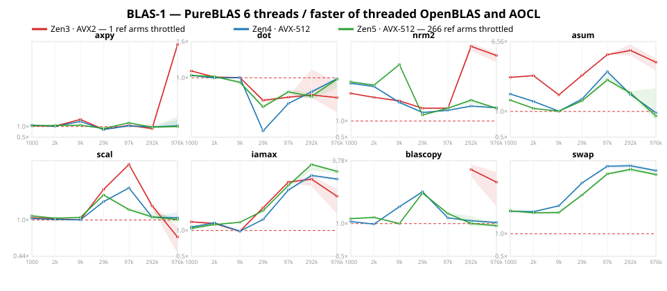
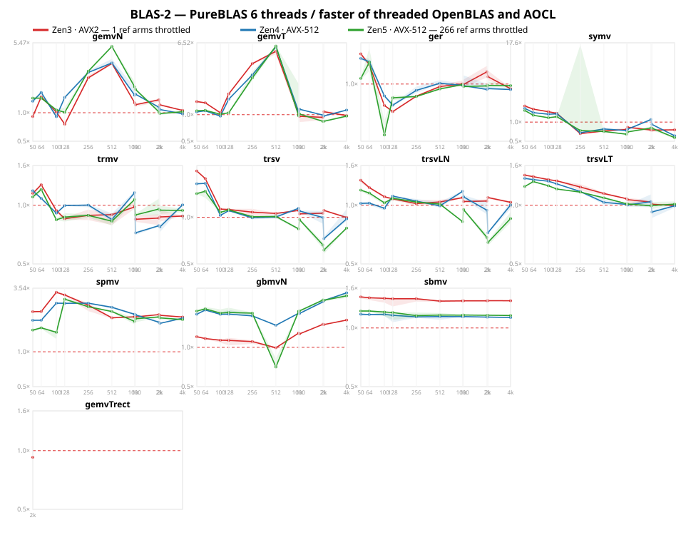
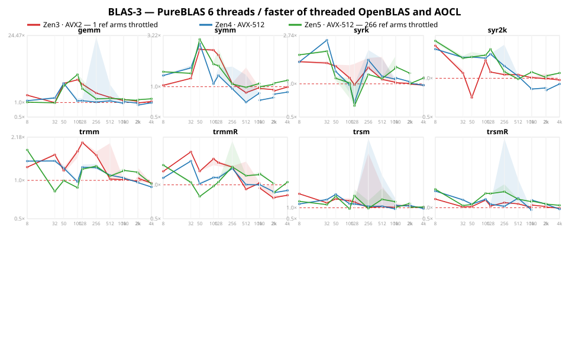
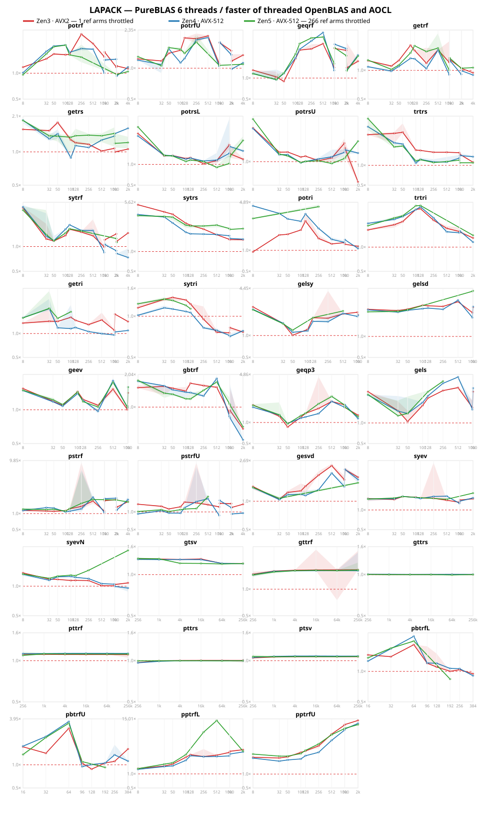
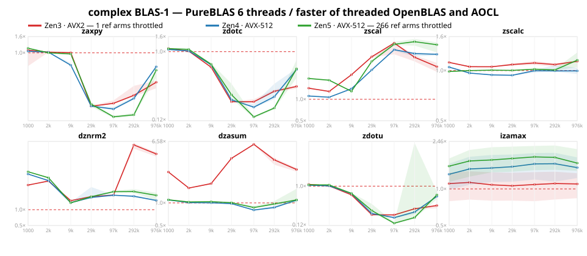
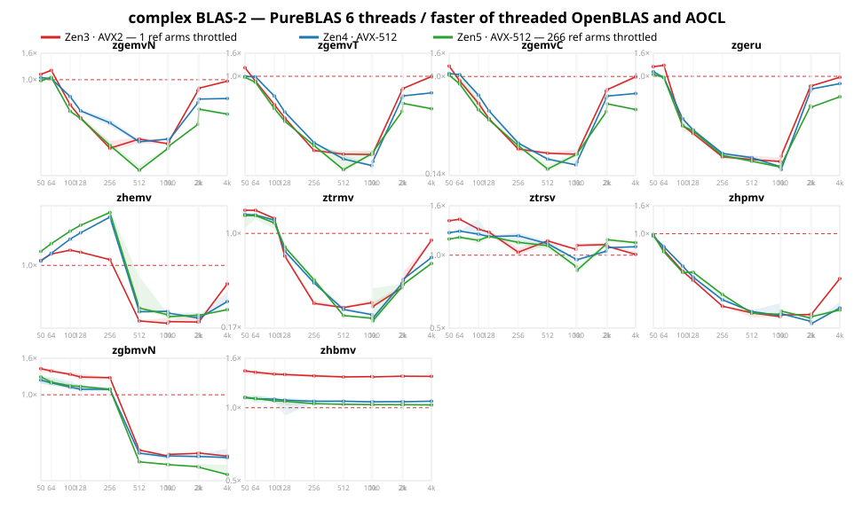
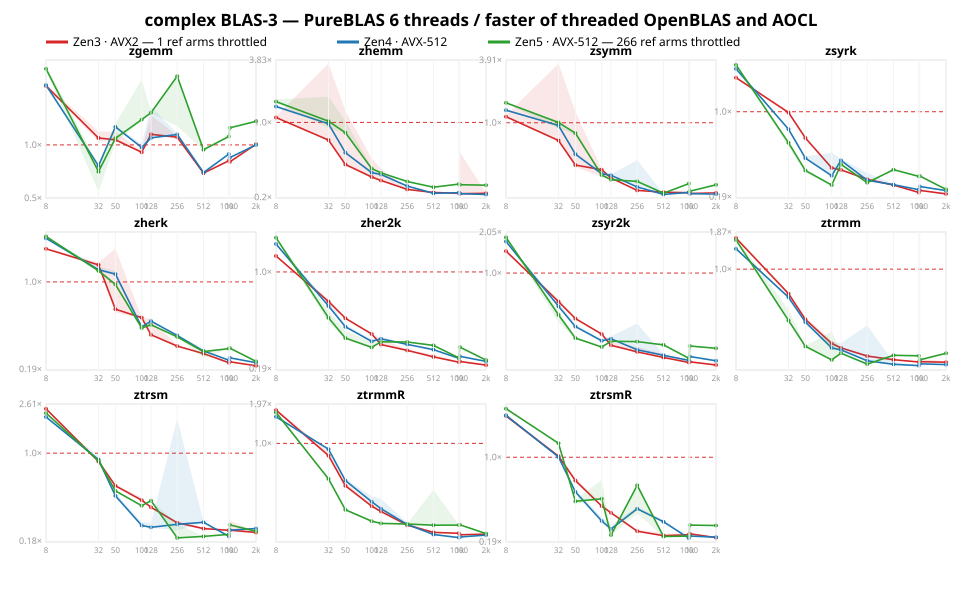
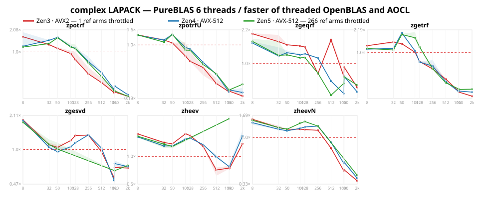

### What threading bought

The panels below ask a different question and are NOT the gate: both arms are PureBLAS, so they show
N threads over 1 thread — what the pool won, with no vendor in it. A panel appears when its routine
reaches at least 1.25× somewhere on the fleet, which is well clear of the harness's own 3.7% noise
floor; a routine with no splitter would draw a flat line at 1.00× and reports the harness rather than
the library.

Read the SHAPE, not just the peak: a curve that climbs with `n` is a routine amortising the
fork-join correctly.

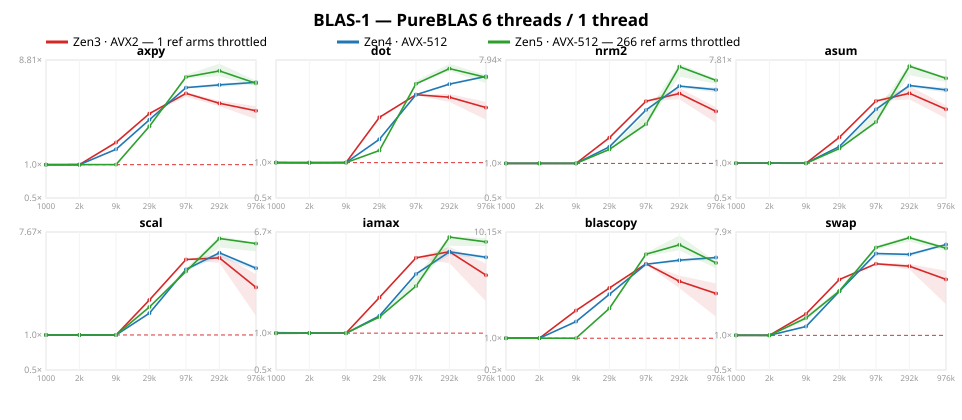
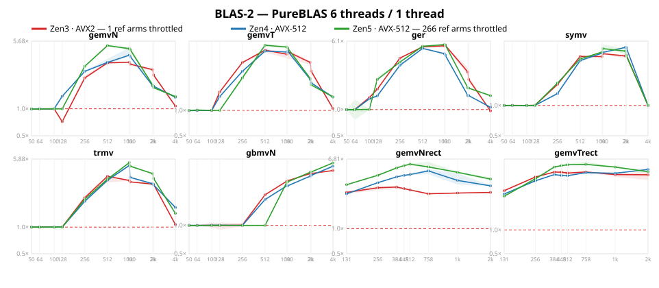
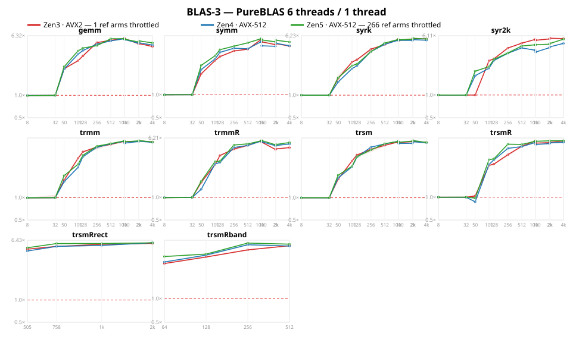
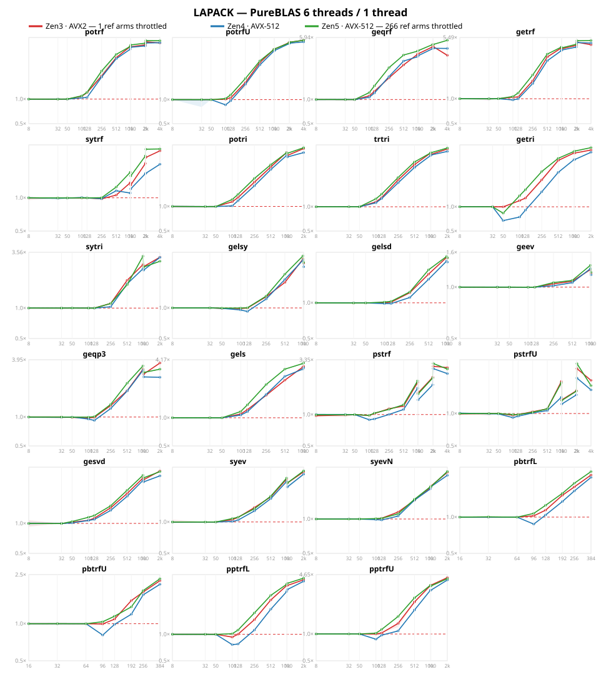

Regenerate both sets with `julia --project=bench bench/plots.jl mtdraw`, which writes
`perf_mtgate_*.svg` and `perf_mt_*.svg` and exits before the gate rendering.

## Results

Best speedup per operation, six threads against one, on each box.

| op | Zen3 · AVX2 | Zen4 · AVX-512 | Zen5 · AVX-512 |
|---|---|---|---|
| L1 `blascopy` | 5.07× @100000 | 5.79× @1000000 | 7.66× @300000 |
| L1 `swap` | 4.17× @100000 | 6.17× @1000000 | 7.04× @300000 |
| L1 `axpy` | 4.40× @100000 | 5.55× @1000000 | 7.00× @300000 |
| L1 `nrm2` | 4.02× @300000 | 4.71× @300000 | 6.92× @300000 |
| L1 `asum` | 3.99× @300000 | 4.70× @300000 | 6.88× @300000 |
| L2 `gemvTrect` | 5.41× @758 | 5.83× @2880 | 6.77× @758 |
| L1 `scal` | 4.56× @300000 | 5.08× @300000 | 6.69× @300000 |
| L1 `dot` | 3.79× @100000 | 5.40× @1000000 | 6.28× @300000 |
| L1 `iamax` | 4.57× @300000 | 4.61× @300000 | 6.07× @300000 |
| L3 `trsmRrect` | 5.83× @2880 | 5.95× @2880 | 5.93× @2880 |
| L2 `gemvNrect` | 3.15× @384 | 4.98× @758 | 5.91× @512 |
| L2 `gemvT` | 5.19× @512 | 5.05× @1024 | 5.91× @512 |
| L3 `trsm` | 5.81× @2100 | 5.80× @1000 | 5.91× @2100 |
| L3 `trmm` | 5.82× @2100 | 5.76× @1000 | 5.88× @2100 |
| L3 `gemm` | 5.79× @1000 | 5.75× @1000 | 5.77× @1000 |
| L3 `syrk` | 5.68× @2100 | 5.52× @2100 | 5.76× @2100 |
| L3 `trmmR` | 5.70× @1000 | 5.64× @1000 | 5.74× @1024 |
| L3 `syr2k` | 5.66× @2100 | 4.82× @4096 | 5.49× @4096 |
| L3 `trsmR` | 5.54× @4096 | 5.31× @4096 | 5.59× @4096 |
| L2 `ger` | 5.39× @1024 | 5.03× @512 | 5.57× @1000 |
| LP `potrfU` | 5.55× @4096 | 5.28× @4096 | 5.53× @4096 |
| LP `geqrf` | 4.56× @2100 | 4.35× @2100 | 5.48× @4096 |
| L3 `symm` | 5.27× @1000 | 4.93× @1000 | 5.40× @1000 |
| LP `getri` | 5.06× @2048 | 4.74× @2048 | 5.40× @2048 |
| L2 `trmv` | 3.74× @512 | 4.95× @1000 | 5.37× @1000 |
| LP `trtri` | 5.19× @2048 | 4.85× @2048 | 5.34× @2048 |
| LP `potrf` | 5.05× @2100 | 4.91× @4096 | 5.21× @2100 |
| LP `potri` | 5.08× @2048 | 4.54× @2048 | 5.21× @2048 |
| L3 `trsmRband` | 4.74× @512 | 4.87× @256 | 5.11× @256 |
| LP `getrf` | 4.81× @2100 | 4.76× @2100 | 5.04× @4096 |
| L2 `gemvN` | 3.30× @1000 | 3.96× @1000 | 4.69× @1000 |
| L2 `gbmvN` | 3.82× @4096 | 4.24× @4096 | 4.60× @4096 |
| LP `pptrfL` | 4.17× @2048 | 4.01× @2048 | 4.35× @2048 |
| LP `pptrfU` | 4.30× @2048 | 4.04× @2048 | 4.18× @2048 |
| LP `gels` | 3.54× @1024 | 3.42× @1024 | 3.85× @1024 |
| L2 `symv` | 3.26× @1024 | 3.77× @2048 | 3.64× @1024 |
| LP `geqp3` | 3.65× @2048 | 3.07× @1000 | 3.41× @1000 |
| LP `gesvd` | 3.37× @2048 | 2.99× @2048 | 3.32× @2048 |
| LP `sytri` | 3.19× @2048 | 3.17× @2048 | 3.26× @1000 |
| LP `gelsy` | 3.03× @1000 | 2.95× @1000 | 3.25× @1000 |
| LP `syev` | 3.03× @2048 | 2.87× @2048 | 3.10× @2048 |
| LP `pstrf` | 2.90× @2100 | 2.76× @2100 | 3.09× @2100 |
| LP `pstrfU` | 2.61× @2100 | 2.13× @2100 | 2.91× @2100 |
| LP `sytrf` | 2.66× @4096 | 2.01× @4096 | 2.77× @4096 |
| LP `syevN` | 2.57× @2048 | 2.41× @2048 | 2.61× @2048 |
| LP `gelsd` | 2.42× @1000 | 2.25× @1000 | 2.46× @1000 |
| LP `pbtrfL` | 2.23× @384 | 2.14× @384 | 2.39× @384 |
| LP `pbtrfU` | 2.23× @384 | 2.09× @384 | 2.31× @384 |
| LP `geev` | 1.27× @1000 | 1.28× @1000 | 1.34× @1000 |
| LP `gbtrf` | 1.01× @2048 | 1.02× @2048 | 1.05× @2048 |

### Zen3 · AVX2

Measured 2026-11-17T10:39 at commit `11f9f346d`, AMD Ryzen 9 5900X 12-Core Processor, pinned at 3701 MHz with boost off.

1142 cells measured, 0 off-lock. Listed below: the threadable ops whose best cell moves further than the 3.7% noise floor.

1 reference arm(s) in this cache are EXCLUDED from the gate: they did not hold the clock band
their sibling arms held in the same cell. A threaded vendor arm can keep its pin on paper and
still spend part of its own window far below it, because six cores of a vendor BLAS on a
power-limited part pull the package clock down where one core never does. A ratio against such an
arm compares two machine states, and the error runs in PureBLAS's FAVOUR — a throttled reference
is a slower reference — so those arms are dropped rather than drawn. The `pb` and `pb_mt` arms of
the same cells shared one window and held the clock, so the self-speedup figures below are
unaffected; it is the gate panels that lose cells.

**Where threading pays.** Best cell per operation:

| op | best speedup | at n | round spread |
|---|---|---|---|
| L3 `trsmRrect` | **5.83×** | 2880 | 0% |
| L3 `trmm` | **5.82×** | 2100 | 0% |
| L3 `trsm` | **5.81×** | 2100 | 0% |
| L3 `gemm` | **5.79×** | 1000 | 0% |
| L3 `trmmR` | **5.70×** | 1000 | 0% |
| L3 `syrk` | **5.68×** | 2100 | 0% |
| L3 `syr2k` | **5.66×** | 2100 | 0% |
| LP `potrfU` | **5.55×** | 4096 | 0% |
| L3 `trsmR` | **5.54×** | 4096 | 1% |
| L2 `gemvTrect` | **5.41×** | 758 | 1% |
| L2 `ger` | **5.39×** | 1024 | 4% |
| L3 `symm` | **5.27×** | 1000 | 0% |
| L2 `gemvT` | **5.19×** | 512 | 5% |
| LP `trtri` | **5.19×** | 2048 | 0% |
| LP `potri` | **5.08×** | 2048 | 0% |
| L1 `blascopy` | **5.07×** | 100000 | 0% |
| LP `getri` | **5.06×** | 2048 | 0% |
| LP `potrf` | **5.05×** | 2100 | 0% |
| LP `getrf` | **4.81×** | 2100 | 0% |
| L3 `trsmRband` | **4.74×** | 512 | 0% |
| L1 `iamax` | **4.57×** | 300000 | 3% |
| LP `geqrf` | **4.56×** | 2100 | 0% |
| L1 `scal` | **4.56×** | 300000 | 4% |
| L1 `axpy` | **4.40×** | 100000 | 1% |
| LP `pptrfU` | **4.30×** | 2048 | 0% |
| L1 `swap` | **4.17×** | 100000 | 1% |
| LP `pptrfL` | **4.17×** | 2048 | 0% |
| L1 `nrm2` | **4.02×** | 300000 | 9% |
| L1 `asum` | **3.99×** | 300000 | 4% |
| L2 `gbmvN` | **3.82×** | 4096 | 2% |
| L1 `dot` | **3.79×** | 100000 | 0% |
| L2 `trmv` | **3.74×** | 512 | 4% |
| LP `geqp3` | **3.65×** | 2048 | 0% |
| LP `gels` | **3.54×** | 1024 | 0% |
| LP `gesvd` | **3.37×** | 2048 | 1% |
| L2 `gemvN` | **3.30×** | 1000 | 0% |
| L2 `symv` | **3.26×** | 1024 | 2% |
| LP `sytri` | **3.19×** | 2048 | 0% |
| L2 `gemvNrect` | **3.15×** | 384 | 5% |
| LP `gelsy` | **3.03×** | 1000 | 0% |
| LP `syev` | **3.03×** | 2048 | 0% |
| LP `pstrf` | **2.90×** | 2100 | 0% |
| LP `sytrf` | **2.66×** | 4096 | 0% |
| LP `pstrfU` | **2.61×** | 2100 | 0% |
| LP `syevN` | **2.57×** | 2048 | 1% |
| LP `gelsd` | **2.42×** | 1000 | 0% |
| LP `pbtrfL` | **2.23×** | 384 | 0% |
| LP `pbtrfU` | **2.23×** | 384 | 0% |
| LP `geev` | **1.27×** | 1000 | 0% |

**Where threading COSTS.** Every cell that got slower with six threads:

| op | n | speedup | round spread |
|---|---|---|---|
| L2 `gemvN` | 128 | **0.72×** | 6% |
| LP `pptrfL` | 100 | **0.93×** | 0% |

### Zen4 · AVX-512

Measured 2026-11-17T04:46 at commit `11f9f346d`, AMD Ryzen 5 7640U w/ Radeon 760M Graphics, pinned at 3501 MHz with boost off.

1142 cells measured, 0 off-lock. Listed below: the threadable ops whose best cell moves further than the 3.7% noise floor.

**Where threading pays.** Best cell per operation:

| op | best speedup | at n | round spread |
|---|---|---|---|
| L1 `swap` | **6.17×** | 1000000 | 3% |
| L3 `trsmRrect` | **5.95×** | 2880 | 0% |
| L2 `gemvTrect` | **5.83×** | 2880 | 1% |
| L3 `trsm` | **5.80×** | 1000 | 0% |
| L1 `blascopy` | **5.79×** | 1000000 | 6% |
| L3 `trmm` | **5.76×** | 1000 | 0% |
| L3 `gemm` | **5.75×** | 1000 | 0% |
| L3 `trmmR` | **5.64×** | 1000 | 0% |
| L1 `axpy` | **5.55×** | 1000000 | 2% |
| L3 `syrk` | **5.52×** | 2100 | 0% |
| L1 `dot` | **5.40×** | 1000000 | 2% |
| L3 `trsmR` | **5.31×** | 4096 | 0% |
| LP `potrfU` | **5.28×** | 4096 | 0% |
| L1 `scal` | **5.08×** | 300000 | 1% |
| L2 `gemvT` | **5.05×** | 1024 | 1% |
| L2 `ger` | **5.03×** | 512 | 4% |
| L2 `gemvNrect` | **4.98×** | 758 | 11% |
| L2 `trmv` | **4.95×** | 1000 | 3% |
| L3 `symm` | **4.93×** | 1000 | 0% |
| LP `potrf` | **4.91×** | 4096 | 0% |
| L3 `trsmRband` | **4.87×** | 256 | 0% |
| LP `trtri` | **4.85×** | 2048 | 0% |
| L3 `syr2k` | **4.82×** | 4096 | 1% |
| LP `getrf` | **4.76×** | 2100 | 0% |
| LP `getri` | **4.74×** | 2048 | 0% |
| L1 `nrm2` | **4.71×** | 300000 | 1% |
| L1 `asum` | **4.70×** | 300000 | 1% |
| L1 `iamax` | **4.61×** | 300000 | 1% |
| LP `potri` | **4.54×** | 2048 | 1% |
| LP `geqrf` | **4.35×** | 2100 | 0% |
| L2 `gbmvN` | **4.24×** | 4096 | 1% |
| LP `pptrfU` | **4.04×** | 2048 | 0% |
| LP `pptrfL` | **4.01×** | 2048 | 0% |
| L2 `gemvN` | **3.96×** | 1000 | 3% |
| L2 `symv` | **3.77×** | 2048 | 2% |
| LP `gels` | **3.42×** | 1024 | 0% |
| LP `sytri` | **3.17×** | 2048 | 0% |
| LP `geqp3` | **3.07×** | 1000 | 0% |
| LP `gesvd` | **2.99×** | 2048 | 2% |
| LP `gelsy` | **2.95×** | 1000 | 0% |
| LP `syev` | **2.87×** | 2048 | 1% |
| LP `pstrf` | **2.76×** | 2100 | 0% |
| LP `syevN` | **2.41×** | 2048 | 1% |
| LP `gelsd` | **2.25×** | 1000 | 0% |
| LP `pbtrfL` | **2.14×** | 384 | 0% |
| LP `pstrfU` | **2.13×** | 2100 | 0% |
| LP `pbtrfU` | **2.09×** | 384 | 0% |
| LP `sytrf` | **2.01×** | 4096 | 0% |
| LP `geev` | **1.28×** | 1000 | 0% |

**Where threading COSTS.** Every cell that got slower with six threads:

| op | n | speedup | round spread |
|---|---|---|---|
| LP `getri` | 50 | **0.67×** | 0% |
| LP `getri` | 100 | **0.75×** | 0% |
| LP `pptrfL` | 100 | **0.76×** | 0% |
| LP `pptrfL` | 128 | **0.78×** | 0% |
| LP `pbtrfU` | 96 | **0.81×** | 0% |
| LP `potrfU` | 100 | **0.86×** | 0% |
| L3 `trsmR` | 50 | **0.87×** | 2% |
| LP `pptrfU` | 100 | **0.87×** | 0% |
| LP `pbtrfL` | 96 | **0.88×** | 0% |
| LP `pstrf` | 100 | **0.89×** | 0% |
| LP `pstrf` | 128 | **0.91×** | 0% |
| LP `getri` | 128 | **0.91×** | 1% |
| LP `pstrfU` | 100 | **0.92×** | 0% |
| LP `geqp3` | 128 | **0.92×** | 1% |
| LP `gelsy` | 128 | **0.92×** | 0% |
| LP `pstrfU` | 128 | **0.94×** | 1% |
| LP `geqp3` | 100 | **0.95×** | 1% |
| LP `gelsy` | 100 | **0.95×** | 0% |

### Zen5 · AVX-512

Measured 2026-11-17T09:35 at commit `11f9f346d`, AMD Ryzen AI 5 340 w/ Radeon 840M, pinned at 2000 MHz with boost off.

1131 cells measured, 11 off-lock. Listed below: the threadable ops whose best cell moves further than the 3.7% noise floor.

266 reference arm(s) in this cache are EXCLUDED from the gate: they did not hold the clock band
their sibling arms held in the same cell. A threaded vendor arm can keep its pin on paper and
still spend part of its own window far below it, because six cores of a vendor BLAS on a
power-limited part pull the package clock down where one core never does. A ratio against such an
arm compares two machine states, and the error runs in PureBLAS's FAVOUR — a throttled reference
is a slower reference — so those arms are dropped rather than drawn. The `pb` and `pb_mt` arms of
the same cells shared one window and held the clock, so the self-speedup figures below are
unaffected; it is the gate panels that lose cells.

**Where threading pays.** Best cell per operation:

| op | best speedup | at n | round spread |
|---|---|---|---|
| L1 `blascopy` | **7.66×** | 300000 | 4% |
| L1 `swap` | **7.04×** | 300000 | 1% |
| L1 `axpy` | **7.00×** | 300000 | 3% |
| L1 `nrm2` | **6.92×** | 300000 | 3% |
| L1 `asum` | **6.88×** | 300000 | 2% |
| L2 `gemvTrect` | **6.77×** | 758 | 6% |
| L1 `scal` | **6.69×** | 300000 | 2% |
| L1 `dot` | **6.28×** | 300000 | 5% |
| L1 `iamax` | **6.07×** | 300000 | 1% |
| L3 `trsmRrect` | **5.93×** | 2880 | 0% |
| L2 `gemvNrect` | **5.91×** | 512 | 5% |
| L2 `gemvT` | **5.91×** | 512 | 7% |
| L3 `trsm` | **5.91×** | 2100 | 1% |
| L3 `trmm` | **5.88×** | 2100 | 0% |
| L3 `gemm` | **5.77×** | 1000 | 0% |
| L3 `syrk` | **5.76×** | 2100 | 0% |
| L3 `trmmR` | **5.74×** | 1024 | 0% |
| L3 `trsmR` | **5.59×** | 4096 | 0% |
| L2 `ger` | **5.57×** | 1000 | 3% |
| LP `potrfU` | **5.53×** | 4096 | 0% |
| L3 `syr2k` | **5.49×** | 4096 | 1% |
| LP `geqrf` | **5.48×** | 4096 | 1% |
| L3 `symm` | **5.40×** | 1000 | 1% |
| LP `getri` | **5.40×** | 2048 | 0% |
| L2 `trmv` | **5.37×** | 1000 | 2% |
| LP `trtri` | **5.34×** | 2048 | 0% |
| LP `potrf` | **5.21×** | 2100 | 0% |
| LP `potri` | **5.21×** | 2048 | 0% |
| L3 `trsmRband` | **5.11×** | 256 | 0% |
| LP `getrf` | **5.04×** | 4096 | 1% |
| L2 `gemvN` | **4.69×** | 1000 | 9% |
| L2 `gbmvN` | **4.60×** | 4096 | 2% |
| LP `pptrfL` | **4.35×** | 2048 | 1% |
| LP `pptrfU` | **4.18×** | 2048 | 0% |
| LP `gels` | **3.85×** | 1024 | 0% |
| L2 `symv` | **3.64×** | 1024 | 7% |
| LP `geqp3` | **3.41×** | 1000 | 0% |
| LP `gesvd` | **3.32×** | 2048 | 1% |
| LP `sytri` | **3.26×** | 1000 | 1% |
| LP `gelsy` | **3.25×** | 1000 | 0% |
| LP `syev` | **3.10×** | 2048 | 0% |
| LP `pstrf` | **3.09×** | 2100 | 1% |
| LP `pstrfU` | **2.91×** | 2100 | 1% |
| LP `sytrf` | **2.77×** | 4096 | 0% |
| LP `syevN` | **2.61×** | 2048 | 4% |
| LP `gelsd` | **2.46×** | 1000 | 0% |
| LP `pbtrfL` | **2.39×** | 384 | 1% |
| LP `pbtrfU` | **2.31×** | 384 | 0% |
| LP `geev` | **1.34×** | 1000 | 1% |
| LP `gbtrf` | **1.05×** | 2048 | 1% |

**Where threading COSTS.** Every cell that got slower with six threads:

| op | n | speedup | round spread |
|---|---|---|---|
| LP `getri` | 50 | **0.83×** | 1% |

## Open: `gesvd` gets slower with threads

`gesvd` is the one routine that is **worse** with threads, and it reproduces on all three
microarchitectures — though not equally, which is itself a clue:

| box | n=256 | n=512 | n=1000 | n=1024 | n=2048 |
|---|---|---|---|---|---|
| Zen3 · AVX2 | 1.44× | 2.00× | 2.86× | 2.75× | 3.37× |
| Zen4 · AVX-512 | 1.35× | 1.87× | 2.71× | 2.62× | 2.99× |
| Zen5 · AVX-512 | 1.50× | 2.15× | 3.06× | 2.87× | 3.32× |

The root cause is **not yet known**. Three plausible explanations have been measured and rejected:

- **Not the fork-join price.** A gemm is only allowed to thread when it is at least 32× the measured
  join cost, so aggregate join overhead cannot exceed about 3%. The measured cost is ~1.29 ms per
  dispatch against a 616 ns join — roughly 2000×, and still ~300× a full sleep-wake.
- **Not the operand shape.** Skinny gemms were suspected, since every worker packs the whole of A. But
  a shape grid shows thin-`n`, thin-`k` and thin-`m` gemms mostly speeding up 1.9–3.7×.
- **Not the spin budget.** Setting the worker spin window to zero moved the bad band rather than
  removing it, and left n≥512 unchanged.

What is established: the threaded path genuinely runs (72 dispatches witnessed at n=512 via the pool's
generation counter, zero at one thread), and `gemm` itself is unstable under threading at n=256 while
being stable and fast at n≥512. Until this is understood, **do not enable threading for a workload
dominated by SVD at these sizes**.

